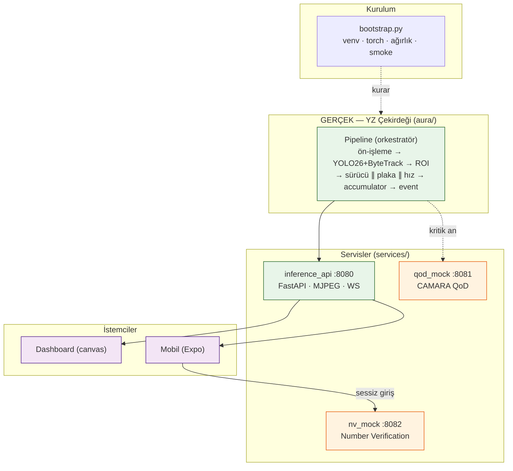
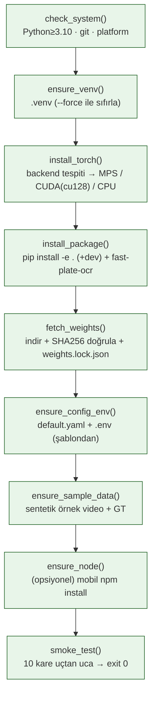
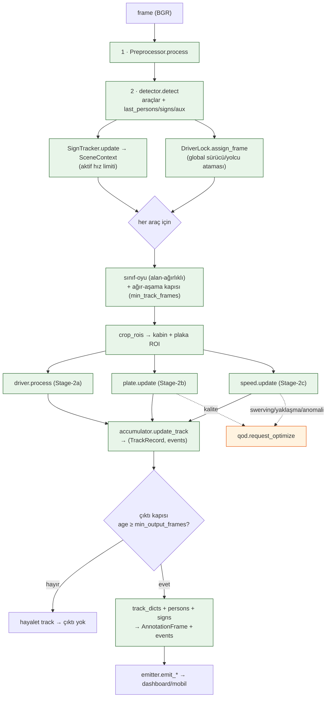
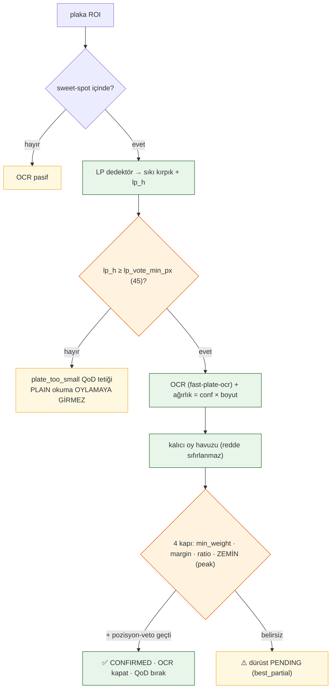

<div align="center">

# 📖 RoadGuard — Uzun Anlatım: Her Şey Ne İşe Yarıyor?

**Kod tabanının baştan sona, dosya dosya, "bu ne işe yarar / nasıl çalışır" anlatımı.**
Önce **bootstrap** (kurulum) ve **pipeline** (çekirdek akış); sonra her alt-sistem detayıyla.


</div>

> [!NOTE]
> Bu belge gerçek koddan (her satırı okunarak) yazılmıştır — **uydurma yok (K-004)**. Hızlı
> referans için her bölümde **"ne yapar / nasıl çalışır / önemli dosyalar / config / tasarım
> notu"** başlıkları vardır. Mermaid diyagramları GitHub'da render olur.

---

## İçindekiler

1. [Kuşbakışı: RoadGuard nedir, parçalar nasıl bağlanır](#1-kuşbakışı)
2. [`bootstrap.py` — tek komutla kurulum](#2-bootstrappy)
3. [`aura/pipeline/pipeline.py` — çekirdek orkestratör](#3-pipeline)
4. [Stage-1 · `detection/` — tespit + takip](#4-detection)
5. [Stage-2a · `driver_state/` — sürücü davranışı](#5-driver_state)
6. [Stage-2b · `plate/` — plaka okuma](#6-plate)
7. [Stage-2c · `speed/` — hız + yalpalama](#7-speed)
8. [`accumulator/` + `scene/` + `stability/` — birikim, sahne, kararlılık](#8-accumulator)
9. [`qod/` + `events/` + `identity/` — QoD, olay yayını, sürücü kimliği](#9-qod)
10. [`eval/` — FTR metrikleri, mAP, QoD A/B](#10-eval)
11. [`core` — config, device, schema, taxonomy, preprocessing, synthetic, smoke](#11-core)
12. [`services/` — inference_api + qod_mock + nv_mock](#12-services)
13. [`train/` — YOLO26 fine-tune hattı](#13-train)
14. [Repo haritası + çalıştırma + onur zırhı](#14-repo)

---

<a name="1-kuşbakışı"></a>
## 1. Kuşbakışı: RoadGuard nedir, parçalar nasıl bağlanır

RoadGuard, yol kenarı bir trafik kamerası akışından **araç, plaka, hız ve riskli sürücü davranışı**
tespit eden gerçek bir YZ çekirdeğini; bu çekirdeği **5G CAMARA QoD** (Quality-on-Demand) ve
**Number Verification** telekom yetenekleriyle birleştiren uçtan uca bir sistemdir.



> [!IMPORTANT]
> **Gerçek ↔ Mock sınırı:** YZ çekirdeğinin tamamı (CV/takip/durum-makinesi/OCR/hız/eval)
> **gerçektir**. Telekom katmanları (QoD, NV) gerçek CAMARA API sözleşmesini birebir taklit
> eden **mock**'lardır — final ortamında yalnızca uç nokta/kimlik değişir, çekirdek aynı kalır.

**İki temel ilke** bütün kod tabanına sinmiştir:
- **Onur zırhı (K-004):** Hiçbir sayı uydurulmaz; tüm eşikler **oran/boyut-temelli** (videoya-özel
  sabit yok); belirsizlikte sistem dürüstçe çekimser kalır (ör. plaka `pending`, hız `is_calibrated=False`).
- **ID-merkezli karar:** Kararlar kare-kare değil, her aracın `track_id`'si altında **zaman içinde
  biriktirilerek** verilir — tek-kare gürültüsü event'e dönüşmez.

---

<a name="2-bootstrappy"></a>
## 2. `bootstrap.py` — tek komutla kurulum

### Ne yapar
Sıfırdan çalışır hale getirir: sanal ortam, **donanıma uygun** torch, paket bağımlılıkları,
model ağırlıkları (SHA256 doğrulamalı), örnek veri ve smoke test. **İdempotenttir** — ikinci
çalıştırma tamamlanmış adımları atlar. Kritik incelik: bootstrap **hiçbir üçüncü-parti modüle
bağımlı değildir** (sistem Python'u ile çalışır); OpenCV/numpy gereken işleri venv python'una
`subprocess` ile devreder.

### Nasıl çalışır — 9 sıralı adım



**Torch backend tespiti (`detect_backend` + `_cuda_index`)** kritik bir karardır: Apple Silicon
(`Darwin`+`arm64`) → **MPS**; `nvidia-smi` varsa → **CUDA**; aksi halde **CPU**. CUDA index'i
GPU'nun *compute capability*'sine göre seçilir: Blackwell (sm_100+, ör. RTX 50xx) **cu128**
gerektirir (eski cu121 derlemesi "no kernel image" ile çöker). CUDA için sürümler sabitlenir
(`torch==2.8.0`, `torchvision==0.23.0`).

**Ağırlık doğrulama (`fetch_weights`)** "trust-on-first-use" çalışır: resmi SHA256 yoksa ilk
indirmede hash hesaplanıp `weights.lock.json`'a yazılır; sonraki çalıştırmalar buna karşı
doğrular, uyuşmazsa **bozuk kabul edip yeniden indirir**. İndirme `.part` geçici dosyasına yapılıp
atomik `replace` ile yerine konur; ağ hatasında **üstel geri-çekilmeli** (2s/4s/8s) yeniden dener.
İndirilemezse pipeline **ağırlıksız mock modda** çalışmaya devam eder (çökmez).

> [!TIP]
> **Bayraklar:** `--dev` (pytest/ruff/black), `--skip-weights` (ağırlık indirme), `--skip-deps`
> (pip atla), `--skip-node`, `--force` (.venv'i sıfırla). Smoke test başarısızsa kurulum
> **ölümcül hata** verir (sağlıklı kurulum garantisi).

### Önemli dosyalar
| Dosya | Rol |
|---|---|
| `bootstrap.py` | Kurulum orkestratörü (stdlib-only, idempotent) |
| `weights/weights.lock.json` | İndirilen ağırlıkların ad→{sha256,url} kilidi |
| `weights/README.md` | Bootstrap'in ürettiği ağırlık durum tablosu |
| `config/default.yaml.template` · `.env.example` | İlk kurulumda kopyalanan şablonlar |

---

<a name="3-pipeline"></a>
## 3. `aura/pipeline/pipeline.py` — çekirdek orkestratör

### Ne yapar
Tüm algı alt-modüllerini **tek akışta** birleştirir. `__init__` her aşama nesnesini **bir kez**
kurar; sonra her kare `process_frame()` içinde bu hazır nesnelerden geçer (kare başına yeniden
kurulum yok). Pipeline upstream/downstream'i (kamera/dashboard) bilmez — yalnızca iki-kanal
çıktı yayar: **`AnnotationFrame`** (kare başına bbox, çizim için) ve **`AuraEvent`** (durum değişimleri).

### Nasıl çalışır — bir karenin yolculuğu (`process_frame`)



**Kritik tasarım kararları (hepsi kodda yorumlu):**
- **İki kapı, ayrı amaç:** `min_track_frames` (ağır aşama kapısı) bir track bu kadar kare
  görülmeden OCR/pose'a girmez (maliyet); `min_output_frames` (çıktı kapısı) annotation/event
  üretmez (ByteTrack parçalanmasından doğan 1-2 karelik hayalet track'ler kanıta sızmasın).
- **Takipsiz tespit elenir:** `track_id is None` olan tespit erken `continue` — tüm böyle
  tespitler tek `-1` kimliğine çökerse per-track durum kirlenirdi.
- **QoD tetikleri** akıştan türetilir: `vehicle_approach` (bbox alanı pencerede `growth` katına
  çıktı = TOGG yaklaşıyor), `speed_anomaly` (tabela limiti veya `high_speed` aşımı), `swerving`,
  plaka `plate_too_small`/`consensus_fail` kalite tetikleri.
- **Bellek hijyeni:** kare sonunda her alt-modülün `prune(idx)`'i çağrılır; `max_age` grace'li
  (kısa oklüzyon/recycled-id davranışı korunur, yalnız uzun süredir görünmeyen track düşer).
- **Deterministik zaman ekseni:** `set_now(idx/fps)` → QoD ve accumulator olayları aynı kare-saatini
  kullanır (offline eval tekrar-üretilebilir; wall-clock kayması yok).

---

<a name="4-detection"></a>
## 4. Stage-1 · `detection/` — tespit + takip

### Ne yapar
Her kareyi işleyip **araç, kişi** (sürücü kilidi için), **trafik tabelası** ve **yardımcı kanıt**
(telefon/sigara nesnesi) tespit eder, **ByteTrack** ile kalıcı `track_id` atar ve downstream için
yalnızca küçük **ROI kırpıkları** üretir. Ağırlık yokken **deterministik mock dedektörle** tüm
hattı uçtan uca çalıştırır.

### Nasıl çalışır
`build_detector(cfg)` fabrikası `runtime.ai_mode`'a göre **YOLO26Detector** ya da **MockDetector**
döner. `auto` modunda: ultralytics kurulu + ağırlık diskte + kaynak gerçek ise YOLO; aksi halde
(veya **gömülü sentetik kaynakta**, çünkü COCO-YOLO renkli blokları araç görmez) mock. Gerçek
yolda `model.track(persist=True, tracker='bytetrack.yaml')` ile tespit+takip yapılır; sonuçtaki her
kutu `canonical()` ile kanonik ada normalize edilir (`cell phone`→`phone`) ve dört kanala ayrılır
(araç / `last_persons` / `last_signs` / `last_aux`). NMS-free YOLO26'nın aynı araca ürettiği kopya
kutular `_dedup` ile (IoU > `dedup_iou`=0.80, sınıftan bağımsız) bastırılır. **HW-002 dayanıklılık:**
MPS/CUDA çalışma-zamanında çökerse bir kez yakalanıp cihaz kalıcı CPU yapılır ve tekrar denenir.

**ROI geometrisi** modelden bağımsız saf hesaptır: `crop_rois` araç kutusunu üst %55 kabin +
alt plaka olarak böler ("zero-frame" prensibi — downstream'e asla tam kare gitmez); `crop_person_roi`
kilitli sürücü kutusundan padli kırpar; `cap_roi_to_area` devasa geometrik-kabin fallback'lerini
kare-alanı oranına köşe-hizalı sınırlar (FP koruması).

**Mock yol** klasik CV'dir: binarize → MORPH_CLOSE → kontur → boyut/oran filtreleri → `SimpleIoUTracker`
(greedy IoU eşleme, ByteTrack'in hafif muadili).

| Önemli dosya | Rol |
|---|---|
| `detection/detector.py` | `Detector` ABC, `build_detector`, ROI geometri fonksiyonları |
| `detection/yolo.py` | `YOLO26Detector` (ultralytics+ByteTrack, dedup, cihaz fallback) |
| `detection/mock.py` | `MockDetector` + `SimpleIoUTracker` |

> [!NOTE]
> **Config:** `models.detector.{path,conf,iou,imgsz,vehicle_classes,dedup_iou}`, `tracking.tracker`,
> `sign.*`, `models.driver_state.aux_classes`. Boş `vehicle_classes` = "süzgeç yok" (kişi/tabela/kanıt
> dışı her şey araç).

---

<a name="5-driver_state"></a>
## 5. Stage-2a · `driver_state/` — sürücü davranışı (iki katman)

### Ne yapar
Her araç ID'si + sürücü ROI'sinden riskli davranışları (**telefon, sigara, kemer ihlali, yorgunluk**)
**ID-merkezli ve zamanda kararlı** tespit eder. Mimari karar gereği **MediaPipe/landmark kütüphanesi
KULLANMAZ** — tüm çıkarım saf YOLO26 (pose keypoint geometrisi veya detection) üzerinden.

### Nasıl çalışır — iki katman
- **Katman A (ham, kare-başına model):** `PoseDriverClassifier` akışı: (1) sürücü kişi kutusuna
  sıkı kırpma (ID-başı önbellek, `redetect_every`); (2) ROI büyütme + CLAHE/gamma parlatma
  (cam-ardı sürücü küçük/karanlık); (3) **geometri** — COCO-17 keypoint'lerden, **yüz genişliği
  ölçek-birimiyle** (mutlak piksel değil, K-004) bilek↔ağız/kulak göreli yakınlığı kıyaslanır:
  bilek kulağa çok yakınsa **telefon**, ağıza yakınsa **sigara**. **Kulak görünmüyorsa hiçbir iddia
  üretilmez** (dürüst çekimserlik); (4) **hibrit nesne kanıtı** — dedektörün ROI'de gördüğü
  phone/smoking nesnesi bayrağa OR'lanır; (5) **bastırma latch'i** — güçlü telefon nesnesi görülünce
  `suppress_frames` boyunca geometrik "sigara" bastırılır (ağız önündeki el muhtemelen telefon).
- **Katman B (ID-merkezli zaman-oylaması):** `DriverStateEngine` her ID için ayrı `TrackVoter`
  tutar; ham bayrağı **16'lık kayar pencereye** ekler, **min 8 kez** True ise kararlı sayar (16/8
  kuralı → tek-kare flicker elenir). `no_seatbelt` bir ham bayrak **değildir** — kemerin
  **yokluğundan** türetilir (varsayılan KAPALI, çünkü cam-ardı footage'da kemer görünmez ve FP üretir).

| Önemli dosya | Rol |
|---|---|
| `driver_state/engine.py` | Katman B orkestratörü, aux füzyonu, no_seatbelt türetme, prune |
| `driver_state/voting.py` | `TrackVoter` 16/8 kayar-pencere oylama çekirdeği |
| `driver_state/pose.py` | `PoseDriverClassifier` (pose geometri + hibrit nesne + latch) |
| `driver_state/classifier.py` · `yolo.py` | Fabrika + mod/backend seçimi; detection backend |

> [!WARNING]
> **Gerçek-video dersi:** Telefon bastırma latch'i yalnız **bastırır**, telefon iddiasını ileri
> taşımaz; aksi halde seyrek nesne FP'leri amplifiye olup gerçek sigarayı eziyordu. `custom_smoking`
> ikinci modeli ayrı bir OR-kanalı olarak eklendi (drop-in koymak phone kanıtını siliyordu).

---

<a name="6-plate"></a>
## 6. Stage-2b · `plate/` — plaka okuma (dürüstlük zırhları)

### Ne yapar
Sweet-spot'a giren araçların plakasını **özel YOLO26s LP dedektörüyle** sıkı kırpıp **çok-motorlu
OCR'a** (`fast-plate-ocr` / EasyOCR / PaddleOCR) verir; okumaları **format-öncelikli, kalıcı,
OCR-güveni × kırpık-boyutu ağırlıklı** bir oy havuzunda biriktirip karar verir. Tek hedef: **doğru
plakayı onayla, yanlış plakayı ASLA onaylama.**

### Nasıl çalışır
`PlateReader.update()` akışı: **durum makinesi** (confirmed → OCR kapalı erken çıkış) → **sweet-spot
kapısı** (araç merkezi netlik bölgesinde mi) → **`_lp_crop`** (özel LP dedektörü plakayı bulur, sıkı
kırpar, **gerçek piksel-yüksekliği `lp_h`**'yi döndürür — kanıt ağırlığının ve QoD'nin temeli) →
**boyut-farkında kanıt politikası** → **OCR** → **`PlateVotePool`**.



**Dürüstlük zırhları (hepsi oran/boyut-temelli, videoya-özel sabit YOK):**
1. **`lp_vote_min_px` güvenlik ağı** — uzak misread'ler (ölçülen `lp_h≤28`, ör. `14TC857`) hiç oya
   giremez; yakın net okuma (`lp_h≥67`) onayı korur.
2. **Kalıcı oy havuzu** redde sıfırlanmaz; karar yalnız **ikamesiz, format-geçerli** okumalarla,
   OCR güveni × kırpık-boyutu ağırlığıyla.
3. **`confirm_peak_weight` ZEMİN koşulu** — kazanan en az bir kez NET/YAKIN okunmuş olmalı; hep-uzak
   sistematik yanlış okuma (`24IC8532`) sayıca biriksin, onaylanmaz.
4. **`confirm_min_char_margin` (2.0)** — her pozisyonda kazanan ikinciyi mutlak marjla geçmeli;
   geçemezse o pozisyon belirsiz → **dürüst `pending`**.

> [!NOTE]
> **Ölçülmüş sonuç (GT=`34TC8532`, 3 gerçek video):** `fast-plate-ocr` **3/3 CONFIRMED, CER 0.0**
> (EasyOCR baseline video_3'te `24IC8532` pending kalıyordu). Motor adaptörleri (`build_ocr`) sayesinde
> TR-normalizasyon + satır-birleştirme motor-bağımsız korunur.

| Önemli dosya | Rol |
|---|---|
| `plate/reader.py` | `PlateReader` — sweet-spot, LP kırpma, boyut-politikası, oy orkestrasyonu |
| `plate/ocr.py` | `OCREngine` fabrikası (fastplate/easyocr/paddle/mock), `build_ocr` |
| `plate/normalize.py` | `normalize_tr` + `PlateVotePool` (oy havuzu + pozisyon-veto + char füzyonu) |

---

<a name="7-speed"></a>
## 7. Stage-2c · `speed/` — hız + yalpalama

### Ne yapar
**Tek sabit kameradan, kamera geometrisi bilgisi olmadan** araçların gerçek hızını (km/h) tahmin
eder; dikkatsiz sürüşü (**swerving/yalpalama**) ve anormal göreli hızı bayraklar. **Kalibrasyon
yoksa hız uydurmaz** — kendi sınırını tanır (`is_calibrated=False`).

### Nasıl çalışır
`SpeedEstimator.update()` `speed.mode`'a göre dallanır. Ana yol **`metric` (oto-kalibrasyon)**:
ppm (piksel/metre) **sahnenin kendisinden** öğrenilir çünkü dışarıdan geometri verilmez. **Plaka
genişliği** (TR plakası 520mm referans, ağırlık 1.0 — en kesin) ve **araç genişliği** (sınıf-bazlı,
düşük ağırlık) ölçümleri `ScaleField`'da görüntü-y'sine (derinlik vekili) göre **ağırlıklı, aykırı-
dayanıklı** bir doğru `ppm(y)` olarak uydurulur (polyfit + MAD aykırı reddi). İki yer-temas noktası
arası metrik yer değiştirmeden anlık hızlar çıkarılır, medyan alınır, **fiziksel-olmayan ivme reddi**
uygulanır, **1-D Kalman + opsiyonel EMA** ile yumuşatılır, km/h'ye çevrilir.

**`swerving`** algoritması kalibrasyon gerektirmez: son `window_s` saniyenin merkez-x serisinde bir
**ZigZag ekstremum sayacı** koşar; geri-dönüş eşiği **araç genişliği biriminde** (ölçek-bağımsız),
pencere saniye cinsinden (fps-bağımsız). Monoton hareketler (tek şerit değişimi, yaklaşma) yapısal
olarak 0 dönüş üretir. Diğer modlar: **tripwire** (iki sanal çizgi arası süre), **ipm** (opsiyonel
homografi modülü), **disabled** (yalnız bayraklar).

| Önemli dosya | Rol |
|---|---|
| `speed/estimator.py` | Mod yönlendirici, swerving/göreli bayraklar, ölü-bölge tutma, prune |
| `speed/calibration.py` | `MetricSpeedEstimator`, `ScaleField` (ppm(y) regresyonu), `KalmanSpeed1D` |

> [!TIP]
> **Ölü-bölge:** araç kadraj kenarındaysa (bbox kırpılmış) yeni hız hesaplanmaz, son geçerli km/h
> tutulur (çıkışta hızın aniden düşmesi önlenir). `prune` recycled track_id'nin bayat tripwire
> durumuyla absürt km/h üretmesini de engeller.

---

<a name="8-accumulator"></a>
## 8. `accumulator/` + `scene/` + `stability/` — birikim, sahne, kararlılık

### Ne yapar
Tüm algı modüllerinin kare-kare çıktısını **ID-merkezli kalıcı `TrackRecord`'larda** biriktirir,
**durum değişimlerinde `AuraEvent` üretir** ve config-tabanlı **risk kurallarını** uygular. Yan
bileşenler: **SignTracker** (tabela → aktif hız limiti) ve **16/8 kararlılık** (titrek tespitleri
yumuşatan StabilityTracker + alan-ağırlıklı TrackClassVoter).

### Nasıl çalışır
`Accumulator.update_track(...)` `self.tracks[track_id]` kaydını **in-place** günceller; her alt-durum
için **değişim** tespit edilince event çıkar (`DRIVER_STATE`, `PLATE_CONFIRMED/REJECTED`, `SPEED`).
**Kritik:** plaka için `model_copy(deep=True)` alınır — PlateReader nesneyi in-place mutasyona
uğrattığı için kopya alınmazsa geçiş event'i kaçar. Risk kuralları `__init__`'te **ön-derlenir**;
`_evaluate_risk` her kuralın token'larını AND'ler. Token örnekleri: `speed.over_limit` (SAF tabela
ihlali — tabela yoksa **pasif**, yanlış ihlal üretmez), `speed.speeding` (tabela varsa onun limiti,
yoksa `high_speed` tabanı), `driver.phone`, `speed.swerving`.

**SignTracker** en güvenilir hız-limiti tabelasını seçer, limit değişince `SPEED_LIMIT_DETECTED`
üretir, tabela kaybolduktan sonra `persistence_frames` boyunca limiti geçerli tutar. **StabilityTracker**
16/8 kuralını her `{track_id}:{alan}` için bağımsız uygular. **TrackClassVoter** araç-sınıfı titremesini
(car↔truck) **alan-ağırlıklı** çözer — yakın/büyük araç sınıfı daha güvenilir (birkaç yakın `car`
karesi onlarca uzak `truck` karesini devralır).

> [!NOTE]
> **Eş-zamanlılık:** `tracks` bir `RLock` ile korunur — pipeline thread'i yazar, dashboard/REST
> tüketicisi okur. Bu, prune sırasındaki dict mutasyonunu okuyucularla serileştirir.

---

<a name="9-qod"></a>
## 9. `qod/` + `events/` + `identity/` — QoD, olay yayını, sürücü kimliği

Üç bağımsız ama tamamlayıcı parça:

**`QoDController` (CAMARA QoD istemcisi)** — "yalnızca gerektiğinde kaynak iste" felsefesi.
`request_quality` (kalite yetersizliği → HIGH_THROUGHPUT) ve `request_optimize` (anomali → LOW_LATENCY)
talepleri **histerezisle** yönetilir: aktif oturum varsa yeni tetik üretilmez ama sayaç tazelenir
(kritik an sürerken erken düşme önlenir); oturum yoksa **cooldown** kontrolü yapılır. `tick()`
`min_active`'i aşan oturumları bırakır (`QOD_RELEASE`). `release_quality` yalnız kalite oturumunu
bırakır, optimize'a dokunmaz (plaka onaylanınca HIGH_THROUGHPUT'u tutmak israf).

**`EventEmitter` (iki-kanal yayıncı)** — `events` ve `annotations` için ayrı `deque(maxlen=500)`
halka tamponları + callback kayıt defterleri. **Eş-zamanlılık (CA-001):** yaz/oku bir `Lock` ile
serileştirilir, ama **callback'ler kilit dışında** çağrılır (yavaş abone tüm yayını kilitlemesin) ve
her callback `try/except` ile izole edilir.

**`DriverLock` (sürücü kimliği)** — konum-merkezli sürücü seçimi + ID-merkezli yolcu kilidi.
`assign_frame` tüm araç-kişi eşleşmesini **global ve dışlamalı** çözer (örtüşen araçlarda çift-sahiplenme
olmaz). Sürücü **kilitlenmez** (her kare konuma göre = en alttaki köşe-kişi yeniden seçilir → track-ID
titrese de görünen sürücü hep "sürücü" etiketlenir); **yolcu ise kilitlenir** (`confirm_frames` ardışık
kare sonra). İlk kilitte tek-seferlik `DRIVER_LOCKED` sinyali.

| Önemli dosya | Rol |
|---|---|
| `qod/client.py` | `QoDController` — histerezisli tetikle/bırak |
| `events/emitter.py` | İki-kanal thread-safe yayıncı |
| `identity/driver_lock.py` | Konum-bazlı sürücü + global yolcu kilidi |

---

<a name="10-eval"></a>
## 10. `eval/` — FTR §4 metrikleri, mAP, QoD A/B

### Ne yapar
Model/boru-hattı başarımını **ölçülebilir kanıta** çevirir: video-düzeyi davranış **P/R/F1**, plaka
**exact-match + CER**, araç sınıfı doğruluğu, **FPS**, dedektör **A/B**, ultralytics **mAP** ve **QoD
ON/OFF delta** tablosu.

### Nasıl çalışır
`python -m aura.eval` üç bağımsız boru hattına dallanır:
- **`--metrics-report`** (report.py): `--summaries` dizinindeki test_video özet JSON'ları + `<stem>_gt.json`
  GT okunur. Her video çoklu-track/çoklu-frame **tek ikili etiket vektörüne** indirgenir
  (`pred_from_summary`: bir davranış `min_frames` eşiğini geçen track varsa True). Özetler dedektöre
  göre gruplanıp **A/B** kıyaslanır. **cv2/torch yüklemeden** saf-sözlük işler (hızlı, test edilebilir).
- **`--map`** (map_eval.py): `YOLO(weights).val(data=...)` ile gerçek mAP50-95/mAP50/P/R + sınıf-bazlı
  tablo + PR eğrisi. Ağırlık/data/ultralytics eksikse **exception yerine loglu None** (davranış raporunu
  kesmez).
- **(varsayılan)** (harness.py): QoD A/B — aynı video iki kez koşulur (scale=1.0 ON, scale=0.35 OFF) ve
  plaka/küçük-nesne/tespit-oranı **ON−OFF delta** tablosu üretilir.

> [!IMPORTANT]
> **Onur zırhı baştan sona:** GT eşleşmesi olmayan video atlanır; `real_speed_kmh` yoksa hız metriği
> None döner ve satır basılmaz. report.py'nin notu: 3-videoluk set "**çalıştığının kanıtı**"dır,
> istatistiksel mAP değildir — geniş set gelince aynı harness gerçek mAP'i `map_report.json` ile bağlar.

---

<a name="11-core"></a>
## 11. `core` — config, device, schema, taxonomy, preprocessing, synthetic, smoke

Pipeline'ın altyapı çekirdeği. **Hiçbir eşik/flag koda gömülmez — tek doğruluk kaynağı YAML config'tir.**

- **`config.py`** — `load_config` üç katmanı sırayla birleştirir: **taban YAML → profil overlay →
  env override** (sonraki öncekini ezer). Derin-merge iç içe sözlükleri birleştirir ama **skaler ve
  LİSTE'leri tümüyle ezer** (ör. `vehicle_classes` kısmen birleşmez — sürpriz davranıştan kaçınma).
  `Config.get("plate.voting.min_weight")` noktalı erişim sağlar. `resolve_repo_path` yolları repo
  köküne göre mutlaklaştırır (CWD-bağımsız); `resolve_source` kaynak yoksa **gömülü örnek videoya**
  düşer (sessiz ölü akış yerine çalışan demo).
- **`device.py`** — `resolve_device` istenen cihazı çözer ve önbellekler. Kritik: **CUDA "smoke probe"**
  — `torch.cuda.is_available()` True dönse bile GPU'da gerçek bir op (8×8 matris çarpımı) çalıştırılır;
  başarısızsa (uyumsuz derleme, ör. Blackwell sm_120) **sessizce CPU'ya düşülür** (çöken yerine çalışan
  pipeline). `auto`'da macOS için MPS denenir.
- **`schema.py`** — Pydantic v2 çekirdek sözleşmeleri: `PlateState`, `DriverState` (`active_flags()`
  yalnız ihlalleri döner; kemerin **görülmesi** ihlal değil), `SpeedState`, `BBox`, ID-merkezli
  `TrackRecord`, stream sözleşmeleri `AuraEvent`/`AnnotationFrame`.
- **`taxonomy.py`** — model-uzayı ↔ RoadGuard kanonik-uzayı eşlemesini **tek noktada** yapar (`CLASS_ALIASES`,
  `canonical`) → model değişince pipeline/şema/config sözleşmesi değişmesin.
- **`preprocessing/preprocess.py`** — şu an M2 **pass-through** (arayüz sabit, filtreler sonraki
  iterasyonda); **`synthetic.py`** — gerçek TOGG verisi gelene dek deterministik trafik videosu + GT
  üretir; **`smoke.py`** — adaptif kurulum/pipeline doğrulaması.

---

<a name="12-services"></a>
## 12. `services/` — inference_api + qod_mock + nv_mock

### Ne yapar
YZ çekirdeğini ağ üzerinden sunan üç FastAPI servisi. **Gerçek↔mock sınırı buradadır:**
`inference_api` tüm CV/YZ hattını **gerçek** çalıştırır; `qod_mock` ve `nv_mock` gerçek telekom API
sözleşmesini **birebir taklit eder** (finalde yalnız endpoint/credential CAMARA/operatör gateway'ine
çevrilir, sözleşme değişmez).

| Servis | Port | Gerçek/Mock | Sunar |
|---|---|---|---|
| `inference_api` | **8080** | **Gerçek YZ** | Pipeline koşturur; MJPEG `/stream/video`, WS `/stream/annotations` + `/stream/events`, `/eval`, `/cameras`; dashboard'u statik serve eder |
| `qod_mock` | **8081** | Mock (CAMARA QoD) | QoS oturumu aç/sorgula/sil (profil QOS_E/L) |
| `nv_mock` | **8082** | Mock (NV) | Sessiz numara doğrulama (`POST /verify`, SMS/OTP yok) |

`inference_api` `state.py`'de pipeline + `EventEmitter`'ı tutar; WS tüketicileri `recent_events()`/
`latest_annotation()` ile **thread-safe** okur. Dashboard ``'ye ham MJPEG, `<canvas>`'a WS bbox
çizer (bbox toggle yalnız canvas'ı etkiler, MJPEG kesilmez). Çalıştırma: `./run.sh` üçünü birden
kaldırır; tek tek `uvicorn services.<ad>.main:app --port <port>`.

---

<a name="13-train"></a>
## 13. `train/` — YOLO26 fine-tune hattı

### Ne yapar
İki YOLO26 modelini (Stage-1 dedektör, Stage-2 sürücü-durum) ham veriden **eğitir → doğrular →
config'e takılabilir `best.pt` üretir**. Ayrıca eksik-sınıf verisini manifestten çekme planı ve
çok-kaynaklı sürücü setlerini birleştirme araçları.

### Nasıl çalışır
`python -m train <komut>` dört alt-komut: `detector`, `driver-state`, `dataset`, `fetch`. **torch/
ultralytics importları lazy** → `--help`/`dataset`/`fetch` ağır ML bağımlılığı olmadan çalışır.
Eğitimin kalbi `run_finetune`: cihaz çöz (`auto`'da `aura.device`, macOS MPS düşüşü için) → `model.train`
→ (varsa) `model.val` → `summarize_metrics` (P/R/F1/mAP) → `export_best` (`best.pt` → `weights/` +
`.metrics.json`). `prepare_dataset` deterministik (seed=42) **train/val/test split** + `data.yaml` +
**veri-dengeleme raporu** (dengesizlik oranı > 3 ise uyarı — FTR §2). `fetch` `datasets.yaml`
manifestini okur, **varsayılan AĞ KULLANMAZ** (kuru plan), yalnız `--run` ile indirir; taksonomi
tutarsızlığını **sessizce düzeltmez, planda uyarı basar** (onur).

| Önemli dosya | Rol |
|---|---|
| `train/__main__.py` | CLI girişi, dört alt-komut, lazy delege |
| `train/utils.py` | `run_finetune`, cihaz çöz, metrik özet/export, denge istatistikleri |
| `train/prepare_dataset.py` | Split + data.yaml + dengeleme raporu (torch'suz) |
| `train/fetch.py` + `datasets.yaml` | Eksik-sınıf indirme planı/manifesti |
| `train/merge_driver_datasets.py` | Çok-kaynaklı sürücü setlerini ortak uzaya birleştir |

---

<a name="14-repo"></a>
## 14. Repo haritası + çalıştırma + onur zırhı

### Dizin haritası
| Dizin | İçerik |
|---|---|
| `aura/` | YZ çekirdeği (preprocessing, detection, driver_state, plate, speed, accumulator, scene, stability, qod, events, identity, eval, pipeline, core) |
| `services/` | `inference_api` (:8080) + `qod_mock` (:8081) + `nv_mock` (:8082) |
| `dashboard/` | Vanilla JS + Canvas + WS arayüzü (build yok) |
| `mobile/` | Expo (React Native) — NV sessiz giriş + canlı tespit panosu |
| `train/` | YOLO26 fine-tune hattı |
| `tools/` | `test_video.py` (annotated mp4 + JSON), `doctor.py` (sağlık), `bench.py` (FPS), `make_ftr_figures.py` |
| `config/` | `default.yaml` (tek config kaynağı) + `profiles/` |
| `weights/` | Model ağırlıkları (bootstrap doldurur; `custom_*` LFS'te) |
| `eval_results/` | Ölçüm artefaktları (özetler, mAP, bench, annotated demolar) |
| `docs/` | Mimari, kurulum, CLI/API referans, değerlendirme, izlenebilirlik, figürler |

### Çalıştırma
```bash
python bootstrap.py          # tek komutla kurulum (idempotent)
python tools/doctor.py       # ortam/hazırlık sağlık kontrolü
./run.sh                     # inference :8080 · QoD :8081 · NV :8082
# profiller: AURA_PROFILE=server|laptop  (yolo26l/CUDA vs yolo26s/MPS)
python -m aura.eval --metrics-report   # FTR §4 metrikleri
```

### 🛡️ Onur zırhı (K-004) — her yerde tekrar eden ilke
> [!IMPORTANT]
> Kod tabanının her köşesinde aynı disiplin görülür: **(1)** tüm eşikler oran/boyut-temelli
> (videoya-özel sabit YOK); **(2)** belirsizlikte dürüst çekimserlik (plaka `pending`, hız
> `is_calibrated=False`, kulak görünmeyince sürücü iddiası yok); **(3)** ölçülen gerçek sayılar
> (eval GT eşleşmesi yoksa atlar, uydurmaz); **(4)** "kanıtlanamayan hedef puanlanmaz" (şartname 4.5)
> → her çıktı JSONL/annotated-mp4/türetilebilir-metrik üçlüsüyle kanıtlanır.

---

*Bu belge `aura/pipeline/pipeline.py` ve `bootstrap.py`'nin tam okunması + 10 alt-sistemin koddan
analiziyle (uydurma yok, K-004) hazırlanmıştır. Detaylı API/config için her dizinin kendi `README.md`'si
ve `docs/mimari.md` kaynaktır.*
