# 📜 Değişiklik Günlüğü

Bu projedeki tüm önemli değişiklikler bu dosyada belgelenir.
Format [Keep a Changelog](https://keepachangelog.com/tr/1.0.0/) temellidir.

> [!IMPORTANT]
> **Onur zırhı K-004 (genel):** Hiçbir sayı/metrik/komut/dosya-yolu/iddia uydurulmaz veya
> değiştirilmez. Bu günlükteki tüm ölçümler gerçek video/eval kanıtına dayanır; yanlış onay
> yerine dürüst `pending` tercih edilir.

---

## 🚀 [2.3.0] — 2026-06-17

**YOLO26 sunucu sürümü + konfigüre edilebilirlik + FTR hazırlığı**

> [!NOTE]
> **Hedef:** prototipi **YOLO26-merkezli, sunucu-hedefli, yüksek konfigüre edilebilir,
> metrik üreten, FTR'ye hazır** hale getirmek. (Sunucu dağıtımı; edge için puan yok.)

### ✨ Eklendi
- **YOLO26 dedektör omurgası varsayılan.** Birincil Stage-1 dedektör fine-tune v4 (yolov8m)
  yerine **stok `yolo26l`** (sunucu, doğruluk-önce; mandate). v4 seçilebilir profil olarak kalır.
- **Config profil katmanı** (`config/profiles/*.yaml`, `default.yaml` üzerine derin-merge):
  `server` (yolo26l/CUDA/imgsz960), `laptop` (yolo26s/MPS), `v4-finetune` (11-sınıf fine-tune).
  `--profile` bayrağı (`aura`, `aura.eval`, `tools/test_video.py`) + `AURA_PROFILE` env.
- **ID-merkezli iki-katmanlı sürücü motoru** (`DriverStateEngine` + `TrackVoter`): Katman A
  zengin pose-hibrit model, Katman B per-track zaman-oylaması (eski per-alan 16/8'in yerine,
  aynı davranış + araç çıkınca tampon prune). Mustafa'nın `feature/stage2-driver-state`
  dalı regresyonsuz entegre edildi; voting `models.driver_state.voting` ile ayarlanır.
- **FTR §4 metrik harness'ı** (`aura/eval/report.py`): `python -m aura.eval --metrics-report`
  → video-düzeyi P/R/F1, plaka exact-match+CER, araç doğruluğu, FPS; dedektöre göre A/B;
  `metrics_report.md`+`.csv`+`.json`. `metrics.prf1()`/`accuracy()` eklendi.
- **Eğitim tool'u mükemmelleştirildi** (`train/`): eğit→`model.val`→metrik export(mAP/P/R/F1)→
  best→`weights/`; otomatik cihaz (CUDA→MPS→CPU); `--lr0/--patience/--resume/--no-augment/--no-val/--out`;
  `dataset --report` veri-dengeleme dağılımı (FTR §2). Boru hattı coco8/yolo26s ile doğrulandı.
- **`tools/doctor.py`** sağlık kontrolü (bağımlılık/cihaz/ağırlık/config/profil) + `make doctor`/`metrics`.
- **`ftr.md`** (Final Tasarım Raporu doldurma rehberi + doldurulabilir taslak + final demo hazırlığı),
  `docs/dagitim.md` (sunucu dağıtımı), `docs/egitim.md`/`docs/veri_seti.md` genişletildi.

### 🐛 Düzeltmeler / sağlamlaştırma
- **Plaka CONFIRM dürüstlük zırhları** (dedektör A/B'de ortaya çıktı): (1) **pozisyon-veto** —
  ayrı-aday bütün-string marjını geçse bile her karakter pozisyonu `char_margin` önde olmalı,
  değilse `pending`; (2) **zemin koşulu** (`confirm_peak_weight=0.30`) — kazanan plaka en az bir
  kez net/yakın okunmuş olmalı (hep-uzak sistematik misread onaylanmaz). Her ikisi de K-004 (genel).

### 📊 Dedektör A/B (3 gerçek video, dürüst ölçüm — `eval_results/metrics_report.md`)
| Dedektör | Davranış makro-F1 | Plaka exact | CER | FPS(MPS) |
|---|---|---|---|---|
| v4-finetune | 1.00 | 2/3 | 0.083 | 4.83 |
| yolo26l (varsayılan) | 0.933 | 1/3 | 0.125 | 5.69 |

> [!NOTE]
> Davranış tespiti çapraz-FP'siz. Karanlık otopark footage'ında EasyOCR il-kodunu (3→0/2)
> tutarlı yanlış okuyabiliyor; sistem yanlış onay yerine `pending` der. Plaka-kritik demoda
> `--profile v4-finetune` önerilir; kalıcı çözüm perspektif düzeltme / komite footage'ı.

### ♻️ Sürücü/Yolcu mekaniği (takım katkısı — `feature/...` main'den entegre)
Bu sürümde main'e gelen pozisyonel sürücü/yolcu mekaniği de korunarak birleştirildi:
- **Sürücü KİMLİĞE değil POZİSYONA göre seçilir** (`aura/identity/driver_lock.py` yeniden yazıldı):
  araçtaki **en alttaki (berabere → en sağdaki) kişi HER ZAMAN sürücü**; her kare yeniden
  seçilir → ByteTrack ID titrese de görünen sürücü hep "sürücü" (kare-189 regresyonu giderildi).
- **Yolcular kilitlenir** (`confirm_frames` ardışık kare → YOLCU; o araçta sürücü adayı olamaz).
- **Annotation'da kişi rolleri** (`AnnotationFrame.persons`) + **dashboard SÜRÜCÜ/YOLCU çizimi**
  (`video-renderer.js`); `DriverAssignment.passenger_ids`/`locked_passenger_ids`;
  `tools/show_driver_rois.py` sürücü/yolcu başlığı. `tests/test_driver_lock.py` (13 test).

> [!TIP]
> Bu mekanik, v2.3'ün Katman B sürücü-durum motoruyla uyumludur (sürücü ROI'sini doğru
> kişiye yönlendirir; motor o ROI'de davranış oylaması yapar).

### 🔀 Takım dalları entegre edildi (plate-speed-calibration + stage2 domain/kemer)
- **Plaka→hız oto-kalibrasyonu** (`feature/plate-speed-calibration`): LP plaka kutusu (520mm
  referans) `speed.observe_plate`'e beslenir → metrik ppm kalibrasyonu (`aura/speed/estimator.py`,
  `aura/plate/reader.py`, `tools/diag_speed_plate.py`, `tests/test_speed_plate_calib.py`).
  Ayrıca **CI black/ruff sürümleri pinlendi** (`ruff==0.15.17 black==26.5.1`) — lint kırılması önlenir.
- **Kemer (seatbelt) iki-katman tasarımı** (`feature/stage2-driver-state` c570c9a, MY engine'e
  port edildi): model ham **`seatbelt`** (kemer VAR) tespit eder; **`no_seatbelt` İHLALİ Katman
  B'de kemerin yokluğundan türetilir** (`models.driver_state.no_seatbelt.enabled`, **VARSAYILAN
  KAPALI** — kemer görünürlüğü düşük footage'da FP koruması). `imgsz 320→640` (küçük telefon),
  `conf 0.45`; domain modeli (`custom_driver.pt`) + dataset birleştirme aracı
  (`train/merge_driver_datasets.py`). Pose varsayılanı korunur; domain modeli `backend: yolo` ile açılır.

### ✅ Kalite

- **183 unit test** yeşil (`pytest -m "not integration"`); yeni/genişletilen: `test_config` (10),
  `test_driver_engine` (12, kemer-türetme dahil), `test_report` (8), plaka zırh testleri,
  train veri-istatistiği + entegre `test_driver_lock` (13) + `test_speed_plate_calib`.
  `ruff` + `black` temiz; CI black/ruff sürümleri pinli.

---

## 🐛 [2.2.1] — 2026-06-13

**geri bildirim düzeltmesi — plaka ilk-karakter + sınıf salınımı**

İkinci geri bildirim ("bozdun; stabilite düzelmedi; eskiden plaka daha iyi okunuyordu;
ilk sayıların 0 okunması kronik") gerçek eval ölçümüyle kök çözüme kavuşturuldu.

### 🐛 Düzeltmeler
- **Plaka ilk-karakter (`3↔0`) ve `T↔I` — pozisyon-hizalı füzyon artık ONAYA katılıyor**
  (`normalize.py:_char_consensus`, güvenli sürüm): OCR aynı plakayı varyantlara bölüyor
  (`34TC8532`/`04TC8532`/`34IC8532`); ayrı-aday kararı bunlar arasında bölünüp **hangi
  varyant baskınsa onu — bazen yanlış `04` — onaylıyordu** (kullanıcının gördüğü regresyon).
  Çözüm: aynı yapıdaki okumalar pozisyon pozisyon birleşir; ONAY için **her pozisyonda**
  kazanan karakter ikinciyi `char_margin` MUTLAK ağırlıkla geçmeli. Bir pozisyon
  belirsizse (0↔3 eşit, ya da uzaktan I↔T) → dürüst `pending` (yanlış plaka ASLA
  onaylanmaz). **Sonuç: video_1 artık `34TC8532` CONFIRMED** (ayrı-aday yanlış `04` seçerdi;
  pos0'da çoğunluk `3`, pos2'de `T` net). `consensus_ratio` 0.6'ya geri alındı.
- **Sınıf oyu ALAN-AĞIRLIKLI** (`stability/class_vote.py`): oy `conf × bbox_alan/kare_alan`
  — yakın/büyük araç sınıfı daha güvenilir (gerçek ölçüm: araç uzaktayken ham tespit
  `truck`, yakınlaşınca `car`). `decay=1.0` (saf kümülatif): `decay<1` + alan-ağırlığı
  GEÇ gelen büyük-alan yanlış tespite **salınım** yaratıyordu (video_3: car→truck→car) —
  giderildi. **Sonuç: video_3 tek sınıf `car`** (salınım yok); video_1/2 car'a yakınsayıp
  sabit kalıyor (ilk uzak-araç truck dönemi modelin ham-tespit sınırı, v5 fine-tune ile çözülür).

### 🔬 Doğrulama (gerçek video, hile yok)
- **video_1**: `car` · plaka **`34TC8532` CONFIRMED** · sigara 118 kare + 4 RISK_ALERT · swerving 0
- **video_2**: `car` · plaka **`34TC8532` CONFIRMED** · telefon 110 kare · swerving 0
- **video_3**: `car` (salınım yok) · plaka `pending` (uzak/bulanık, OCR 3→2 & T→I; yanlış onay yok) · swerving 119 kare + RISK_ALERT

---

## 🐛 [2.2.0] — 2026-06-13

**geri bildirim turu — sürücü ROI, stabilite, plaka ilk-karakter, Windows**

Kullanıcı geri bildirimi (gerçek video kanıtlarına dayalı 5 madde) köklerinden çözüldü.

### ✨ Eklenenler
- **Sürücü-içi sıkı kırpma** (`aura/driver_state/pose.py` → `_driver_crop`): pose + v4 nesne kanıtı artık tüm kabin yerine yalnız **sürücünün kişi kutusu (+%10)** üzerinde koşar (ön cam/yolcu yansımaları FP kaynağıydı). Kutu track başına önbelleğe alınır (`driver_crop.redetect_every`), kare başına tek pose geçişi korunur. ROI zaten darsa (`min_gain`) kırpma atlanır. Sürücü tarafı `driver_lock.corner` ile aynı sözleşmeyi kullanır.
- **Pose modeli yükseltmesi**: `yolo26s-pose` → **`yolo26l-pose`** (varsayılan; bootstrap indirir, `weights.lock.json`'a kilitlenir). Alan minimum olduğundan büyük model affordable (kullanıcı kararı: minimum alana maksimum model). Diskte yoksa s-pose'a **loglu** fallback (`_pose_weight_exists`).
- **Track başına araç-sınıfı oylaması** (`aura/stability/class_vote.py`, `TrackClassVoter`): güven-ağırlıklı çoğunluk + hafif unutma (`decay`) tek-kare `car↔truck` titremesini düzeltir. Sınıf pipeline'da **tek noktada** (`det.bbox.cls` yerinde) güncellenir → hız genişlik-önseli, accumulator, annotation ve event'ler aynı kararlı sınıfı görür. `tests/test_class_vote.py`.
- **Pozisyon-hizalı plaka karakter füzyonu** (`aura/plate/normalize.py` → `_char_fuse_best`): birden çok format-geçerli okuma varsa aynı YAPIDAKİ okumalar pozisyon pozisyon birleşip en olası tek tahmini üretir. **YALNIZ `partial` (kanıt izi) için — CONFIRMED kararına KATILMAZ.** Gerçek video dersi (önemli): uzak/bulanık karelerde OCR sistematik yanlış okuyabilir (T→I, 3→2) ve doğru okuma hiç gelmeyebilir; böyle bir okumayı onaylamak yanlış plakayı kesinleştirir → `pending + en iyi tahmin` daha dürüst. Onay yalnız katı ayrı-aday konsensüsüyle (min ağırlık + margin + oran).
- **Boyut-farkında plaka kanıtı** (`aura/plate/reader.py`): okuma ağırlığı = OCR güveni × kaynak kalitesi (LP kırpık yüksekliği). Çok küçük LP (`lp_vote_min_px`) oylamaya girmez; küçük LP (`lp_qod_below_px`) görüldüğü AN `plate_too_small` QoD kalite tetiği (consensus_fail beklemeden — havuz zehirlenmeden). Uzak/bulanık karelerin sistematik misread'leri artık yakın/net okumayı ezemez.
- **QoD erken bırakma** (`aura/qod/client.py` → `release_quality`): plaka onaylandığı an HIGH_THROUGHPUT bırakılır (eski akış: onaydan ~31 kare sonra zaman aşımı). Aynı track'teki swerving/approach LOW_LATENCY oturumuna dokunmaz.
- **Windows araç paritesi**: `dev.ps1` (test/lint/format/train/eval/video-test/clean — Makefile eşleniği); `tools/test_video.py` JSON özetine `class_changes` izi (sınıf titremesinin gerçekten bastırıldığının kanıtı); `tools/show_cabin_rois.py` → **`show_driver_rois.py`** (pipeline ile aynı bileşenler: gerçek sürücü ROI + l-pose ham bayrakları + iç kırpık kutusu).
- **`min_track_frames` artık ÇIKTI kapısı**: genç (muhtemelen hayalet) track'ler ağır aşamalara girmediği gibi **annotation/event de üretmez** (video_3'teki 2-karelik phantom `truck` track'leri çıktıya sızmıyordu).

### 🐛 Düzeltmeler
- **run.ps1 / setup.ps1 (PS 5.1)**: `$ErrorActionPreference='Stop'` + native stderr yönlendirmesi modül-yok dalını çökertiyordu → probe geçici `Continue` ile sarıldı; `Wait-Process` boş/çökmüş süreçte tüm servisleri öldürüyordu → `-EA SilentlyContinue` + sayı guard'ı; bare `python` (Store stub) → `py -3` fallback + çıkış-kodu doğrulama; `Set-Location` → `Push/Pop-Location` (çağıranın dizini bozulmasın); UTF-8 BOM (Türkçe karakter); `.env` yükleme (run.sh ile parite).
- **bootstrap.py**: git-lfs ipucu platforma göre (`%USERPROFILE%` / `~`) + git-lfs kurulum notu.
- `Makefile` başlığı: olmayan `run_dev.ps1` → `setup.ps1 / run.ps1 / dev.ps1`.

### 🔬 Doğrulama (gerçek video, hile yok)
- **video_1**: araç `car` (kare 37'de truck→car, kalıcı) ✓ · sigara **118 kare** (l-pose + sürücü kırpma; eski 23'ten yükseldi) · plaka **34TC8532** (ilk-karakter düzeltildi) · phone 0 · swerving 0
- **video_2**: `car` ✓ · plaka **34TC8532 CONFIRMED** ✓ · telefon 110+ kare · sigara 0 · swerving 0
- **video_3**: `car` (phantom truck track'leri elendi) ✓ · swerving 119 kare + RISK_ALERT · davranış bayrakları temiz · plaka uzak/bulanık (dürüst `pending` + partial)

---

## ✨ [2.1.0] — 2026-06-12

**gece bakım + yenileme oturumu — detay: `fable.md`, plan: `plan.md`**

### ✨ Eklenenler
- **Pose-tabanlı sürücü davranışı** (`aura/driver_state/pose.py`): YOLO26-pose (COCO 17 keypoint) ile bilek↔ağız/kulak **göreli yakınlık** geometrisi — fine-tune ağırlık olmadan telefon/sigara tespiti (v1 prototipin gerçek videoda ölçülmüş MediaPipe geometrisinin saf-YOLO portu; mimari "landmark kütüphanesi yok" kararı korunur). ROI ön-işleme (büyüt + CLAHE + gamma) dahil. `models.driver_state.backend: auto|pose|yolo`. **Gerçek videoda doğrulandı: video_1 sigara, video_2 telefon.**
- **Swerving / dikkatsiz sürüş tespiti** (`aura/speed/estimator.py`): yanal yörüngede zigzag (yön-değişim sayacı) veya ani şerit kayması; tüm eşikler **araç genişliği biriminde** (ölçek-bağımsız, K-004). `SpeedState.swerving` → 16/8 süzgeci → `speed.swerving` risk tokenı → `swerving_vehicle` kuralı → `RISK_ALERT` + QoD optimize. `tests/test_swerving.py`.
- **TR plaka normalizasyonu + format-öncelikli kalıcı oy havuzu** (`aura/plate/normalize.py`): blok-farkında karakter düzeltme (O→0, 1→I...), track-ömrü oy birikimi (redde sıfırlanmaz), karar yalnız ikamesiz format-geçerli ham okumalarla (min oy + margin + oran); kesik okumalar (`8532`) alt-dizi desteği verir; `PlateState.partial` en güçlü adayı kanıt izi olarak taşır. `tests/test_plate_normalize.py`.
- **Stage-1 kanıt füzyonu**: dedektörün tam karede gördüğü `phone`/`smoking` nesnesi (fine-tune v4) araca düşüyorsa sürücü bayrağına OR'lanır (`models.driver_state.fuse_detections`).
- **QoD yaklaşma tetiği** (`qod.approach`): bbox alanı pencere içinde büyüyorsa (`vehicle_approach`) optimize tetiklenir — şartnamenin birincil "TOGG yaklaşması" senaryosu.
- **Fine-tune dedektör** `weights/yolguvenligi_types_v4.pt` (11 sınıf, held-out test mAP50 .788; v1 reposundan Git LFS ile kurtarıldı) birincil detector yapıldı; yoksa stok `yolo26s.pt`'ye **loglu** fallback. Sınıf adı taksonomisi `aura/taxonomy.py` (`cell phone`→`phone`, `cigarette`→`smoking`...).
- **Araç kutusu dedup** (`models.detector.dedup_iou`): NMS-free/fine-tune modellerin aynı araca ürettiği çift kutu (car+truck) bastırılır — hayalet ByteTrack track'leri ve gereksiz OCR maliyeti kalktı (gerçek videoda 7 track → 2).
- **Ağır aşama kapısı** (`tracking.min_track_frames`): track N kare yaşamadan OCR/pose çalışmaz.
- **`tools/test_video.py`**: video → annotated mp4 + JSON özet (event sayıları, plaka oy dökümü, sürücü bayrak süreleri, swerving kareleri, QoD nedenleri) — jüri/denetim kanıtı (şartname 4.5). `python -m aura`'ya `--save-events` (JSONL kanıt izi).
- `smoking_driver` risk kuralı (sigara artık `RISK_ALERT` üretir); `SPEED` event'ine `swerving` + `calibrated` alanları; annotation'a `swerving`, `plate_partial`, `speed_calibrated`.
- EasyOCR güçlendirme: aynı-satır segment birleştirme ("34"+"TC"+"8532" tek okuma), 4K crop küçültme (`plate.ocr_max_side`), parlama testi (far FP'si OCR'a girmez), küçük plakada CLAHE+2x varyantı.
- 3 gerçek test videosu için GT iskeletleri (`data/samples/video_*_gt.json`).

### 🐛 Düzeltmeler
- **D3:** `--source` artık config'e yazılır — `ai_mode: auto` gerçek videoyu mock'ta işleyebiliyordu (`aura/__main__.py` + `services/.../state.py`).
- **D4:** `--device auto` macOS'ta artık MPS seçer (önceden hep CPU'ya düşüyordu, `aura/device.py`).
- Model yolları repo köküne göre çözülür (CWD-bağımsız, `resolve_repo_path`).
- `bootstrap.py`: indirmelere yeniden-deneme (3×, artan bekleme) + `.part` temizliği; `yolo26s-pose.pt` ağırlık listesinde; v4 için komşu-repo kopyalama fallback'i.

### ♻️ Değişiklikler
- `models.detector`: path → v4, conf 0.35→0.30, imgsz 640→768 (eşik rehberi config yorumunda: ön-eğitimli stok model için 0.08-0.10).
- Eski kök `plan.md` → `docs/plan_insa_v2.md` arşivlendi; kök `plan.md` artık 12 Haz yenileme planı.

---

## 🚧 [Unreleased]

### 🧪 W1 — FTR ön-hazırlık (`feat/ultraplan-w1`)

#### ✨ Eklendi
- **Plaka OCR varsayılanı `fast-plate-ocr`** (`aura/plate/ocr.py`, `ocr_engine: fastplate`): plakaya-özel
  hafif ONNX modeli (`global-plates-mobile-vit-v2`, ~5MB; ilk koşuda otomatik iner). Çıktısı EasyOCR
  `readtext` sözleşmesine normalize edilir → `_merge_line` + TR-normalizasyon + küçük-ROI ikinci-şans
  hattı motor-bağımsız çalışır. **Ölçüldü (18 Haz 2026, 3 gerçek video, GT=34TC8532):**
  EasyOCR baseline 2/3 exact (video_3 `pending`, partial `24IC8532`, CER 0.25 — uzak karelerde
  sistematik 3→2 il-kodu + T→I misread); **fast-plate-ocr 3/3 exact, CER 0.0** (video_3'ü kurtarır,
  v1/v2 exact'ini korur). Kurulu değilse loglu EasyOCR fallback. K-004: config-driven, oran-bazlı,
  videoya-özel sabit/kara-liste YOK — yalnız motor seçimi.

  > [!TIP]
  > **Plaka OCR A/B özeti (GT=34TC8532):**
  > | Motor | Exact-match | CER |
  > |---|---|---|
  > | EasyOCR (baseline) | 2/3 | 0.25 (video_3) |
  > | fast-plate-ocr (yeni varsayılan) | 3/3 | 0.0 |

- **mAP harness ölçüldü** (`aura/eval/map_eval.py`, `python -m aura.eval --map`): stok `yolo26l`
  COCO-val2017 held-out (5000 görsel) **mAP50-95 0.537 / mAP50 0.709** (P 0.740, R 0.641);
  coco128 mAP50-95 0.619 / mAP50 0.790 (`eval_results/map_yolo26l.json`).
- **Açık veri toplama (CC BY 4.0, PIL-doğrulanmış):** license_plate 9123 (keremberke/HF),
  seatbelt 3104 (Roboflow/HF), phone 659, smoking 557 (CigDet/Mendeley). minibüs: auth-gerektirmeyen
  kaynak bulunamadığından toplanamadı (dürüst not).
- **`tools/bench.py`** — video + profil → ortalama FPS + p50/p95 kare-süresi profilleme
  (`eval_results/bench_<device>.md`).

#### ⏳ Süren (henüz kesinleşmedi — dürüst ayrım)

> [!WARNING]
> Aşağıdaki çalışma **sürüyor**; domain-spesifik final mAP'ler henüz kesin değil.

- **YOLO26s domain fine-tune** açık veri üzerinde **sürüyor**: license_plate mAP50 ≈ 0.97
  (epoch ~12/35); smoking + seatbelt eğitimi sırada. Domain-spesifik final mAP'ler henüz kesin değil.

### ✨ Eklenenler
- **Trafik tabelası + hız-limiti çapraz kontrolü (sahne katmanı)** — ID-merkezli accumulator'ın yanına ince bir sahne katmanı: `aura/scene/sign_tracker.py` (`SignTracker`). Dedektör tabelaları araç/kişi DIŞI ayrı toplar (`Sign` tipi, `detector.last_signs`; `yolo.py` + `mock.py` sentetik demo). `SignTracker` en güvenilir hız-limiti tabelasını `sign.value_map` ile km/h'ye çözer ve araç tabelayı geçtikten sonra da `persistence_frames` boyunca **aktif limiti** tutar (değişince `SPEED_LIMIT_DETECTED`, `track_id=-1`). `Accumulator.set_scene()` her kare aktif limiti alır; yeni `speed.over_limit` risk koşulu + `speed_limit_violation` kuralı → zengin payload'lı **`SPEED_LIMIT_VIOLATION`** event (hız/limit/aşım/plaka). Aktif limit yoksa kural pasif (yanlış ihlal yok). `AnnotationFrame`'e `signs` + `scene` alanları; dashboard tabela kutuları + "LİMİT" banner (`video-renderer.js` + server-side `state.py`). Config `sign:` bloğu (`default.yaml` + `.template`). `tests/test_sign.py` (11 test). **Not:** dedektör `speed_limit_*` sınıflarını üretene dek (custom dataset merge + retrain) feature sessizce pasif; `sign.mock_synthetic: true` ile ağırlıksız demo edilebilir.
- **Metrik hız (`speed.mode: metric`) — kalibrasyonsuz oto-kalibrasyon** (`aura/speed/calibration.py`, eski prototip `ai/calibration.py` portu): araç-genişliği (varsa plaka 520 mm) → `ppm(y)` ölçek-alanı (aykırı-dayanıklı regresyon) → yer düzlemi metrik yer değiştirme → pencere-medyan + ivme aykırı reddi + **Kalman + EMA** → gerçek km/h. Isınma bitene dek `is_calibrated=False` (km/h iddia edilmez). Mevcut yenilikler korundu: QoD tetiği, stability 16/8, accumulator risk + `SPEED` event'leri, annotation stream artık km/h ile beslenir.
- **Ölü bölge (`speed.frame_margin_px`, 50px):** araç kadraj kenarına değince yeni hız hesaplanmaz; sınıra girmeden önceki son geçerli hız tutulur (kadrajdan çıkarken bbox kırpılıp hız aniden düşmesin).
- `tests/test_speed_metric.py`: sentetik doğruluk (bilinen ppm → 45 km/h ±2), ısınma, ölü bölge tutma, EMA yumuşatma.

### ♻️ Değişiklikler
- yolo26 ağırlıkları `ultralytics>=8.4.0` gerektirir (8.3.x yükler ama inference bozuk) — `pyproject.toml` pin + `bootstrap.py` v8.4.0 URL'leri + `weights/weights.lock.json` (SHA256 trust-on-first-use).
- Mock-fallback testleri ortam-bağımsız hale getirildi (ağırlık mevcutken de geçer).

### 🐛 Düzeltmeler
- Windows UTF-8 kodlama hatası: eval raporu (`report.md`/`report.json`) ve CLI A/B tablosu, varsayılan Windows kod sayfası (cp1254/cp1252) "Δ" karakterini kodlayamadığı için çöküyordu. `write_text(..., encoding="utf-8")` + CLI'de `stdout.reconfigure(utf-8)`. `synthetic.py`, `bootstrap.py`, `train/prepare_dataset.py` yazımları da UTF-8'e geçirildi (Türkçe metin / non-ASCII path güvenliği). 58 unit test artık Windows'ta da geçiyor.

---

## 🏗️ Milestone tarihçesi (M1–M16)

> [!NOTE]
> Aşağıda v2 monorepo'nun uçtan-uca inşa milestone'ları yer alır. Her milestone kümülatif
> test sayısını ilerletir (5 → 58, +2 integration skip).

```mermaid
flowchart LR
    M1["M1<br/>iskelet + bootstrap"] --> M2["M2<br/>sözleşmeler · 5 test"]
    M2 --> M3["M3<br/>detection + ByteTrack"]
    M3 --> M4["M4<br/>stability + driver · 20"]
    M4 --> M5["M5<br/>plate + QoD · 31"]
    M5 --> M6["M6<br/>speed · 35"]
    M6 --> M7["M7<br/>servisler · 46"]
    M7 --> M8["M8<br/>dashboard"]
    M8 --> M9["M9<br/>QoD A/B · 50"]
    M9 --> M10["M10<br/>train · 53"]
    M10 --> M11["M11<br/>mobil Expo"]
    M11 --> M12["M12<br/>opsiyonel · 58"]
    M12 --> M13["M13<br/>CLI --help"]
    M13 --> M14["M14<br/>api docs"]
    M14 --> M15["M15<br/>mimari docs"]
    M15 --> M16["M16<br/>CI + DoD"]
```

📦 Milestone 1 — Repo iskeleti + bootstrap + config + weights + smoke

- Tam monorepo dizin iskeleti oluşturuldu (`aura/`, `services/`, `dashboard/`, `train/`, `docs/`, `tests/`).
- `bootstrap.py` (saf stdlib): venv, torch backend otomatik tespiti, paket kurulumu, model ağırlığı otomatik indirme (SHA256 trust-on-first-use), örnek video üretimi, smoke test.
- `config/default.yaml` (§14 tam şema) + kalibrasyon örneği.
- `setup.sh`/`setup.ps1` + `run.sh`/`run.ps1` cross-platform sarmalayıcılar.
- `pyproject.toml` (aura paketi + core/dev bağımlılık grupları), `Makefile`, `.gitignore`, `.gitattributes`, `.env.example`, `LICENSE` (MIT).

📦 Milestone 2 — Pydantic v2 sözleşmeleri + pipeline iskeleti (5 test)

- `aura/schema.py`: §6.0 sözleşmeleri (`PlateState`, `DriverState`, `SpeedState`, `BBox`, `TrackRecord`, `AuraEvent`, `AnnotationFrame`) + `make_event` yardımcısı.
- Pipeline iskeleti: `preprocessing` → `detection`(+ROI geometri) → `stability` ⊗ (`driver_state` ∥ `plate`) → `speed` → `accumulator` → `events`. Model-bağımlı modüller dürüst stub, akış ve sözleşmeler doğru.
- `accumulator` (gerçek): ID-merkezli `TrackRecord` + durum-değişimi event'leri + config'ten risk kuralları.
- `events.EventEmitter` (gerçek): event/annotation halka tamponu + callback kayıt defteri (M7 WS köprüsü için).
- `python -m aura` CLI (§4.1 argparse) + `Pipeline.run_video/frames`.
- `tests/test_contracts.py`: sözleşme + accumulator + risk testleri (5 geçti).

📦 Milestone 3 — detection + ByteTrack + ROI crop → accumulator

- `aura/detection/yolo.py`: `YOLO26Detector` (gerçek) — ultralytics YOLO26 + ByteTrack, araç sınıf filtresi, ROI crop.
- `aura/detection/mock.py`: `MockDetector` (deterministik) — parlak araç bloklarını eşikler + `SimpleIoUTracker` ile kalıcı ID; ağırlık olmadan tüm hat çalışır.
- `build_detector` + `resolve_ai_mode`: real/mock/auto çözümlemesi (lazy import).
- Uçtan-uca doğrulandı: sentetik videoda 3 araç kalıcı ID ile takip, DETECTION_UPDATE event'leri, 90 annotation karesi.
- `tests/test_detection.py`: mock dedektör + IoU + ROI testleri (CI-uyumlu).

📦 Milestone 4 — stability (16/8) + driver_state (20 test)

- `aura/stability/state_machine.py` (gerçek): per `track×alan` kayar pencere (16), ≥8 tutarlılıkta commit; flicker'da önceki yüksek-güvenli değer korunur.
- `aura/driver_state/yolo.py`: `YOLO26lDriverClassifier` (gerçek) — cabin ROI çoklu-etiket detection.
- `aura/driver_state/mock.py`: `MockDriverClassifier` — cabin baskın rengini senaryo durumuna eşler (phone / smoking+no_seatbelt / fatigue).
- Uçtan-uca: 3 DRIVER_STATE event + 1 RISK_ALERT (unbelted), 16/8 süzgecinden geçerek.
- `tests/test_stability.py` (7/16→ret, 8/16→kabul, flicker), `tests/test_driver_state.py` → toplam 20 test geçti.

📦 Milestone 5 — plate (sweet spot + voting + OCR) + QoD kalite tetiği (31 test)

- `aura/plate/ocr.py`: `RealOCR` (EasyOCR) + `MockOCR` (renk→senaryo plakası); `build_ocr` çözümlemesi.
- `aura/plate/voting.py`: `VotingBuffer` (konsensüs/ret).
- `aura/plate/reader.py` (gerçek): sweet-spot gating → voting → Türk plaka regex → konsensüs (PLATE_CONFIRMED + erken çıkış) / ret (PLATE_REJECTED + QoD kalite tetiği + yeniden okuma); yetersiz piksel → QoD.
- `aura/qod/client.py`: `QoDController` — histerezis (min_active + cooldown), QOD_TRIGGER/RELEASE; pipeline'a entegre.
- accumulator plaka snapshot fix'i (aliasing → geçiş event'leri).
- Uçtan-uca: sweet-spot içi 2 PLATE_CONFIRMED, sağ-şerit araç gating ile pending.
- `tests/test_plate.py` + `tests/test_qod.py` → toplam 31 test geçti.

📦 Milestone 6 — speed (disabled + relative flag, tripwire, ipm fallback) (35 test)

- `aura/speed/estimator.py` (gerçek): `disabled` (relative_velocity_flag), `tripwire` (iki çizgi × gerçek mesafe / frame-delta), `ipm` (M12 opsiyonel modüle güvenli düşüş).
- Göreli hız bayrağı 16/8 süzgecinden geçirildi (eşik civarı salınım önlendi).
- Speed anomalisi → QoD optimize tetiği (LOW_LATENCY).
- Uçtan-uca senaryo: 3 DETECTION + 3 DRIVER_STATE + 2 PLATE_CONFIRMED + 1 SPEED + 1 QOD_TRIGGER + 1 RISK_ALERT.
- `tests/test_speed.py` → toplam 35 test geçti.

📦 Milestone 7 — events + inference_api + qod_mock + nv_mock (46 test)

- `services/inference_api/` (FastAPI :8080): `StreamManager` (arka plan pipeline worker), tüm router'lar (system/cameras/stream/tracks/eval/config), MJPEG `GET /stream/video`, `WS /stream/annotations` + `WS /stream/events` — iki-kanal tasarım.
- `services/qod_mock/` (:8081): CAMARA QoD sözleşmesi (sessions CRUD).
- `services/nv_mock/` (:8082): Number Verification sessiz doğrulama.
- `GET /cameras`: OpenCV enum + platform isim çözümleme (macOS AVFoundation), `AURA_CAMERA_PROBE=0` ile atlanır.
- Canlı doğrulama: 3 servis kalktı, pipeline autostart (67 kare/3 track/1 QoD session), MJPEG 917KB aktı, mock'lar yanıt verdi, OpenAPI 15 endpoint.
- `tests/test_events.py` + `tests/test_api_contracts.py` → toplam 46 test geçti.

📦 Milestone 8 — dashboard (kamera seçici + MJPEG+Canvas + bbox toggle + event log + track panel)

- `dashboard/` (vanilla HTML5 + ES6 modules + Canvas + WS + Chart.js CDN, npm/build yok).
- İki-kanal video: MJPEG `` + `<canvas>` overlay; **bbox toggle client-side** (MJPEG kesilmez).
- `camera-selector.js` (webcam/iPhone/video/RTSP), `video-renderer.js` (bbox+ikon+QoD çizimi), `event-stream.js` (auto-reconnect WS), `qod-panel.js` (Chart.js A/B), `app.js` (orkestratör + track kartları + event log + tema).
- `style.css`: dark/light CSS custom properties, grid düzen.
- `inference_api` `/` ve `/assets` üzerinden serve eder.
- Doğrulandı: `/` 200 (html), 5 ES modül + CSS 200, `node --check` 5/5.

📦 Milestone 9 — QoD A/B paneli (eval harness + /eval/results + Chart.js) (50 test)

- `aura/eval/metrics.py`: Levenshtein/CER, plaka doğruluğu, tespit oranı, küçük-nesne oranı.
- `aura/eval/harness.py`: aynı video QoD ON (tam çözünürlük) vs QoD OFF (düşük çözünürlük) → GT'ye karşı delta tablosu + report.md/json.
- `python -m aura.eval` CLI (§4.3) + `/eval/run`/`/eval/results`/`/eval/results/export` bağlandı; dashboard Chart.js paneli tüketir.
- Ölçülen delta (şartname %40 kanıtı): Plaka +33pp, Küçük nesne +51pp, Tespit +25pp.
- `tests/test_eval.py` → toplam 50 test geçti.

📦 Milestone 10 — train modülü + egitim/veri_seti dokümanları (53 test)

- `python -m train` (§4.2): `detector` (YOLO26s) / `driver-state` (YOLO26l 320px) / `dataset` subcommand'ları; ultralytics lazy import (`--help` torch gerektirmez).
- `train/prepare_dataset.py` (gerçek): train/val/test split + `data.yaml` üretimi (deterministik).
- `train/roboflow_pull.py` (ROBOFLOW_API_KEY), `train/utils.py` (custom ağırlık swap), `configs/` data.yaml örnekleri.
- `docs/egitim.md` + `docs/veri_seti.md`.
- `tests/test_train.py` → toplam 53 test geçti.

📦 Milestone 11 — mobil Expo iskeleti

- `mobile/` (Expo SDK 51 + React Native + TypeScript): NV sessiz giriş, canlı `WS /stream/events` listesi, QoD rozeti.
- `src/api/client.ts` (verifyNumber + connectEvents + setSource), `LoginScreen`/`DashboardScreen`, `src/config.ts` (EXPO_PUBLIC_API_URL/NV_URL).
- `mobile/README.md`: `npx expo start`, mock↔gerçek geçişi (yalnızca adres), Android emülatör notu.
- Doğrulandı: JSON config'ler valid, TS import yolları tutarlı (Expo build emülatör gerektirir).

📦 Milestone 12 — §8 opsiyonel modüller (toggle + lazy import) (58 test)

- `aura/optional/loader.py`: `get_optional(cfg, name)` — flag kapalıyken **import yapmaz** (lazy).
- `zero_waste_payload.py` (ROI+yapısal metin payload), `super_resolution.py` (OCR öncesi upscale), `homography_ipm.py` (`ipm_speed` piksel→dünya).
- Pipeline/PlateReader/SpeedEstimator'a lazy hook'lar; kapalıyken davranış değişmez.
- `docs/mimari_ek_moduller.md` (ana mimari yalnızca referans verir).
- `tests/test_optional.py`: kapalıyken `sys.modules`'te yok + işlevsellik → toplam 58 test geçti.

📦 Milestone 13 — CLI --help her yerde + docs/cli_referans.md

- Tüm entry point'ler argparse `--help` (§4 şablonları); `docs/cli_referans.md` gerçek çıktılardan (10 komut).

📦 Milestone 14 — docs/api_referans.md

- Tüm endpoint'ler (inference_api + mock'lar): curl + httpx + canlı response örnekleri.

📦 Milestone 15 — docs/mimari.md v2.0 + doküman tamamlama

- `docs/mimari.md`: v1.1 YZ katmanı (§1–7) korundu + sistem katmanı (§8: topoloji, event/annotation sözleşmesi, NV/QoD akışı, mock↔gerçek sınırı), yorgunluk/MediaPipe gerekçesi (§9), kamera enumerasyonu (§10).
- `docs/kurulum.md`, `docs/calistirma.md`, `docs/kalibrasyon.md`, `docs/degerlendirme.md`, `docs/README.md` eklendi.

📦 Milestone 16 — testler + CI + DoD + izlenebilirlik

- `.github/workflows/ci.yml`: ruff + black + pytest (`-m "not integration"`); hafif kurulum (torch/ultralytics hariç).
- `tests/test_integration.py` (`@pytest.mark.integration`, CI'da skip), `tests/README.md`.
- `docs/sartname_izlenebilirlik.md`: her şartname maddesi → modül eşlemesi.
- `ruff` + `black` tüm kod tabanında temiz; 58 unit test geçti, 2 integration skip.
- README.md gözden geçirildi (öne çıkanlar, tam doküman tablosu, test & kalite).

