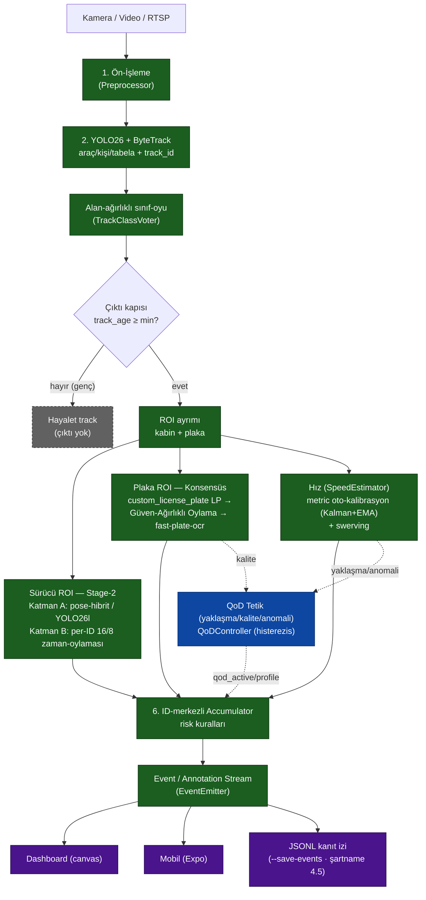

<div align="center">

# AURA — 5G & Yapay Zekâ ile Akıllı Yol Güvenliği

**Trafik kamerasından araç · plaka · sürücü davranışı · hız → CAMARA 5G QoD ile birleşen tek-komut monorepo**


</div>

> [!NOTE]
> **TEKNOFEST 2026** "5G & Yapay Zekâ ile Akıllı Yol Güvenliği" yarışması prototipi.
> Üretim kalitesinde, cross-platform (macOS + Windows), tek komutla ayağa kalkan monorepo.

AURA; trafik kamerası görüntüsünden **araç / plaka / sürücü davranışı / hız** tespiti yapan
gerçek bir YZ çekirdeği ile, bu çekirdeği **5G QoD** (CAMARA Quality-on-Demand) ve
**Number Verification** gibi telekom yetenekleriyle birleştiren bir sistemdir.

> [!IMPORTANT]
> **Gerçek / Mock sınırı:** YZ çekirdeğinin tamamı (CV/tracking/state-machine/OCR/speed/eval)
> **gerçektir**. Ağ/telekom/mobil katmanları (QoD gateway, NV API, 5G şebekesi) gerçek API
> sözleşmesini birebir taklit eden **mock**'lardır — final ortamında yalnızca endpoint/credential değişir.

---

## ✨ Öne çıkanlar (v2.3 + W1 — YOLO26 sunucu sürümü)

- **YOLO26 omurga, konfigüre edilebilir:** varsayılan Stage-1 dedektör **stok `yolo26l`**
  (sunucu, doğruluk-önce); **config profilleri** (`--profile server|laptop|v4-finetune`)
  `default.yaml` üzerine derin-merge edilir. Sürücü davranışı **YOLO26-pose** geometrisi +
  hibrit nesne kanıtı; plaka artık **eğitilmiş özel LP dedektörü** (`custom_license_plate`,
  YOLO26s, held-out **mAP50 0.983 / mAP50-95 0.706**) + format-öncelikli güven-ağırlıklı
  oylama (3-video A/B'de plaka 3/3 korundu → varsayılan; ağırlık yoksa loglu stok LP'ye düşer).
- **Plaka OCR varsayılanı `fast-plate-ocr`:** plakaya-özel hafif ONNX modeli
  (`global-plates-mobile-vit-v2`, ~5MB; ilk koşuda otomatik iner). 3 gerçek videoda
  **3/3 exact-match (CER 0.0)** ölçüldü — EasyOCR'ın video_3'te kalan il-kodu misread'ini
  (3→2, T→I) giderir; v1/v2 exact'ini korur. Kurulu değilse loglu `easyocr` fallback
  (`ocr_engine: easyocr|paddleocr|fastplate`). Ölçüm K-004 uyumlu: oran-bazlı, videoya-özel sabit yok.
- **ID-merkezli iki-katmanlı sürücü motoru:** Katman A (pose-hibrit model) + Katman B
  (`DriverStateEngine` per-track 16/8 zaman-oylaması) → tek-kare FP'leri eler, araç çıkınca tampon düşer.
- **FTR'ye hazır metrikler:** `python -m aura.eval --metrics-report` → video-düzeyi
  **P/R/F1 + plaka exact-match/CER + FPS** (dedektör A/B); `python -m aura.eval --map`
  doğrulama setinde **mAP**; hız mutlak-GT **MAE/MAPE** (kalibre kareler). `eval_results/`.
  Ölçülen (held-out): davranış makro-F1 **1.0** (3 video), araç sınıfı **%100**,
  stok `yolo26l` COCO-val2017 **mAP50-95 0.537 / mAP50 0.709** (5000 görsel).
- **W1 plaka & hız sağlamlaştırma:** küçük/karanlık LP kırpığına OCR-öncesi **CLAHE+2x
  iyileştirme** (`ocr_enhance_below_px`; deneysel dewarp modülü kaldırıldı — gerçek-video
  kazanımı motor seçiminden geldi); opsiyonel **PaddleOCR** motoru (`ocr_engine: paddleocr`,
  kuruluysa); hız varsayılanı **`metric` oto-kalibrasyon** (Kalman+EMA) + **swerving**;
  `tools/bench.py` ile FPS profilleme.
- **Eğitim boru hattı (YOLO26 fine-tune) — TAMAMLANDI (19 Haz 2026):** `python -m train`
  eğit→doğrula→metrik→best; `dataset --report` veri-dengeleme dağılımı (FTR §2). Açık veri
  (CC BY 4.0, PIL-doğrulanmış) toplandı: license_plate 9123 (8823 işlendi), seatbelt 3104,
  phone 659, smoking 557. YOLO26s fine-tune'lar bitti, **gerçek held-out mAP** (`weights/custom_*.metrics.json`):
  license_plate **0.983/0.706**, smoking **0.856/0.457**, seatbelt **0.895/0.546** (mAP50/mAP50-95).
  `custom_license_plate` A/B regresyonsuz → **varsayılan LP dedektör**; `custom_smoking`
  `pose.py`'da **ikinci-model** (phone kanıtını korur); `seatbelt` opsiyonel (dış-kamera görüş açısı).
- **Ağırlıksız da çalışır:** ağırlık yoksa pipeline deterministik *mock* modda tüm hattı
  (tespit→plaka→sürücü→hız→QoD→event) uçtan uca koşturur; demo ve testler model olmadan geçer.
- **QoD kanıtı:** A/B harness ölçülebilir delta üretir; **yaklaşma tetiği** (`vehicle_approach`)
  şartnamenin "TOGG yaklaşınca QoD" senaryosunu birebir karşılar — %40 QoD puanı için kanıt.
- **Denetim izi + sağlık:** `tools/test_video.py` annotated mp4 + JSON kanıt; `--save-events`
  JSONL iz (şartname 4.5); `python tools/doctor.py` tek-bakış ortam/hazırlık kontrolü.
- **Kalite:** 780+ unit test (mock modda; `tests/` + `services/`), `ruff` + `black`
  temiz (sürüm-pinli), GitHub Actions CI.
- **FTR rehberi:** [`ftr.md`](ftr.md) — Final Tasarım Raporu'nu bu kanıtlarla doldurma kılavuzu.

---

## 📊 Ölçülen Sonuçlar

Yalnızca repo ölçümleriyle doğrulanmış, held-out rakamlar:

| Metrik | Değer | Bağlam |
|---|---|---|
| 🎯 Plaka OCR | **3/3 exact-match · CER 0.0** | 3 gerçek video (`fast-plate-ocr`) |
| 🧠 Davranış makro-F1 | **1.0** | 3 video held-out |
| 🚗 Araç sınıfı doğruluğu | **%100** | held-out |
| 📦 Stok `yolo26l` mAP | **mAP50 0.709 · mAP50-95 0.537** | COCO-val2017 (5000 görsel) |
| 🚙 `license_plate` fine-tune | **mAP50 0.983 · mAP50-95 0.706** | YOLO26s held-out |
| 🚬 `smoking` fine-tune | **mAP50 0.856 · mAP50-95 0.457** | YOLO26s held-out |
| 🔒 `seatbelt` fine-tune | **mAP50 0.895 · mAP50-95 0.546** | YOLO26s held-out |
| 📡 QoD A/B delta | **plaka +33pp · küçük nesne +51pp · tespit +25pp** | sentetik kontrollü set |

---

## ✅ Durum Tablosu

Bir bakışta neyin **bittiği** (ölçülmüş) vs neyin **sürdüğü** (devam eden çalışma). K-004 gereği
biten ile süren net ayrılır; rakamlar repo ölçümleriyle (`eval_results/`, `config/default.yaml`) doğrulanmıştır.

| Bileşen | Durum | Kanıt / not |
|---|---|---|
| Plaka OCR (`fast-plate-ocr`) | ✅ | 3 gerçek videoda 3/3 exact-match, CER 0.0 (`config/default.yaml` ölçüm notu) |
| Davranış tespiti (telefon/sigara/swerving) | ✅ | held-out makro-F1 **1.0** (3 video; `eval_results/metrics_report.md`) |
| Araç tespiti / sınıfı | ✅ | held-out araç sınıfı doğruluğu **%100** |
| Stok `yolo26l` mAP (genel) | ✅ | COCO-val2017 mAP50-95 **0.537** / mAP50 **0.709** (`eval_results/map_yolo26l.json`) |
| QoD A/B kanıtı | ✅ | plaka +33pp · küçük nesne +51pp · tespit +25pp (sentetik kontrollü set) |
| YZ çekirdeği (CV/track/state/OCR/speed) | ✅ | gerçek kod; ağırlıksız mock modda da uçtan uca koşar |
| Telekom katmanı (QoD/NV/5G) | ⏳ mock | CAMARA sözleşmesini birebir taklit eder; final'de yalnız endpoint/credential değişir |
| Domain fine-tune (license_plate / smoking / seatbelt) | ✅ | YOLO26s held-out: lp **0.983/0.706**, smoking **0.856/0.457**, seatbelt **0.895/0.546** (`weights/custom_*.metrics.json`) |
| Özel LP dedektörü varsayılan | ✅ | `custom_license_plate` (A/B 3/3 plaka korundu) → `config/default.yaml` `plate.lp_detector.path` |
| Özel smoking ikinci-model | ✅ | `pose.py`'da roi_objects yanında; phone-kanıtı korunur (drop-in regresyonu A/B ile elendi) |
| Canlı/telefon kamera plaka okuma (19 Haz fix) | ✅ | sweet_spot neredeyse tam-kadraj (0.03–0.97 / 0.06–0.98); kaliteyi piksel-boyut kapısı sınırlar |
| Mobil (Expo/RN) | ✅ iskelet | NV sessiz giriş + canlı WS tespit panosu + QoD histerezis; tsc-temiz |

---

## 🎯 Puanlama Uyumu (TEKNOFEST 2026)

Puanlama: **%40 YZ · %40 QoD · %20 rapor** (FTR son teslim 28.06.2026).

| Eksen | Ağırlık | AURA'nın kanıtı |
|---|---|---|
| YZ başarımı | %40 | Gerçek CV çekirdeği; held-out davranış makro-F1 1.0, plaka 3/3 exact, araç %100, stok mAP50-95 0.537 |
| QoD kullanımı | %40 | A/B harness ölçülebilir delta üretir (+33/+51/+25pp); `vehicle_approach` tetiği şartnamenin "TOGG yaklaşınca QoD" senaryosunu birebir karşılar |
| Rapor / sunum | %20 | `ftr.md` doldurma rehberi + yayın-kalite Mermaid diyagramlar (`docs/diagrams/`) + şartname izlenebilirlik tablosu |

---

## 🚀 Hızlı Başlangıç

### macOS / Linux
```bash
./setup.sh                       # bağımlılıklar + model ağırlıkları + örnek veri + smoke (tek komut)
python tools/doctor.py           # ortam/hazırlık kontrolü (bağımlılık, cihaz, ağırlık, profil)
./run.sh                         # inference :8080, QoD mock :8081, NV mock :8082
AURA_PROFILE=server ./run.sh     # sunucu profili (yolo26l, CUDA, büyük imgsz)
```

### Windows (PowerShell 5.1+)
```powershell
git lfs install ; git lfs pull   # model ağırlıkları (LFS)
.\setup.ps1                      # kurulum (dev araçları için: .\setup.ps1 --dev)
.\run.ps1                        # inference :8080, QoD :8081, NV :8082
```
Sıfır Windows bilgisiyle kurulum/çalıştırma/CUDA/sorun-giderme için tam rehber:
**[`docs/windows.md`](docs/windows.md)**.

Ardından tarayıcıda:
- **Dashboard:** http://localhost:8080/
- **OpenAPI:** http://localhost:8080/docs

`setup` idempotenttir; ikinci çalıştırma tamamlanmış adımları atlar. Donanım backend'i
otomatik seçilir (Apple Silicon→MPS, NVIDIA→CUDA, diğer→CPU).

> [!WARNING]
> **Canlı / telefon kamera plaka okuma (19 Haz fix):** plaka OCR'ı tetikleyen `sweet_spot`
> bölgesi eskiden test-videolarının "araç alttan yaklaşır" geometrisine dardı (0.18–0.85 /
> 0.40–0.90) → telefonu elde tutunca araç bölgeye girmediği için OCR hiç çalışmıyordu. Artık
> neredeyse tam-kadraj (0.03–0.97 / 0.06–0.98); kaliteyi frame-bölgesi değil **piksel-boyut
> kapısı** (`lp_vote_min_px` / `min_pixel_height`) + oy havuzu + dürüstlük zırhları sınırlar.

---

## 🧠 Mimari Özeti



<details>
<summary>📐 Orijinal ASCII akış diyagramı</summary>

```
[Kamera] → [Ön-İşleme] → [YOLO26 + ByteTrack] ─┬─→ [Sürücü ROI] → Katman A: YOLO26-pose geometri+hibrit nesne
                              ↑                 │                  Katman B: per-ID 16/8 zaman-oylaması (engine)
                       [Sınıf oyu]             └─→ [Plaka ROI] → [custom_license_plate LP + Güven-Ağırlıklı Oylama + fast-plate-ocr]
                                                                          ↓
                                                          [QoD Tetik (yaklaşma/kalite/anomali)]
                              [ID-Merkezli Accumulator] ← [Hız + Swerving (yanal yörünge)]
                                          ↓
                              [Event / Annotation Stream] → Dashboard + Mobil + JSONL kanıt
```

</details>

Mimari kararlar (değişmez): cascade pipeline (Stage-1 YOLO26 dedektör → Stage-2 sürücü motoru:
**Katman A model + Katman B ID-merkezli zaman-oylaması**), ID-merkezli birikim, **landmark
kütüphanesi yok** (sürücü davranışı YOLO26-pose keypoint geometrisi veya YOLO26l detection ile —
`models.driver_state.backend`), kalibrasyon-bağımlı hız. Dedektör/cihaz/eşikler **config
profilleriyle** seçilir (`--profile`). Detay: [`docs/mimari.md`](docs/mimari.md).

**Yayın diyagramları (FTR §3.2):** yukarıdaki ASCII'nin yayın-kalite Mermaid karşılıkları
`docs/diagrams/`'tadır — [pipeline kuşbakışı](docs/diagrams/pipeline_kusbakisi.mmd) ·
[sistem topolojisi (gerçek↔mock)](docs/diagrams/sistem_topolojisi.mmd) ·
[plaka karar akışı](docs/diagrams/plaka_karar_akisi.mmd). Render: [`docs/diagrams/README.md`](docs/diagrams/README.md).

---

## 🛠️ Komut Rehberi

| Komut | Açıklama |
|---|---|
| `python bootstrap.py --help` | Kurulum seçenekleri |
| `python tools/doctor.py` | Ortam/hazırlık sağlık kontrolü (bağımlılık, cihaz, ağırlık, profil) |
| `python -m aura --help` | Ana inference pipeline (`--profile`, `--save-events` JSONL kanıt izi) |
| `python tools/test_video.py --help` | Gerçek video testi → annotated mp4 + JSON kanıt (`--profile` ile A/B) |
| `python -m aura.eval --metrics-report` | FTR §4 metrik raporu (P/R/F1 + plaka CER + FPS + dedektör A/B) |
| `python -m aura.eval --map` | Doğrulama setinde mAP (`eval_results/map_*.json`) |
| `python -m aura.eval --qod-comparison` | QoD A/B delta (şartname %40 QoD kanıtı) |
| `python tools/bench.py --help` | Video + profil → ortalama FPS + p50/p95 kare-süresi (`eval_results/bench_<device>.md`) |
| `python -m train --help` | YOLO26 eğitimi (detector / driver-state / dataset `--report`) |
| `python -m aura.synthetic` | Sentetik örnek video + ground-truth üret |
| `make help` | Geliştirme kısayolları (`make doctor` / `metrics` / `test`) |

**Config profilleri** (`config/profiles/*.yaml`, `default.yaml` üzerine derin-merge):
`--profile server` (yolo26l/CUDA/imgsz960) · `laptop` (yolo26s/MPS) · `v4-finetune`
(11-sınıf fine-tune). `AURA_PROFILE` env ile de seçilir.

Tüm `--help` çıktıları: [`docs/cli_referans.md`](docs/cli_referans.md).
Tüm API endpoint'leri: [`docs/api_referans.md`](docs/api_referans.md).

---

## 🗂️ Repo Haritası

| Dizin | İçerik |
|---|---|
| `aura/` | YZ çekirdeği (preprocessing, detection, stability, driver_state, plate, speed, accumulator, qod, events, pipeline, eval) |
| `services/` | `inference_api` (FastAPI) + `qod_mock` + `nv_mock` |
| `dashboard/` | Vanilla JS + Canvas profesyonel web arayüzü |
| `mobile/` | Expo (React Native) iskeleti |
| `train/` | YOLO26 fine-tune pipeline'ları |
| `tools/` | `test_video.py` (annotated mp4 + JSON kanıt), `doctor.py` (sağlık), `bench.py` (FPS profilleme) |
| `config/` | `default.yaml` — tek config kaynağı |
| `weights/` | Model ağırlıkları (bootstrap doldurur, `.gitignore`'lu) |
| `data/samples/` | Örnek video + ground-truth |
| `docs/` | Mimari, kurulum, CLI/API referans, değerlendirme, izlenebilirlik |
| `tests/` | pytest (state machine, voting, risk, QoD, API sözleşmeleri) |

---

## 📚 Dokümantasyon

<details>
<summary>Tüm belgeler (tabloyu aç)</summary>

| Belge | İçerik |
|---|---|
| [`docs/mimari.md`](docs/mimari.md) | Tam sistem mimarisi v2.0 |
| [`docs/diagrams/`](docs/diagrams/README.md) | Yayın-kalite Mermaid mimari diyagramları (FTR §3.2) |
| [`docs/kurulum.md`](docs/kurulum.md) | Platform-bazlı kurulum + sorun giderme |
| [`docs/calistirma.md`](docs/calistirma.md) | Uçtan uca demo senaryosu |
| [`docs/cli_referans.md`](docs/cli_referans.md) | Tüm `--help` çıktıları |
| [`docs/api_referans.md`](docs/api_referans.md) | Tüm endpoint'ler (curl + response) |
| [`docs/egitim.md`](docs/egitim.md) | Eğitim akışı + hyperparameter rehberi |
| [`docs/veri_seti.md`](docs/veri_seti.md) | Veri toplama + sentetik augmentasyon |
| [`docs/kalibrasyon.md`](docs/kalibrasyon.md) | Hız kalibrasyonu (tripwire / IPM) |
| [`docs/degerlendirme.md`](docs/degerlendirme.md) | Metrikler + QoD A/B protokolü |
| [`docs/mimari_ek_moduller.md`](docs/mimari_ek_moduller.md) | §8 opsiyonel modüller (lazy) |
| [`docs/sartname_izlenebilirlik.md`](docs/sartname_izlenebilirlik.md) | Şartname ↔ modül eşlemesi |
| [`docs/dagitim.md`](docs/dagitim.md) | Sunucu dağıtımı (CUDA, profil, servis, ölçeklenme) |
| [`docs/yol_haritasi.md`](docs/yol_haritasi.md) | Sıradaki işler (plaka dewarp+OCR, açık veri setleri, final hazırlığı) — Gemini destekli |
| [`ftr.md`](ftr.md) | Final Tasarım Raporu doldurma rehberi + doldurulabilir taslak |
| [`gemini.md`](gemini.md) | Gemini CLI kullanım rehberi (araştırma/ikinci-görüş) |

</details>

Her dizin kendi `README.md`'sini taşır.

---

## 🧪 Test & Kalite

```bash
pytest -m "not integration"        # 780+ unit test (mock modda, ağırlık gerektirmez)
ruff check . && black --check .    # lint + format
```
Model gerektiren testler `@pytest.mark.integration` ile işaretli (CI'da skip edilir).
CI iskeleti: [`.github/workflows/ci.yml`](.github/workflows/ci.yml) — ruff + black + pytest
(sürümler pinli: `ruff==0.15.17`, `black==26.5.1`).

---

## 📄 Lisans

MIT — bkz. [`LICENSE`](LICENSE).

---

> Bu proje geliştirilirken yapay zekâdan yararlanılmıştır.
