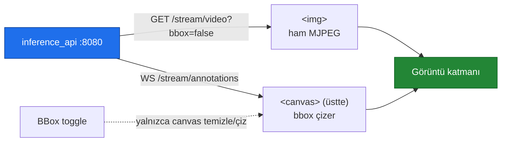

> 📂 **dashboard/** · Profesyonel Web Arayüzü · [⬅ repo kökü](../README.md)

<div align="center">

# 🖥️ `dashboard/` — Profesyonel Web Arayüzü


-ff6384?style=flat-square)


</div>

Vanilla HTML5 + ES6 Modules + Canvas + WebSocket + Chart.js (CDN). **npm/build yok.**
`inference_api` tarafından `/` üzerinden statik serve edilir.

---

## 🚀 Aç

```bash
./run.sh                       # sonra:
open http://localhost:8080/
```

---

## 🧩 Bileşenler

| Dosya | Sorumluluk |
|---|---|
| `index.html` | Grid düzen: header · kaynak · video · track listesi · QoD A/B |
| `assets/app.js` | Orkestratör (modülleri kurar, WS bağlar, durum yoklar) |
| `assets/video-renderer.js` | Canvas bbox overlay; **client-side bbox toggle** |
| `assets/camera-selector.js` | `GET /cameras` → dropdown + RTSP/video girişi |
| `assets/event-stream.js` | WS tüketici (events + annotations, auto-reconnect) |
| `assets/qod-panel.js` | QoD A/B Chart.js bar chart + `Eval Çalıştır` |
| `assets/style.css` | Dark/light tema (CSS custom properties) |

---

## 🎞️ İki-kanal video



1. `` ← `GET /stream/video?bbox=false` (ham MJPEG).
2. `<canvas>` üstte; `WS /stream/annotations`'tan gelen bbox'ları çizer.
3. **BBox toggle** yalnızca canvas'ı temizler/çizer → MJPEG kesilmez, sunucuya gidiş-geliş yok.

> [!TIP]
> **BBox toggle** istemci tarafında çalışır: MJPEG kesilmez ve sunucuya gidiş-geliş yapılmaz.

---

## ✨ Özellikler

- **Kamera seçici:** webcam / iPhone Continuity / video dosyası / RTSP URL.
- **Event log:** son 50 event, tip-bazlı renk (RISK kırmızı, PLATE yeşil, QoD sarı).
- **Track kartları:** plaka, hız, sürücü ikonları (📱🚬⚠️😴), QoD rozeti; tıkla → detay modalı.
- **QoD A/B paneli:** QoD OFF vs ON metrik karşılaştırması (şartname %40 kanıtı).
- **Tema:** dark/light toggle (header ◐).
