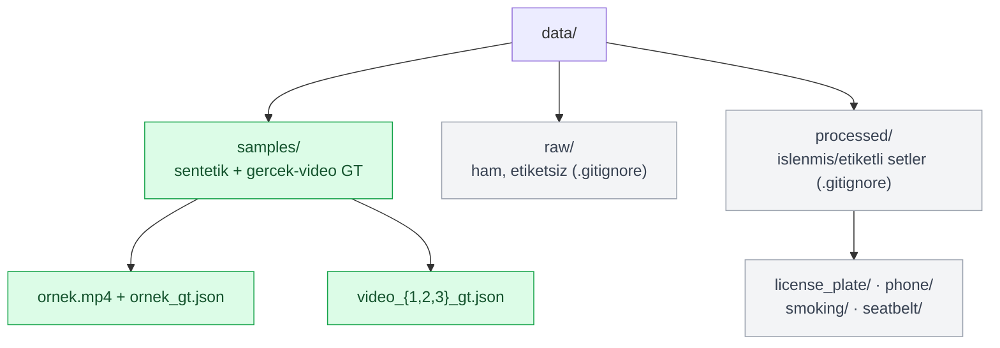
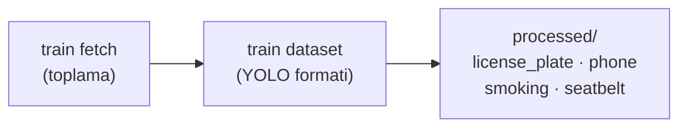

> 📂 **data/** · Veri Katmani · [⬅ repo koku](../README.md)

<div align="center">

# 🗂️ `data/` — Veri


</div>

---

## 📁 Dizin Yapisi



| Dizin | Icerik | Durum |
|---|---|---|
| `samples/` | Sentetik senaryo + gercek-video GT | ✅ izlenir |
| `raw/` | Ham/etiketlenmemis egitim verisi | 🟡 `.gitignore` |
| `processed/` | Islenmis/etiketli egitim setleri | 🟡 `.gitignore` |

---

## 🎬 `samples/`

Bootstrap tarafından üretilen **deterministik sentetik trafik senaryosu**:
- `ornek.mp4` — 90 kare, 3 araç, farklı şeritler/zamanlar, plaka varyasyonları (`.gitignore`'lu, yeniden üretilebilir).
- `ornek_gt.json` — kare-bazlı ground-truth (bbox, vehicle_class, plaka, sürücü durumu, hız).

Yeniden üret:
```bash
python -m roadguard.synthetic --out data/samples --frames 90
```

Ek olarak `samples/` gerçek test videolarının **video-düzeyi** ground-truth'unu da tutar:
- `video_{1,2,3}_gt.json` — gerçek test videosu GT'si (12 Haz 2026). Kare-kare bbox
  etiketi yoktur; **plaka ve davranış video-düzeyinde** verilir (GT plaka `34TC8532`).
  Videoların kendisi (`video_1.mp4` …) repo kökündedir.

> [!NOTE]
> Gerçek test videoları için **kare-kare bbox etiketi yoktur**; plaka ve davranış yalnızca **video-düzeyinde** verilir (GT plaka `34TC8532`).

<details>
<summary><b>📄 GT yapısı (<code>ornek_gt.json</code>)</b></summary>

```json
{ "video": "ornek.mp4", "fps": 30, "width": 640, "height": 360,
  "frames": [ { "frame": 0, "objects": [
    { "id": 1, "bbox": [x1,y1,x2,y2], "vehicle_class": "car",
      "plate": "34ABC123", "driver": {"phone": true, ...}, "speed_kmh": 40.0 } ] } ] }
```

</details>

> [!IMPORTANT]
> Gerçek TOGG veri seti geldiğinde `data/samples/` üzerine yazılır; `data/raw/` (ham, etiketsiz veri) `.gitignore`'ludur.

---

## 🧱 `raw/`

Ham/etiketlenmemiş eğitim verisi (git'e dahil edilmez). Eğitim akışı: `docs/veri_seti.md`.

---

## ⚙️ `processed/`

İşlenmiş/etiketli eğitim setleri (sınıf-başına klasör: `license_plate/`, `phone/`,
`smoking/`, `seatbelt/`). `train fetch` ile toplanır, `train dataset` ile YOLO formatına
hazırlanır. `.gitignore`'ludur (büyük). Kaynak/lisans manifesti: `train/datasets.yaml`.


