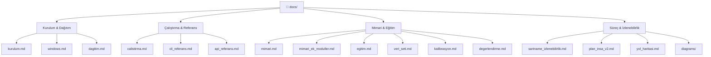

> 📂 **docs/** · Dokümantasyon · [⬅ repo köküne](../README.md)

# 📚 `docs/` — Dokümantasyon

---

## 🗂️ Belge Haritası

| Belge | İçerik |
|---|---|
| [`mimari.md`](mimari.md) | Tam sistem mimarisi v2.0 (YZ katmanı korunmuş + sistem katmanı) |
| [`mimari_ek_moduller.md`](mimari_ek_moduller.md) | §8 opsiyonel modüller (lazy, toggle) |
| [`kurulum.md`](kurulum.md) | Platform-bazlı kurulum + sorun giderme |
| [`windows.md`](windows.md) | Konsolide Windows kılavuzu (ön koşullar, CUDA, profiller, sorun giderme) |
| [`dagitim.md`](dagitim.md) | Sunucu dağıtımı (profil seçimi + servis kaldırma) |
| [`calistirma.md`](calistirma.md) | Uçtan uca demo senaryosu |
| [`cli_referans.md`](cli_referans.md) | Tüm `--help` çıktıları (gerçek çalıştırılmış) |
| [`api_referans.md`](api_referans.md) | Tüm endpoint'ler (curl + response) |
| [`egitim.md`](egitim.md) | Eğitim akışı + hyperparameter rehberi |
| [`veri_seti.md`](veri_seti.md) | Dataset toplama + sentetik augmentasyon stratejisi |
| [`kalibrasyon.md`](kalibrasyon.md) | Tripwire/IPM hız kalibrasyonu |
| [`degerlendirme.md`](degerlendirme.md) | Metrikler + QoD A/B protokolü |
| [`sartname_izlenebilirlik.md`](sartname_izlenebilirlik.md) | Şartname maddesi ↔ modül eşlemesi |
| [`plan_insa_v2.md`](plan_insa_v2.md) | Uygulama planı v2.0 (milestone'lar + inşa sırası) |
| [`yol_haritasi.md`](yol_haritasi.md) | Sıradaki işler / veri toplama yol haritası (FTR'ye dek) |
| [`diagrams/`](diagrams/) | FTR §3.2 için yayın-kalitesi Mermaid mimari diyagramları |

---

## 🧭 Belge İlişkileri

---

> [!NOTE]
> Tüm `.md` Türkçe, kod İngilizce. Her dizin kendi `README.md`'sini taşır.
