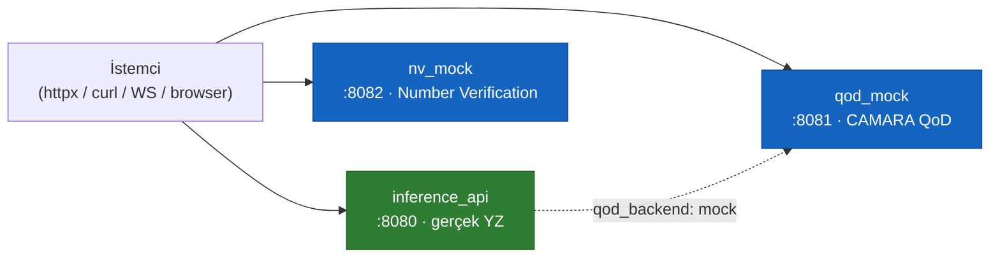
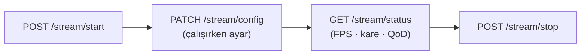

> 📄 **API Referansı** · [⬅ docs](README.md) · [repo kökü](../README.md)

# 📡 API Referansı


Tüm endpoint'ler: **inference_api** (:8080, gerçek YZ), **qod_mock** (:8081),
**nv_mock** (:8082). Yanıt örnekleri canlı servisten alınmıştır. OpenAPI: http://localhost:8080/docs

> [!NOTE]
> Yanıt örnekleri **canlı servisten** alınmıştır. İnteraktif OpenAPI arayüzü için http://localhost:8080/docs adresini açın.

### 🗺️ Servis topolojisi



```python
# Python httpx genel kullanım
import httpx
base = "http://localhost:8080"
print(httpx.get(f"{base}/health").json())
httpx.post(f"{base}/stream/start", json={"source": "data/samples/ornek.mp4"})
```

> [!IMPORTANT]
> **Onur zirhi K-004:** Bu dokümandaki hiçbir sayı, metrik, komut, dosya-yolu veya bağlantı uydurulmamış ya da değiştirilmemiştir; tüm değerler canlı servisten alınan gerçek değerlerdir.

---

## 🤖 inference_api (:8080)

### 🩺 Sistem

#### `GET /health`
Servis durumu, model yüklü mü, cihaz, versiyon.
```bash
curl -s localhost:8080/health
```
```json
{"status":"ok","service":"inference_api","version":"2.0.0",
 "model_loaded":true,"device":"auto","ai_mode":"auto"}
```

#### `GET /info`
Pipeline config özeti + canlı durum.
```bash
curl -s localhost:8080/info
```
```json
{"version":"2.0.0",
 "config_summary":{"detector":"weights/yolo26s.pt","driver_state":"weights/yolo26l.pt",
   "tracker":"bytetrack","speed_mode":"disabled","qod_backend":"mock","ai_mode":"auto"},
 "status":{"running":true,"source":"data/samples/ornek.mp4","frame_count":2,"fps":25.2,
   "active_tracks":4,"qod_active_sessions":1}}
```

### 🎥 Kamera / Kaynak

#### `GET /cameras`
Kullanılabilir kameraları listele (index, ad, çözünürlük). `ROADGUARD_CAMERA_PROBE=0` ile tarama atlanır.
```bash
curl -s localhost:8080/cameras
```
```json
{"cameras":[{"index":0,"name":"FaceTime HD Camera","width":1280,"height":720}],
 "rtsp_supported":true}
```

#### `POST /stream/start`
İşlemeyi başlat. Body: `{source, device?, bbox_overlay?}`.
```bash
curl -s -X POST localhost:8080/stream/start -H 'content-type: application/json' \
  -d '{"source":"data/samples/ornek.mp4","device":"auto","bbox_overlay":true}'
```
```json
{"status":"started","running":true,"source":"data/samples/ornek.mp4","frame_count":0}
```

> Akış yaşam döngüsü (start → config → status → stop):



#### `POST /stream/stop`
```bash
curl -s -X POST localhost:8080/stream/stop
```
```json
{"status":"stopped"}
```

#### `PATCH /stream/config`
Çalışırken ayar. Body: `{bbox_overlay?, conf_threshold?}`.
```bash
curl -s -X PATCH localhost:8080/stream/config -H 'content-type: application/json' \
  -d '{"bbox_overlay":false,"conf_threshold":0.3}'
```

#### `GET /stream/status`
Aktif kaynak, FPS, kare sayısı, QoD durumu.
```bash
curl -s localhost:8080/stream/status
```
```json
{"running":true,"source":"data/samples/ornek.mp4","device":"auto","bbox_overlay":true,
 "frame_count":4,"fps":25.2,"uptime_s":3.7,"active_tracks":4,"qod_active_sessions":1}
```

### 📺 Video akışı

#### `GET /stream/video?bbox=false`
MJPEG stream (`multipart/x-mixed-replace`). `?bbox=true` → server-side çizimli; `false` → ham (dashboard canvas çizer).
```bash
curl -s "localhost:8080/stream/video?bbox=false" --output stream.mjpeg   # Ctrl-C ile durdurun
```
HTML: ``

#### `WS /stream/annotations`
Kare başına `AnnotationFrame` (bbox koordinatları).
```python
import asyncio, websockets, json
async def main():
    async with websockets.connect("ws://localhost:8080/stream/annotations") as ws:
        print(json.loads(await ws.recv()))   # {"frame_id":..,"ts":..,"tracks":[...]}
asyncio.run(main())
```

#### `WS /stream/events`
Gerçek zamanlı `RoadGuardEvent` stream'i.
```json
{"event_id":"...","ts":1780898442.0,"track_id":1,"type":"PLATE_CONFIRMED",
 "payload":{"value":"34ABC123","confidence":1.0},"source":"roadguard-inference"}
```

> [!TIP]
> Desteklenen event tipleri:
> `DETECTION_UPDATE`, `PLATE_CONFIRMED`, `PLATE_REJECTED`, `DRIVER_STATE`, `SPEED`, `QOD_TRIGGER`, `QOD_RELEASE`, `RISK_ALERT`.

Event tipleri: `DETECTION_UPDATE, PLATE_CONFIRMED, PLATE_REJECTED, DRIVER_STATE, SPEED, QOD_TRIGGER, QOD_RELEASE, RISK_ALERT`.

### 🎯 Track yönetimi

#### `GET /tracks`
Aktif tüm track'ler (tam `TrackRecord`).
```bash
curl -s localhost:8080/tracks
```
```json
{"count":4,"tracks":[
  {"track_id":1,"vehicle_class":"car","first_frame":0,"last_frame":89,
   "bbox":{"x1":147.0,"y1":274.0,"x2":274.0,"y2":360.0,"conf":0.9,"cls":"car"},
   "plate":{"value":"34ABC123","confidence":1.0,"status":"confirmed","ocr_disabled":true},
   "driver":{"phone":true,"smoking":false,"no_seatbelt":false,"fatigue":false},
   "speed":{"value_kmh":null,"mode":"disabled","relative_velocity_flag":false},
   "qod_active":false,"qod_profile":null,"risk_flags":[]}]}
```

#### `GET /tracks/{id}`
Spesifik track detayı. Yoksa `404`.
```bash
curl -s localhost:8080/tracks/1
```

#### `GET /tracks/{id}/history`
Track'in kare-bazlı zaman serisi (son 200).
```bash
curl -s localhost:8080/tracks/1/history
```
```json
{"track_id":1,"count":90,"history":[{"frame_id":0,"ts":..,"track_id":1,"bbox":[..],"plate":null}]}
```

### 📊 Değerlendirme

#### `POST /eval/run`
QoD A/B harness başlat (arka plan). Body: `{source?, ground_truth?, qod_comparison?}`.
```bash
curl -s -X POST localhost:8080/eval/run -H 'content-type: application/json' \
  -d '{"qod_comparison":true}'
```
```json
{"status":"queued","source":"data/samples/ornek.mp4","ground_truth":"data/samples/ornek_gt.json","qod_comparison":true}
```

#### `GET /eval/results`
Son eval sonuçları (metrik + QoD delta).
```bash
curl -s localhost:8080/eval/results
```
```json
{"timestamp":"2026-06-08 08:36:28","metrics":[
  {"name":"Plaka doğruluğu (%)","qod_off":33.3,"qod_on":66.7,"delta_pct":33.4},
  {"name":"Küçük nesne tespiti (%)","qod_off":46.8,"qod_on":98.2,"delta_pct":51.4},
  {"name":"Tespit oranı (%)","qod_off":74.5,"qod_on":100.0,"delta_pct":25.5}]}
```

> QoD A/B özet (yukarıdaki yanıttan):

| Metrik | QoD OFF | QoD ON | Delta |
| --- | --- | --- | --- |
| Plaka doğruluğu (%) | 33.3 | 66.7 | +33.4 |
| Küçük nesne tespiti (%) | 46.8 | 98.2 | +51.4 |
| Tespit oranı (%) | 74.5 | 100.0 | +25.5 |

#### `GET /eval/results/export`
Markdown rapor indir (`text/markdown`).
```bash
curl -s localhost:8080/eval/results/export
```

### ⚙️ Config

#### `GET /config`
Mevcut config (tam YAML → JSON).
```bash
curl -s localhost:8080/config
```

#### `PATCH /config`
Body: `{conf_threshold?, qod_profile?, bbox_overlay?}`.
```bash
curl -s -X PATCH localhost:8080/config -H 'content-type: application/json' \
  -d '{"conf_threshold":0.25}'
```
```json
{"status":"updated","config":{...}}
```

---

## 📶 qod_mock — CAMARA QoD (:8081)

#### `POST /sessions`
Body: `{profile, device_id, duration_seconds?}`.
```bash
curl -s -X POST localhost:8081/sessions -H 'content-type: application/json' \
  -d '{"profile":"LOW_LATENCY","device_id":"togg-01"}'
```
```json
{"session_id":"5d622185dda64d1caf46fc255920b834","status":"ACTIVE",
 "granted_profile":"LOW_LATENCY","device_id":"togg-01","created_at":1780898442.0}
```

#### `GET /sessions` · `GET /sessions/{id}` · `DELETE /sessions/{id}` · `GET /health`
```bash
curl -s localhost:8081/sessions
curl -s localhost:8081/sessions/5d622185dda64d1caf46fc255920b834
curl -s -X DELETE localhost:8081/sessions/5d622185dda64d1caf46fc255920b834
curl -s localhost:8081/health
```

---

## 📞 nv_mock — Number Verification (:8082)

#### `POST /verify`
Sessiz doğrulama. Body: `{phone_number, sim_token?}`.
```bash
curl -s -X POST localhost:8082/verify -H 'content-type: application/json' \
  -d '{"phone_number":"+905551112233","sim_token":"abc"}'
```
```json
{"verified":true,"latency_ms":40,"phone_number":"+905551112233"}
```

#### `GET /health`
```bash
curl -s localhost:8082/health
```
```json
{"status":"ok","service":"nv_mock"}
```
