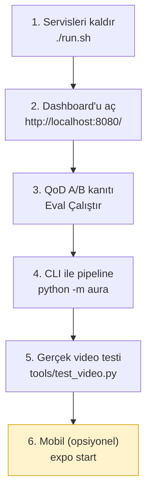

> 📄 **Çalıştırma — Uçtan Uca Demo Senaryosu** · [⬅ docs](README.md) · [repo kökü](../README.md)

# 🚀 Çalıştırma — Uçtan Uca Demo Senaryosu


## Ne yapar
Kurulu sistemde tipik bir demo akışını adım adım gösterir.

## 📋 Gereksinimler
`./setup.sh` tamamlanmış olmalı.

> [!TIP]
> **Önce sağlık kontrolü (önerilir):**
> ```bash
> python tools/doctor.py        # bağımlılık, cihaz (MPS/CUDA/CPU), ağırlık, config ✓
> ```
> Tüm çekirdek bileşenler ✓ ise sistem **gerçek modda** hazırdır. Ağırlık eksikse pipeline
> sessizce `mock` moda düşer (çökmez) — `python bootstrap.py` ile ağırlıkları indirin.

---

## 🧭 Senaryo Akışı



### 1️⃣ Servisleri kaldır
```bash
./run.sh
```
```powershell
.\run.ps1            # Windows (PowerShell 5.1+) — eşdeğer
```
inference_api (:8080), qod_mock (:8081), nv_mock (:8082) kalkar. Dashboard otomatik
örnek videoyla başlar (`AURA_AUTOSTART=1`).

> [!NOTE]
> Tüm Windows iş akışı (profil, env sözdizimi, sorun giderme): **[`windows.md`](windows.md)**.

### 2️⃣ Dashboard'u aç
```
http://localhost:8080/
```

| Panel | Konum | İşlev |
|---|---|---|
| **Kaynak seç** | sol | webcam / iPhone / video / RTSP |
| **Canlı video** | orta | MJPEG + Canvas bbox overlay |
| **BBox: ON/OFF** | — | client-side toggle (akış kesilmez) |
| **Event log** | — | PLATE_CONFIRMED, RISK_ALERT, QOD_TRIGGER… renk-kodlu |
| **Track listesi** | sağ | plaka, hız, sürücü ikonları, QoD rozeti; tıkla → detay |

### 3️⃣ QoD A/B kanıtı
Alt panelde **Eval Çalıştır** → harness aynı videoyu QoD OFF/ON koşar; Chart.js delta
gösterir (plaka doğruluğu, küçük nesne, tespit oranı).

### 4️⃣ CLI ile pipeline
```bash
.venv/bin/python -m aura --source data/samples/ornek.mp4 --max-frames 90 --log-level INFO
.venv/bin/python -m aura.eval --source data/samples/ornek.mp4 --qod-comparison
```

### 5️⃣ Gerçek video testi (kanıt üretimi)
Gerçek 4K test videosunu pipeline'dan geçirip **annotated mp4 + JSON kanıt** üretir
(şartname 4.5 izi: plaka kararı, sürücü bayrak süreleri, swerving, FPS):
```bash
.venv/bin/python tools/test_video.py --source ~/video_1.mp4 --device mps
#   → eval_results/video_1_annotated.mp4 + eval_results/video_1_summary.json
```
```powershell
.\dev.ps1 video-test C:\yol\video_1.mp4    # Windows; cihaz otomatik (--device auto)
#   → eval_results\video_1_annotated.mp4 + eval_results\video_1_summary.json
```

### 6️⃣ Mobil (opsiyonel)
```bash
cd mobile && EXPO_PUBLIC_API_URL=http://<LAN-IP>:8080 npx expo start
```
Sessiz NV girişi → canlı event listesi + QoD rozeti.

---

## 🧪 Örnekler
```bash
# Webcam ile canlı
curl -X POST localhost:8080/stream/start -H 'content-type: application/json' -d '{"source":"0"}'
# RTSP
curl -X POST localhost:8080/stream/start -H 'content-type: application/json' \
  -d '{"source":"rtsp://192.168.1.10:8554/stream"}'
```

> [!IMPORTANT]
> **Canlı / telefon kamera ile plaka okuma (19 Haz fix):** webcam/iPhone gibi **elde tutulan**
> kaynaklarda plaka OCR'ı, aracın kadrajdaki konumuna bakan `plate.sweet_spot` bölgesiyle
> kapılanır. Bu bölge eskiden test-videolarının "araç alttan yaklaşır" geometrisine ayarlı
> dardı (0.18–0.85 / 0.40–0.90) → telefonu çevirince araç bölgeye girmeyince OCR **hiç**
> tetiklenmiyordu. Varsayılan artık neredeyse tam-kadraj (**0.03–0.97 / 0.06–0.98**); kaliteyi
> frame-bölgesi değil **piksel-boyut kapısı** (`plate.lp_vote_min_px` / `plate.min_pixel_height`)
> + oy havuzu + dürüstlük zırhları sınırlar. Onaylanmamış plaka dashboard'da "plaka?" (partial
> kanıt izi) olarak görünür. Çok dar/uzak kadrajda plaka okunmuyorsa aracı kadraja yaklaştırın
> (piksel-yüksekliği `lp_qod_below_px` altındaysa `plate_too_small` QoD kalite tetiği düşer).

---

## 🛠️ Sorun Giderme
| Belirti | Çözüm |
|---|---|
| Dashboard boş video | `/stream/status` `running:true` mı? Kaynak doğru mu? |
| Event akmıyor | WS bağlantısı (tarayıcı konsolu); inference :8080 çalışıyor mu? |
| Mobil bağlanmıyor | `localhost` yerine LAN IP; emülatörde `10.0.2.2` |
| Eval "no_results" | Önce **Eval Çalıştır** / `POST /eval/run` |
| Canlı kamerada plaka okunmuyor | Aracı kadraja yaklaştır (plaka piksel-yüksekliği `lp_vote_min_px` üstü olmalı); `plate.sweet_spot` zaten neredeyse tam-kadraj (19 Haz fix). Onaysız okuma "plaka?" partial olarak görünür |
