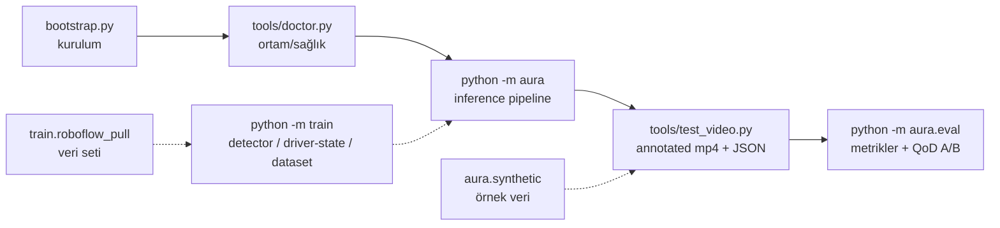
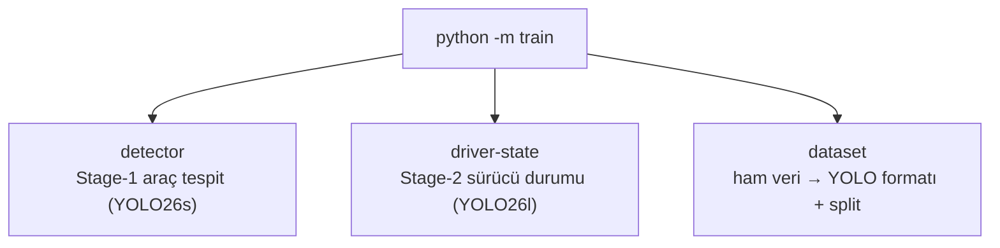

> 📄 **CLI Referansı** · [⬅ docs](README.md) · [repo kökü](../README.md)

# 🖥️ CLI Referansı

<div align="center">


</div>

> [!NOTE]
> Bu dosya **gerçek çalıştırılmış `--help` çıktılarından** üretilmiştir.
> Yeniden üretmek için: ilgili komutu `--help` ile çalıştırıp çıktıyı yapıştırın.

> [!IMPORTANT]
> **v2.3 yenileri:** çalıştırılabilirler `--profile {server,laptop,v4-finetune}` kabul eder
> (config profili; `AURA_PROFILE` env ile de). Yeni komutlar: `python tools/doctor.py`
> (ortam sağlık kontrolü), `python -m aura.eval --metrics-report` (FTR §4 P/R/F1 + dedektör A/B),
> `python -m train dataset --report` (veri-dengeleme). `--help` çıktısı her zaman günceldir.

---

## 📑 İçindekiler

| Komut | Amaç |
| --- | --- |
| [bootstrap.py](#bootstrappy) | kurulum |
| `python tools/doctor.py` | ortam/sağlık kontrolü (v2.3) |
| [python -m aura](#python--m-aura) | inference pipeline (`--profile`) |
| [python tools/test_video.py](#python-toolstest_videopy) | gerçek video testi (annotated mp4 + JSON kanıt) |
| [python -m aura.eval](#python--m-auraeval) | değerlendirme + QoD A/B + `--metrics-report` |
| [python -m train](#python--m-train) | eğitim (alt komutlar; doğrulama+metrik export) |
| [python -m aura.synthetic](#python--m-aurasynthetic) | örnek veri |
| [python -m aura.smoke](#python--m-aurasmoke) | smoke test |
| [python -m train.roboflow_pull](#python--m-trainroboflow_pull) | Roboflow |

### 🧭 Tipik akış



---

## 🚀 bootstrap.py

```
usage: python bootstrap.py [-h] [--skip-weights] [--skip-node] [--skip-deps]
                           [--force] [--dev]

RoadGuard kurulum bootstrap'i — tek komutla sıfırdan kurulum.

options:
  -h, --help      show this help message and exit
  --skip-weights  Model ağırlığı indirmeyi atla
  --skip-node     Node.js/mobil kurulumunu atla
  --skip-deps     pip kurulumlarını atla (yalnızca yapı/config/ağırlık)
  --force         Mevcut .venv'i sil ve sıfırdan kur
  --dev           Dev bağımlılıklarını da kur (pytest, ruff, black)

örnekler:
  python bootstrap.py                 # tam kurulum
  python bootstrap.py --dev           # dev bağımlılıklarıyla
  python bootstrap.py --skip-weights  # ağırlık indirmeden
  python bootstrap.py --force         # .venv'i sıfırdan kur
```

---

## 🧠 python -m aura

```
usage: python -m aura [-h] [--config PATH] [--source SOURCE]
                      [--device {auto,cpu,cuda,mps}] [--no-bbox]
                      [--max-frames MAX_FRAMES] [--save-events PATH]
                      [--log-level {DEBUG,INFO,WARNING}]

RoadGuard inference pipeline — araç, plaka, sürücü durumu ve hız tespiti.

options:
  -h, --help            show this help message and exit
  --config PATH         Config dosyası (varsayılan: config/default.yaml)
  --source SOURCE       Video dosyası, kamera index (0,1,2...) veya RTSP/HTTP
                        URL
  --device {auto,cpu,cuda,mps}
                        İşlem birimi (varsayılan: config'ten / auto)
  --no-bbox             Ham video akışı (annotation overlay olmadan)
  --max-frames MAX_FRAMES
                        En fazla bu kadar kare işle (test/demo için)
  --save-events PATH    Üretilen tüm event'leri JSONL olarak bu dosyaya yaz
                        (denetim/kanıt izi)
  --log-level {DEBUG,INFO,WARNING}
                        Log seviyesi (varsayılan: INFO)

örnekler:
  python -m aura --source 0
  python -m aura --source video.mp4 --device mps
  python -m aura --source rtsp://10.0.0.5:8554/cam --log-level DEBUG
```

---

## 🎬 python tools/test_video.py

```
usage: python tools/test_video.py [-h] --source PATH [--config PATH]
                                  [--device {auto,cpu,cuda,mps}]
                                  [--ai-mode {auto,real,mock}]
                                  [--max-frames MAX_FRAMES] [--output PATH]
                                  [--json PATH] [--no-video]

Videoyu RoadGuard pipeline'ından geçir; annotated mp4 + JSON özet üret.

options:
  -h, --help            show this help message and exit
  --source PATH         İşlenecek video dosyası
  --config PATH         Config (vars: config/default.yaml)
  --device {auto,cpu,cuda,mps}
                        İşlem birimi
  --ai-mode {auto,real,mock}
                        AI modu (vars: real — gerçek video testi aracı
                        olduğundan)
  --max-frames MAX_FRAMES
                        En fazla bu kadar kare işle
  --output PATH         Annotated mp4 çıktısı (vars:
                        eval_results/<video>_annotated.mp4)
  --json PATH           JSON özet çıktısı (vars:
                        eval_results/<video>_summary.json)
  --no-video            Video yazma (yalnız JSON özet)

örnekler:
  python tools/test_video.py --source ~/video_1.mp4
  python tools/test_video.py --source ~/video_3.mp4 --device mps --max-frames 200
```

> [!TIP]
> JSON özet şunları içerir: event sayıları, QoD tetik nedenleri, track başına
> plaka kararı + en güçlü 5 oy + `partial` aday, sürücü bayrak süreleri (kare),
> swerving kare sayısı, yanal yörünge (`trajectory`) ve işleme FPS'i — şartname
> 4.5 "her hedefin otomatik analiz sonucu üretildiğini kanıtlama" izi.

---

## 📊 python -m aura.eval

```
usage: python -m aura.eval [-h] [--source SOURCE]
                           [--ground-truth GROUND_TRUTH] [--qod-comparison]
                           [--output OUTPUT] [--config CONFIG]

RoadGuard model değerlendirme — doğruluk metrikleri ve QoD A/B karşılaştırması

options:
  -h, --help            show this help message and exit
  --source SOURCE       Test video dosyası
  --ground-truth GROUND_TRUTH
                        Ground-truth JSON dosyası
  --qod-comparison      QoD açık/kapalı senaryolarını karşılaştır (şartname
                        kanıtı)
  --output OUTPUT       Rapor çıktı dizini
  --config CONFIG       Config dosyası

örnekler:
  python -m aura.eval --source data/samples/ornek.mp4 --ground-truth data/samples/ornek_gt.json
  python -m aura.eval --source test.mp4 --ground-truth gt.json --qod-comparison
```

---

## 🏋️ python -m train

```
usage: python -m train [-h] {detector,driver-state,dataset} ...

RoadGuard model eğitimi

positional arguments:
  {detector,driver-state,dataset}
    detector            Stage-1 araç tespit modelini eğit (YOLO26s fine-tune)
    driver-state        Stage-2 sürücü durumu modelini eğit (YOLO26l fine-
                        tune)
    dataset             Ham veriyi YOLO formatına dönüştür ve split uygula

options:
  -h, --help            show this help message and exit

örnekler:
  python -m train detector --data data/detector.yaml --epochs 100
  python -m train driver-state --data data/driver.yaml --imgsz 320
  python -m train dataset --input data/raw/ --output data/processed/
```



<details>
<summary>🔧 python -m train detector</summary>

```
usage: python -m train detector [-h] --data DATA [--epochs EPOCHS]
                                [--imgsz IMGSZ] [--batch BATCH]
                                [--weights WEIGHTS]
                                [--device {auto,cpu,cuda,mps}]
                                [--project PROJECT] [--name NAME]

options:
  -h, --help            show this help message and exit
  --data DATA           data.yaml yolu
  --epochs EPOCHS
  --imgsz IMGSZ
  --batch BATCH
  --weights WEIGHTS     Başlangıç ağırlığı
  --device {auto,cpu,cuda,mps}
  --project PROJECT
  --name NAME
```

</details>

<details>
<summary>🔧 python -m train driver-state</summary>

```
usage: python -m train driver-state [-h] --data DATA [--epochs EPOCHS]
                                    [--imgsz IMGSZ] [--batch BATCH]
                                    [--weights WEIGHTS]
                                    [--device {auto,cpu,cuda,mps}]
                                    [--project PROJECT] [--name NAME]

options:
  -h, --help            show this help message and exit
  --data DATA           data.yaml yolu
  --epochs EPOCHS
  --imgsz IMGSZ         Cabin ROI küçük → 320 önerilir
  --batch BATCH
  --weights WEIGHTS
  --device {auto,cpu,cuda,mps}
  --project PROJECT
  --name NAME
```

</details>

<details>
<summary>🔧 python -m train dataset</summary>

```
usage: python -m train dataset [-h] --input INPUT --output OUTPUT
                               [--train TRAIN] [--val VAL] [--classes CLASSES]
                               [--seed SEED]

options:
  -h, --help         show this help message and exit
  --input INPUT      Ham veri dizini (images/ + labels/)
  --output OUTPUT    Çıktı dizini
  --train TRAIN      Train oranı
  --val VAL          Val oranı (kalan → test)
  --classes CLASSES  Virgülle sınıf listesi (örn. car,truck)
  --seed SEED
```

</details>

---

## 🧪 python -m aura.synthetic

```
usage: python -m aura.synthetic [-h] [--out OUT] [--frames FRAMES] [--fps FPS]
                                [--width WIDTH] [--height HEIGHT]

Sentetik trafik test videosu + ground-truth üret (deterministik).

options:
  -h, --help       show this help message and exit
  --out OUT        Çıktı dizini
  --frames FRAMES  Kare sayısı (varsayılan 90)
  --fps FPS        FPS (varsayılan 30)
  --width WIDTH    Genişlik
  --height HEIGHT  Yükseklik

örnek:
  python -m aura.synthetic --out data/samples --frames 90
```

---

## 💨 python -m aura.smoke

```
usage: python -m aura.smoke [-h] [--frames FRAMES]

RoadGuard adaptif smoke test (kurulum + pipeline doğrulama).

options:
  -h, --help       show this help message and exit
  --frames FRAMES  İşlenecek kare sayısı
```

---

## 🗂️ python -m train.roboflow_pull

```
usage: python -m train.roboflow_pull [-h] --workspace WORKSPACE
                                     --project PROJECT [--version VERSION]
                                     [--format FORMAT] [--output OUTPUT]

Roboflow veri seti indirme (ROBOFLOW_API_KEY gerekir).

options:
  -h, --help            show this help message and exit
  --workspace WORKSPACE
  --project PROJECT
  --version VERSION
  --format FORMAT       Etiket formatı (YOLO uyumlu)
  --output OUTPUT
```
