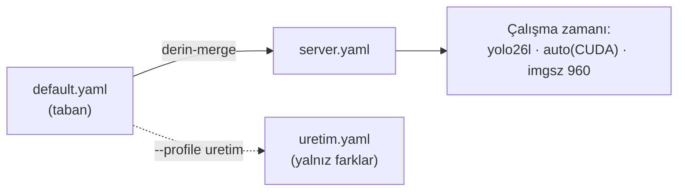
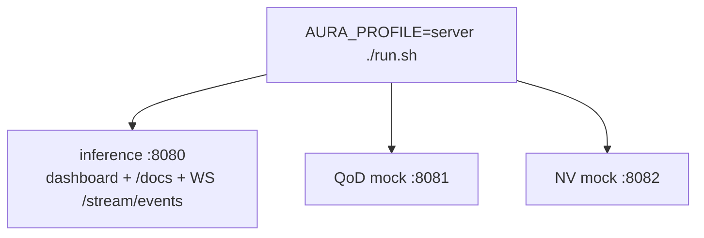
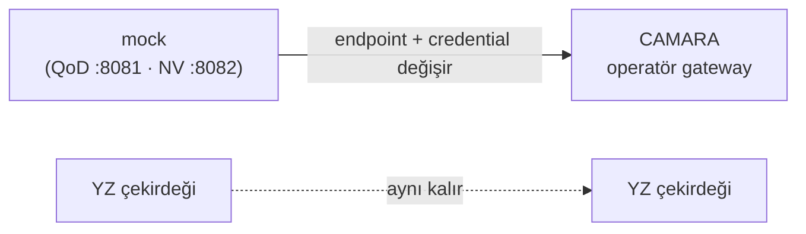

> 📄 **Sunucu Dağıtımı** · [⬅ docs](README.md) · [repo kökü](../README.md)

# 🚀 Sunucu Dağıtımı

<div align="center">


</div>

> [!NOTE]
> AURA **sunucuda** çalışacak şekilde tasarlanmıştır (edge cihaz hedefi yok). Bu doküman
> sunucu kurulumu, profil seçimi, servis olarak çalıştırma ve ölçeklenmeyi anlatır.

---

## 🧩 1. Profil seçimi

AURA'nın çalışma zamanı davranışı `config/profiles/*.yaml` ile seçilir (`default.yaml`
üzerine **derin-merge**). Sunucu için **`server`** profili:

```bash
AURA_PROFILE=server ./run.sh                      # servisler (env ile profil)
python -m aura --profile server --source rtsp://kamera   # CLI ile profil
```
```powershell
$env:AURA_PROFILE = "server"; .\run.ps1           # Windows eşdeğeri (env ile profil)
```

| Profil | Dedektör | Cihaz | imgsz | Hedef |
|---|---|---|---|---|
| `server` | yolo26l | auto (CUDA) | 960 | sunucu, maksimum doğruluk |
| `laptop` | yolo26s | auto (MPS) | 640 | geliştirme, hafif |
| `v4-finetune` | yolguvenligi_types_v4 | auto | 768 | 11-sınıf fine-tune (plaka-kritik) |

Kendi profilinizi yazın: `config/profiles/uretim.yaml` (yalnız farkları içerir) → `--profile uretim`.



---

## ⚙️ 2. CUDA kurulumu (sunucu)

`bootstrap.py` torch'u tespit edilen backend'e göre kurar. NVIDIA sunucuda CUDA'lı torch için:

```bash
python bootstrap.py --dev          # backend'i otomatik seçer
python tools/doctor.py             # "Cihaz (auto → cuda:0)  CUDA: <GPU>" görmelisiniz
```

> [!TIP]
> `runtime.device: auto` → CUDA varsa otomatik seçilir; sabit `cuda` da yazılabilir.

---

## 🛰️ 3. Servisleri çalıştırma

```bash
AURA_PROFILE=server ./run.sh
#   inference  → :8080  (dashboard + OpenAPI /docs + WS /stream/events)
#   QoD mock   → :8081
#   NV mock    → :8082
```

Portlar env ile değişir: `AURA_INFERENCE_PORT`, `AURA_QOD_MOCK_PORT`, `AURA_NV_MOCK_PORT`.



### 🐧 systemd örneği (üretim)

```ini
[Unit]
Description=AURA Inference API
After=network.target
[Service]
WorkingDirectory=/opt/aura
Environment=AURA_PROFILE=server
ExecStart=/opt/aura/.venv/bin/python -m uvicorn services.inference_api.main:app --host 0.0.0.0 --port 8080
Restart=always
[Install]
WantedBy=multi-user.target
```

### 🪟 Windows sunucu (PowerShell)

Linux dışı sunucuda aynı servisler `run.ps1` ile kalkar (profil + GPU dahil):

```powershell
$env:AURA_PROFILE = "server"; .\run.ps1
#   inference :8080 / QoD :8081 / NV :8082  (CUDA otomatik seçilir)
```

> [!NOTE]
> NVIDIA GPU: güncel sürücü yeterli; `bootstrap.py` CUDA'lı PyTorch'u (cu128) kendi kurar.
> Doğrulama: `.\dev.ps1 doctor --profile server` → "Cihaz (auto → cuda:0)" görünmeli.
> Tam Windows rehberi: [`windows.md`](windows.md).

<details>
<summary><strong>Task Scheduler ile servis (boot'ta otomatik başlat)</strong></summary>

systemd yerine Windows'ta planlı görev kullanın — yükseltilmiş bir PowerShell'de bir kez:

```powershell
$action  = New-ScheduledTaskAction  -Execute "powershell.exe" `
  -Argument "-NoProfile -ExecutionPolicy Bypass -File C:\opt\aura\run.ps1" `
  -WorkingDirectory "C:\opt\aura"
$trigger = New-ScheduledTaskTrigger -AtStartup
$env_v   = @{ AURA_PROFILE = "server" }   # profil için run.ps1 .env'i de okur
Register-ScheduledTask -TaskName "AURA Inference" -Action $action -Trigger $trigger `
  -RunLevel Highest -Description "AURA servisleri (inference/qod/nv)"
```

> [!TIP]
> Profili kalıcı kılmak için `.env` içine `AURA_PROFILE=server` yazmak en güvenlisidir;
> `run.ps1` `.env`'i otomatik yükler. Servis olarak kalıcı barındırma için NSSM veya
> Windows Service sarmalayıcısı da kullanılabilir.

</details>

---

## 🔄 4. Final ortamı: mock → gerçek

QoD ve Number Verification mock'ları gerçek CAMARA sözleşmesini taklit eder. Finalde yalnız
**endpoint + credential** değişir (YZ çekirdeği aynı kalır):

```yaml
qod:                 { backend: camara, endpoint: https://<operator-gateway>/qod }
number_verification: { backend: camara, endpoint: https://<operator-gateway>/nv }
```



---

## 📈 5. Performans / ölçeklenme

- **FPS:** sunucu CUDA'da MPS'e göre belirgin yüksektir. Büyük `imgsz` (960) doğruluk için;
  daha yüksek throughput gerekiyorsa `imgsz` 768/640'a düşürün veya `yolo26s` profiline geçin.
- **Gerçek FPS ölçümü (CUDA sunucuda):**
  ```bash
  python tools/bench.py --source <video.mp4> --device cuda --profile server
  #   → ortalama FPS + p50/p95 kare-süresi; eval_results/bench_cuda0.md
  ```
  Apple Silicon (MPS) üzerindeki sayılar **alt sınırdır** — gerçek dağıtım FPS'i için
  benchmark'ı hedef CUDA sunucuda koşun. `p95` kare-süresi (kuyruk gecikmesi) tek-kare
  ortalamadan daha bilgilendiricidir; akış SLA'sını ona göre belirleyin.
- **Batch akış:** birden çok kamera için her akışa ayrı pipeline örneği (process) verin; QoD
  yalnız kritik anda kalite yükselttiği için 5G kaynak kullanımı verimlidir.
- **OCR maliyeti:** plaka OCR yalnız `min_track_frames` geçen ve sweet-spot'taki araçlarda
  koşar; `lp_detector` sıkı kırpma OCR girdisini küçültür.

---

## ✅ 6. Sağlık kontrolü

```bash
python tools/doctor.py --profile server   # bağımlılık, cihaz, ağırlık, config, profil
```
```powershell
.\dev.ps1 doctor --profile server          # Windows eşdeğeri
```

> [!IMPORTANT]
> Tüm çekirdek bileşenler ✓ ise sistem gerçek modda hazırdır; ağırlık eksikse `python bootstrap.py`
> (Windows: `.\setup.ps1`).
