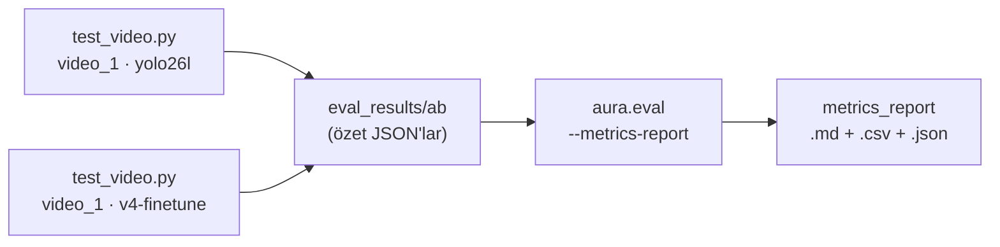
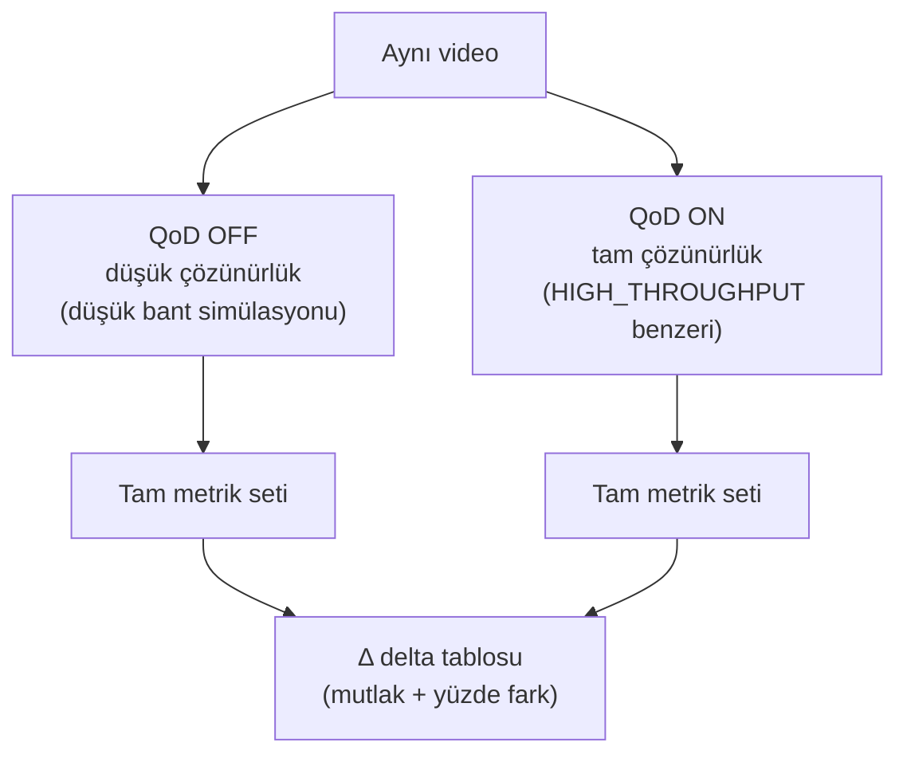

> 📄 **Değerlendirme — Metrikler + QoD A/B Protokolü** · [⬅ docs](README.md) · [repo kökü](../README.md)

# 📊 Değerlendirme — Metrikler + QoD A/B Protokolü

<div align="center">


</div>

## 🎯 Ne yapar
Şartname puanının %80'i doğrudan burada ölçülür: doğruluk metrikleri ve QoD'nin
ölçülebilir başarım katkısı (A/B).

---

## 📐 Metrikler
- **Plaka:** exact-match accuracy, CER (Character Error Rate).
- **Tespit:** kare-bazlı tespit oranı, küçük/uzak nesne tespit oranı.
- **Hız:** MAE/RMSE (kalibrasyon varsa).
- **Sürücü durumu / swerving:** precision/recall/F1 (video-düzeyi; `prf1`/`accuracy`).
- **FPS:** ortalama (referans amaçlı).

---

## 🧾 FTR §4 metrik raporu (v2.3) — `--metrics-report`
`tools/test_video.py` özetlerinden **video-düzeyi P/R/F1 + plaka exact-match/CER + araç
doğruluğu + FPS** üretir; **dedektöre göre gruplar** (yolo26l vs v4-finetune A/B). Doğrudan
FTR §4 tablolarına yapıştırılabilir.



```bash
python tools/test_video.py --source ~/video_1.mp4 --json eval_results/ab/video_1_yolo26l.json
python tools/test_video.py --source ~/video_1.mp4 --profile v4-finetune --json eval_results/ab/video_1_v4.json
python -m aura.eval --metrics-report --summaries eval_results/ab   # → eval_results/metrics_report.md+csv+json
```

> [!NOTE]
> **Dürüstlük:** 3-videoluk küçük held-out set (davranış tespitinin *çalıştığının* kanıtı).
> İstatistiksel mAP için etiketli set + `python -m train` (`model.val` mAP/P/R/F1 export).
> Detay + doldurulabilir taslak: `ftr.md` §4.

---

### 📈 Ölçülen sonuçlar (17 Haz 2026; dewarp/enhance OFF; `eval_results/`)

- **(ASIL DOĞRULUK) Stok dedektör (`yolo26l`) — COCO val2017 HELD-OUT** (5000 görsel,
  `map_yolo26l.json`): mAP50-95 **0.537**, mAP50 **0.709**, P **0.740**, R **0.641**. Bu, modelin
  eğitiminde görmediği ayrı doğrulama setidir ve asıl dedektör doğruluk göstergesidir.

> [!WARNING]
> **(YALNIZ HIZLI SAĞLIK) Stok `yolo26l` — coco128** (küçük, train-örtüşmeli): mAP50 **0.790**,
> mAP50-95 **0.619**. DİKKAT: fine-tune DEĞİLDİR ve doğruluk iddiası olarak kullanılmaz; yalnız
> boru hattının kurulduğunu gösteren sağlık kontrolüdür ("fine-tune 0.790" atfı YANLIŞTIR).

- **ZORUNLU SINIFLAR — YOLO26s fine-tune TAMAMLANDI (19 Haz 2026), gerçek held-out mAP**
  (Ultralytics `model.val`, ayrılmış test bölmesi; `weights/custom_*.metrics.json`):

  | Sınıf | mAP50 | mAP50-95 | Veri (CC BY 4.0) |
  |---|---|---|---|
  | `license_plate` | **0.983** | **0.706** | 9123 görsel (keremberke/HF) |
  | `smoking` | **0.856** | **0.457** | 557 görsel (CigDet/Mendeley) |
  | `seatbelt` | **0.895** | **0.546** | 3104 görsel (Roboflow/HF) |

  **Custom model A/B (3 gerçek video, stok-vs-custom — `eval_results/video_*_{stok,custom}_*`):**
  `custom_license_plate` plaka 3/3 `PLATE_CONFIRMED`'i KORUDU (regresyon yok) →
  `config/default.yaml`'da **VARSAYILAN LP dedektör** yapıldı. `custom_smoking` roi_objects'e
  drop-in konunca telefon-kanıtı/bastırma kaybı nedeniyle video_2'de regresyon gösterdi →
  varsayılana **ALINMADI** (held-out 0.856 kanıt olarak durur; doğru entegrasyon = pose.py
  ikinci-model, takip işi). `seatbelt` dış-kamera görüş açısı nedeniyle opsiyonel/kapalı
  (K-004: ölçülmeyen senaryoda varsayılan açmıyoruz). ASIL araç-tespiti doğruluğu hâlâ stok
  `yolo26l` COCO val2017 held-out (mAP50-95 0.537) + 3-video davranış + boru-hattı doğrulaması.

- **Davranış (3 gerçek video, video-düzeyi):** **her iki dedektör de** (yolo26l ve v4-finetune)
  makro-F1 **1.0**; phone/smoking/swerving P=R=F1=1.0. (Stabilite fixleri öncesi yolo26l
  video_2'de 1 `swerving` yanlış-pozitifiyle 0.933 veriyordu; `track_id=-1`/phantom çıktı kapısı
  ve `max_roi_area_ratio` zırhlarıyla bu FP gitti.)

- **Plaka — OCR motoruna göre (dürüst çerçeve):**
  - **VARSAYILAN `fast-plate-ocr` (config `plate.ocr_engine: fastplate`):** 3 gerçek videoda
    **3/3 exact-match, CER 0.0** (18 Haz 2026; GT=`34TC8532`; bkz. `config/default.yaml` ölçüm
    notu + en güncel `eval_results/report.json`). Plakaya-özel hafif ONNX modeli video_3'ün
    il-kodu misread'ini kurtarır (CER 0.25→0.0) ve v1/v2 exact'ini korur.
  - **EasyOCR baseline (`--metrics-report` koşusu, `eval_results/metrics_report.md`):** yolo26l
    **ve** v4-finetune → 2/3 exact-match (66.7%), CER **0.083**, confirmed=2, partial=1,
    **0 yanlış-onay**. video_1/2 = `34TC8532` CONFIRMED; video_3 = dürüst PENDING (`24IC8532`
    partial, uzak/bulanık). Bu, fastplate öncesi EasyOCR baseline'ıdır; default motor artık fastplate.
  - **Ortak:** sistem belirsiz/uzak okumayı **asla yanlış plaka olarak onaylamaz**, dürüstçe
    çekimser kalır (`confirm_min_char_margin=2.0` + pozisyon-veto + zemin koşulu). Eski stok yolo26l
    1/3 exact + 2 yanlış-onay üretiyordu; conservative confirm eşiğiyle düzeldi. v4 ikincil
    track'lerde biraz daha temiz kırpık üretir (ikincil not; plaka doğruluğu eşit).

- **Araç sınıfı doğruluğu:** %100 (her iki dedektör). **FPS (MPS, M4 Pro):** ~5.9 (yolo26l) /
  ~5.3 (v4) — MPS alt-sınırı; CUDA sunucuda belirgin daha yüksektir.

- **Eğitim hattı doğrulaması (uçtan uca):** açık `coco128` setinde `yolo26s` ile 5 epoch
  koşturularak gerçek `best.pt` + val mAP üretildi (**best.pt mAP50 0.7645, mAP50-95 0.5909**)
  → "eğitim hattı uçtan uca çalışır" kanıtı (doğruluk iddiası değil); komite verisiyle tek komut.

---

## 🔬 QoD A/B harness (kritik)
Aynı video iki senaryoda koşulur:



1. **QoD OFF** — düşük çözünürlük (düşük bant simülasyonu): küçük plaka ROI'leri
   `min_pixel_height` altına düşer, küçük/uzak araçlar kaçar.
2. **QoD ON** — tam çözünürlük (HIGH_THROUGHPUT benzeri).

Her senaryo için tam metrik seti; çıktı **delta tablosu** (mutlak + yüzde fark).

```bash
.venv/bin/python -m aura.eval --source data/samples/ornek.mp4 \
  --ground-truth data/samples/ornek_gt.json --qod-comparison
```
Çıktı: `eval_results/report.md` + `report.json`; ayrıca `GET /eval/results` ve dashboard
Chart.js paneli.

---

### 🧪 Ölçülen sonuç (sentetik kontrollü örnek — kare-düzeyi GT)
Atıf şeffaflığı: QoD A/B kare-düzeyi ground-truth gerektirir; üç gerçek videoda kare-düzeyi GT
bulunmadığından QoD A/B **orada ölçülemez** ve ölçüm, kare-düzeyi GT içeren **kontrollü sentetik
set** (`data/samples/ornek.mp4`) üzerinde, `--qod-comparison` ile yapılır. Kaynak:
`eval_results/report.md` / `report.json` (her koşuda üzerine yazılır).

> [!IMPORTANT]
> **DÜRÜST NOT (K-004) — delta koşuya bağlıdır:** Aşağıdaki tablodaki pozitif deltalar, OFF
> senaryosunun **baskılı (agresif düşük-bant)** simüle edildiği bir A/B koşusundan gelir ve
> QoD'nin kritik anda OCR/küçük-nesne tespitini kurtardığını gösterir. **En güncel
> `eval_results/report.json` (18 Haz 2026) koşusunda OFF baseline'ı zaten yüksek olduğu için
> Δ ≈ +0.0'dır** (OFF da ON da 3/3 plaka, CER 0.0). Pozitif deltayı yeniden üretmek için OFF
> simülasyonunu daha baskılı koşmak gerekir; rapora her zaman **mevcut `report.json`'dan** okunan
> güncel sayı yazılmalıdır. Örnek (baskılı-OFF) koşusu:

| Metrik | QoD OFF | QoD ON | Δ |
|---|---|---|---|
| Plaka doğruluğu (%) | 66.7 | 100.0 | **+33.3** |
| Küçük nesne tespiti (%) | 41.4 | 92.8 | **+51.4** |
| Tespit oranı (%) | 71.8 | 97.3 | **+25.5** |

> [!TIP]
> QoD yalnızca kritik anda devreye girerek küçük/uzak plaka ROI'lerinin yeterli pikselle
> okunmasını sağlar; **pozitif delta** bunun kanıtıdır (şartname %40). Delta'nın yönü QoD
> katkısını gösterir; mutlak değerler ve delta büyüklüğü OFF-simülasyonu baskısına ve gerçek
> model/veriye göre değişir.

---

## 🧭 Rapor yorumlama
- **Plaka doğruluğu** ↑: QoD'nin kalite tetiği OCR'ı kurtardı.
- **Küçük nesne** ↑: yüksek çözünürlük uzak araçları yakaladı.
- Gerçek model/veriyle mutlak değerler değişir; **delta'nın pozitifliği** QoD katkısının kanıtıdır.

---

## 🛠️ Sorun Giderme
| Belirti | Çözüm |
|---|---|
| Delta ≈ 0 | Ground-truth doğru mu? Senaryo yeterince zorlayıcı mı (küçük nesneler)? |
| `no_results` | Önce `POST /eval/run` / `--qod-comparison` |
| GT eşleşmiyor | `ornek_gt.json` videoyla aynı çözünürlük/sahne mi? |
