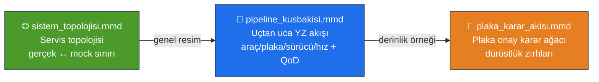
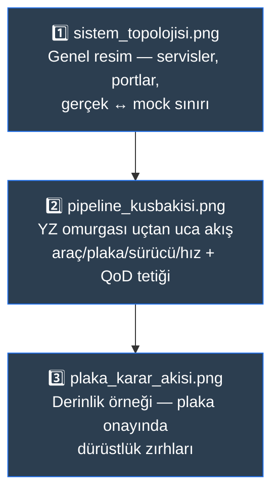

> 📂 **docs/diagrams/** · Yayın Diyagramları (FTR §3.2) · [⬅ docs/](../mimari.md) · [⬅ repo kökü](../../README.md)

<div align="center">

# 🧠 RoadGuard — Yayın Diyagramları

### FTR §3.2 "Çözüm Mimarisi"


-FF3670?style=flat-square)


</div>

Bu klasör, Final Tasarım Raporu (FTR) **§3.2 Çözüm Mimarisi** bölümü için yayın
kalitesinde Mermaid mimari diyagramlarını içerir. Her diyagram **gerçek koda/mimariye
sadıktır** (uydurma yok); kaynak dosyalar her `.mmd` başlığındaki `%%` yorumlarında
gösterilir.

> [!IMPORTANT]
> **Onur zırhı (K-004):** Her diyagram gerçek koda/mimariye sadıktır — uydurma yok.
> Kaynak dosyalar her `.mmd` başlığındaki `%%` yorumlarında gösterilir.

---

## 🗂️ Diyagram Haritası

| Diyagram | Açıklama |
|---|---|
| [`pipeline_kusbakisi.mmd`](pipeline_kusbakisi.mmd) | **Uçtan uca akış:** ham video → ön-işleme → YOLO26+ByteTrack+alan-ağırlıklı sınıf-oyu → ROI ayrımı → Sürücü ROI (Katman A pose-hibrit/YOLO26l + Katman B per-ID 16/8 zaman-oylaması) ∥ Plaka ROI (YOLO11n LP + güven-ağırlıklı kalıcı oy + pozisyon-veto + OCR) → hız (metric oto-kalibrasyon + swerving) → ID-merkezli accumulator → event/annotation stream → Dashboard + Mobil + JSONL kanıt. QoD tetikleri (yaklaşma / kalite / anomali) ayrı blokta gösterilir. Kaynak: `roadguard/pipeline/pipeline.py`. |
| [`sistem_topolojisi.mmd`](sistem_topolojisi.mmd) | **Servis topolojisi ve gerçek↔mock sınırı:** `inference_api (:8080)` (MJPEG `/stream/video`, WS `/stream/annotations`, WS `/stream/events`, `/eval`) + `qod_mock (:8081)` (CAMARA QoD) + `nv_mock (:8082)` (Number Verification) + Dashboard + Mobil. YZ çekirdeği **gerçek** (yeşil), telekom katmanı **mock** (kırmızı, kesik çizgi). Kaynak: `docs/mimari.md §8`, `services/*/README.md`. |
| [`plaka_karar_akisi.mmd`](plaka_karar_akisi.mmd) | **Plaka onay karar ağacı:** sweet-spot → LP dedektör sıkı kırpma → boyut-farkında ağırlık → format-öncelikli kalıcı oy havuzu → pozisyon-hizalı karakter füzyonu (`char_margin`) → zemin-koşulu (`confirm_peak_weight`) → **CONFIRMED** veya dürüst **PENDING + partial**. Dürüstlük zırhları (turuncu karar düğümleri) vurgulanmıştır: yanlış plaka asla onaylanmaz. Kaynak: `docs/mimari.md §5`, `roadguard/plate/{reader,normalize}.py`, `config/default.yaml plate.*`. |

### Diyagramlar arası ilişki (genel bakış)



---

## 🖼️ Render (PNG/SVG üretimi)

Mermaid CLI (`mmdc`) ile her `.mmd` görüntüye çevrilir. **Kurulum/çalıştırma talimatıdır;
bu klasör kaynak (.mmd) tutar, üretilmiş görseller commit edilmez.**

```bash
# Tek seferlik (kurulum gerektirir; npx ilk çağrıda indirir):
npx @mermaid-js/mermaid-cli -i pipeline_kusbakisi.mmd  -o pipeline_kusbakisi.png
npx @mermaid-js/mermaid-cli -i sistem_topolojisi.mmd   -o sistem_topolojisi.png
npx @mermaid-js/mermaid-cli -i plaka_karar_akisi.mmd   -o plaka_karar_akisi.png

# Yüksek çözünürlük / koyu tema (rapora gömmek için):
npx @mermaid-js/mermaid-cli -i pipeline_kusbakisi.mmd -o pipeline_kusbakisi.svg -t dark -b transparent -s 2
```

> [!TIP]
> **Alternatif görüntüleme yolları:** VS Code "Markdown Preview Mermaid Support" eklentisi,
> GitHub `.md` önizleme (```mermaid fence), veya https://mermaid.live (kopyala-yapıştır).

---

## 📊 FTR §3.2'ye gömme

FTR raporunun **§3.2 "Çözüm Mimarisi" (15 puan)** bölümüne aşağıdaki sırayla gömülür:



1. **`sistem_topolojisi.png`** — önce genel resim: servisler, portlar ve gerçek↔mock
   sınırı (jüriye "YZ çekirdeği gerçek, telekom katmanı sözleşme-taklidi mock" mesajını
   tek bakışta verir; "final ortamda yalnızca endpoint/credential değişir" notuyla).
2. **`pipeline_kusbakisi.png`** — sonra YZ omurgasının uçtan uca akışı (araç/plaka/sürücü/
   hız + QoD'un kritik anda nasıl tetiklendiği — %40 QoD puanı kanıtı).
3. **`plaka_karar_akisi.png`** — derinlik örneği olarak plaka onayındaki dürüstlük zırhları
   (şartname 4.5 "kanıtlanamayan hedef puanlanmaz" ilkesinin somut tasarımı).

> [!NOTE]
> **Önerilen yerleşim:** her görselin altına 1-2 cümlelik şekil-altı yazısı (yukarıdaki tablo
> açıklamaları kısaltılarak). Render edilen PNG/SVG'ler rapor kaynağına (Word/LaTeX/Docs)
> gömülür; `.mmd` kaynakları repoda izlenebilirlik için kalır. Diyagramlar `docs/mimari.md`
> ve kök `README.md`'den de bağlanır ("yayın diyagramları: docs/diagrams/").
