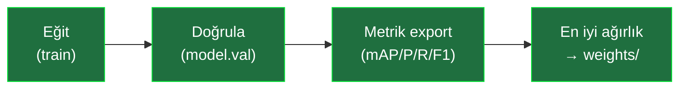
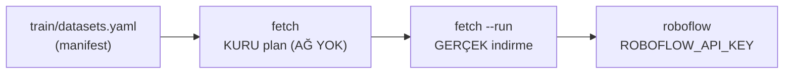
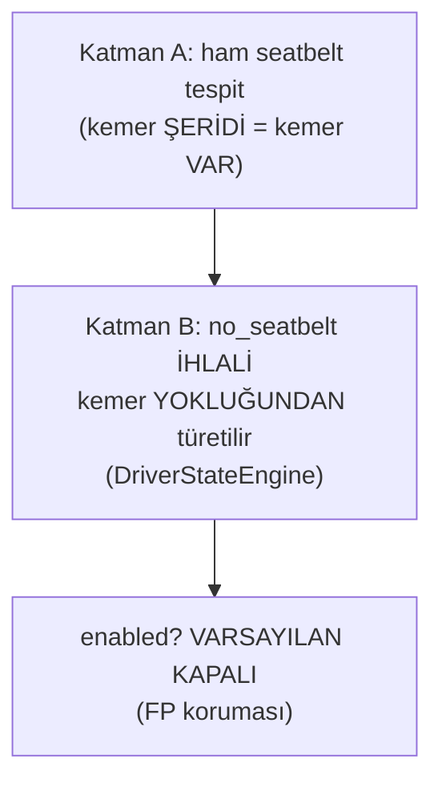

> 📄 **Eğitim Akışı — YOLO26 fine-tune** · [⬅ docs](README.md) · [repo kökü](../README.md)

# 🎓 Eğitim Akışı — YOLO26 fine-tune (detaylı)

<div align="center">


-7952B3?style=flat-square)


</div>

> [!NOTE]
> Bu belge, RoadGuard'ın YOLO26 modellerini kendi/komite verinizle nasıl eğiteceğinizi,
> veriyi nasıl dengeleyeceğinizi ve sonuçları **FTR raporuna** (§2 Veri Seti, §4 Sınama)
> nasıl bağlayacağınızı uçtan uca anlatır. Eğitim tool'u `train/` altındadır ve
> **eğit → doğrula (`model.val`) → metrik export (mAP/P/R/F1) → en iyi ağırlığı `weights/`'e
> kopyala** akışını otomatik yürütür.



---

## 📍 0. Mevcut durum (dürüst)

- RoadGuard'ın varsayılan araç dedektörü **stok `yolo26l`** (sunucu); sürücü davranışı **YOLO26-pose**
  geometrisiyle fine-tune'suz çalışır. Plaka kırpma artık **eğitilmiş `custom_license_plate`**
  (YOLO26s) varsayılandır; ağırlık yoksa loglu stok LP'ye/geniş-crop'a düşer → **plaka/davranış
  demosu eğitim olmadan da** çalışır.
- 11-sınıf fine-tune `yolguvenligi_types_v4` (yolov8m, held-out mAP50 .788) açık-kaynak köprü
  veriyle eğitilmişti (`--profile v4-finetune`).

> [!IMPORTANT]
> **YENİ (19 Haz 2026): zorunlu sınıflar için YOLO26s fine-tune TAMAMLANDI.** Dört gerçek açık
> veri seti indirilip işlendi (hepsi CC BY 4.0, PIL-doğrulanmış; bkz. `docs/veri_seti.md`):
> `license_plate` 8823, `seatbelt` 3104, `smoking` 557, `phone` 659. Eğitim taban=`weights/yolo26s.pt`,
> `imgsz 640`, 35 epoch, `--patience 12`, MPS (`runs/train/<sınıf>_s/`).

**Gerçek held-out mAP** (Ultralytics `model.val` ayrılmış test bölmesi; `weights/custom_*.metrics.json`):

| Sınıf | mAP50 | mAP50-95 | Durum |
|---|---|---|---|
| `license_plate` | **0.983** | **0.707** | ✅ varsayılan LP dedektör |
| `smoking` | **0.856** | **0.457** | ✅ `pose.py` ikinci-model |
| `seatbelt` | **0.895** | **0.546** | 🟡 opsiyonel (dış-kamera açısı) |

`custom_license_plate` 3-video A/B'de regresyonsuz →
**varsayılan LP dedektör** (`config/default.yaml` `plate.lp_detector.path`); `custom_smoking`
`pose.py`'da ikinci-model (phone-kanıtını korur); `seatbelt` opsiyonel (dış-kamera görüş açısı).

> [!TIP]
> **Komite TOGG/etiketli verisi paylaşıldığında** aynı akışla `minibus`/`fatigue` dahil tüm
> sınıflar için **YOLO26'yı fine-tune edin** → hem mandate (YOLO26) hem en yüksek doğruluk. Boru
> hattı uçtan uca doğrulandı (aşağıda §6).

---

## ⚙️ 1. Gereksinimler

- `./setup.sh` ile kurulmuş ortam (ultralytics 8.4 + torch). Kontrol: `python tools/doctor.py`.
- YOLO formatında etiketli veri (bkz. `docs/veri_seti.md`).
- Cihaz `auto` (CUDA→MPS→CPU otomatik). Sunucuda CUDA; geliştirmede MPS.

---

## 📥 1.5. Eksik-sınıf verisi çekme (manifest → plan → indirme)

Eksik sınıflar (`cigarette/smoking`, `seatbelt`, `fatigue`, `minibus`, `license_plate`)
için açık veri setleri `train/datasets.yaml` manifestinde toplanır (kaynak + lisans +
RoadGuard taksonomisine eşleme). Önce **planı** görün (ağ kullanmaz), sonra gerçek indirin:



```bash
python -m train fetch                  # KURU plan: kaynak/lisans/eşleme/çıktı (AĞ YOK)
python -m train fetch --class minibus  # tek sınıfın planı
python -m train fetch --run            # GERÇEK indirme (roboflow → ROBOFLOW_API_KEY)
```

> [!WARNING]
> Plan, taksonomiyle çelişen eşlemeleri `⚠` ile işaretler; `sources: []` olan sınıflar
> (teyitli set yok → `fatigue`/`license_plate`) boş listelenir. Kaggle/URL kaynakları
> `--run` ile otomatik inmez (manuel indirme talimatı basılır). Lisanslar **FTR §5
> kaynakçaya** yazılmalıdır (açık-kaynak veri kullanımı şartnamede serbest).

---

## 🗂️ 2. Veri hazırlama (split + data.yaml + DENGE RAPORU)

```bash
python -m train dataset \
  --input data/raw/ --output data/processed/ \
  --classes car,truck,bus,minibus,license_plate,person,phone,cigarette,seatbelt \
  --train 0.8 --val 0.1            # kalan %10 → test
```

`data/processed/{train,val,test}/{images,labels}` + `data.yaml` üretir **ve sonunda
veri-dengeleme raporunu basar** (FTR §2 için kopyalanabilir). Sadece rapor için:

```bash
python -m train dataset --report --output data/processed/
# → split başına görüntü + sınıf-örnek dağılımı + dengesizlik oranı (max/min)
```

> [!CAUTION]
> **Dengeleme (data balancing):** dengesizlik oranı > 3 ise uyarı verir. Çözümler: az sınıfa
> ek örnek toplama/etiketleme, oversampling, ve augmentasyonu o sınıf lehine güçlendirme.

---

## 🎯 3. Stage-1 dedektör (YOLO26 fine-tune)

```bash
python -m train detector --data data/processed/data.yaml \
  --weights weights/yolo26l.pt \      # YOLO26 base (mandate); hafif için yolo26s.pt
  --epochs 100 --imgsz 768 --batch 16 --device auto \
  --patience 50 --lr0 0.01 \          # early-stop + öğrenme oranı (opsiyonel)
  --out custom_detector.pt
```

Akış: eğitir → `model.val` ile doğrular → `weights/custom_detector.pt` + yanında
`custom_detector.metrics.json` (mAP50, mAP50-95, precision, recall, f1) yazar.

---

## 🚗 4. Stage-2 sürücü durumu (YOLO26 fine-tune, 320px)

```bash
python -m train driver-state --data data/driver/data.yaml \
  --weights weights/yolo26l.pt --imgsz 320 --epochs 100 --device auto \
  --out custom_driver.pt
```

> [!NOTE]
> Yorgunluk bir **detection sınıfı** olarak öğrenilir (kapalı göz/esneme/baş düşmesi);
> MediaPipe/landmark **kullanılmaz** (mimari kararı, `docs/mimari.md`). Eğitimli ağırlık varsa
> `models.driver_state.backend: yolo` ile pose yerine bu kullanılır.

**Kemer (seatbelt) iki-katman tasarımı:** Model ham **`seatbelt`** (kemer ŞERİDİ = kemer VAR)
tespit eder; sınıf listesi `[phone, smoking, seatbelt, fatigue]`. **`no_seatbelt` İHLALİ Katman
B'de kemerin yokluğundan TÜRETİLİR** (`DriverStateEngine`) ve `models.driver_state.no_seatbelt.enabled`
ile aç/kapa edilir (**VARSAYILAN KAPALI** — kemer görünmeyen footage'da FP koruması; net kemer
görünen kamerada açın). **Domain modeli** (`custom_driver.pt`, jui/driver-behaviors gibi) için
`backend: yolo` + `path: weights/custom_driver.pt`; `imgsz 640` (320 küçük telefonu kaybediyordu).



**Birden çok sürücü-davranış veri setini birleştirme:** `python -m train.merge_driver_datasets`
(spec: `train/configs/driver_merge.json`) — farklı kaynakların sınıflarını RoadGuard taksonomisine
(phone/smoking/seatbelt/fatigue) eşleyip tek YOLO setinde toplar.

---

## 🔁 5. Inference'a alma (config swap / profil)

`config/default.yaml`:

```yaml
models:
  detector: { path: weights/custom_detector.pt, conf: 0.30 }   # fine-tune → conf 0.25-0.35
  driver_state: { path: weights/custom_driver.pt, backend: yolo }
```

veya kalıcı bir profil dosyası (`config/profiles/komite.yaml`) yazıp `--profile komite` ile
açın. `python tools/doctor.py --profile komite` ile doğrulayın. `./run.sh` yeniden başlatın.

---

## ✅ 6. Boru hattı doğrulaması (yapıldı)

Eğitim tool'u, açık `coco8` setiyle (yolo26s, 1 epoch) **uçtan uca doğrulandı**: gerçek
`best.pt` + gerçek doğrulama metriği üretti (örnek koşu: mAP50≈0.42, P≈0.15, R≈0.63 —
8-görüntülük smoke; sadece pipeline'ın çalıştığını kanıtlar). Komite verisiyle gerçek
sayılar bu komutlarla üretilir:

```bash
python -m train detector --data coco128.yaml --weights weights/yolo26s.pt --epochs 3  # hızlı kontrol
```

---

## 🎛️ 7. Hyperparameter rehberi

| Parametre | Öneri | Not |
|---|---|---|
| `--weights` | `yolo26l.pt` (doğruluk) / `yolo26s.pt` (hız) | YOLO26 base; mandate |
| `--epochs` | 100–300 | `--patience` ile early-stop |
| `--imgsz` | detector 768 (sunucu) / 640, driver 320 | büyük imgsz = küçük/uzak nesne |
| `--batch` | GPU belleğine göre 8–32; `-1` oto (CUDA) | OOM'da düşürün |
| `--lr0` | 0.01 (vars) | küçük veri → 0.001 daha kararlı |
| augmentasyon | mozaik+flip+HSV+ölçek (vars açık) | `--no-augment` ile kapatılır (ablation) |

---

## 📊 8. FTR'ye bağlama (puan)

- **§2 Veri Seti (20p):** `dataset --report` çıktısını (split + sınıf dağılımı + dengesizlik
  oranı) + augmentasyon listesi + açık-kaynak set kaynakçası rapora koyun. Detay: `docs/veri_seti.md`.
- **§5 Kaynakça:** `python -m train fetch` planının sonundaki lisans özeti (CC BY 4.0 / CC0 …)
  + `train/datasets.yaml` kaynak listesi açık-kaynak veri atıflarını verir.
- **§4 Sınama (20p):** eğitim sonrası `*.metrics.json` (mAP/P/R/F1) + üç video metriği
  (`python -m roadguard.eval --metrics-report`) rapora tablo olarak girer. Detay: `ftr.md` §4.

---

## 🧰 9. Sorun Giderme

<details>
<summary>Sık karşılaşılan sorunlar ve çözümleri</summary>

- **`ultralytics yok`**: `./setup.sh` veya `pip install -e ".[dev]"`. `python tools/doctor.py`.
- **CUDA/MPS OOM**: `--batch` düşürün veya `--imgsz` küçültün.
- **mAP düşük**: veri dengesizliği/az örnek — `dataset --report` + `docs/veri_seti.md`.
- **best.pt bulunamadı**: eğitim erken kesilmiş; `runs/<project>/<name>/weights/` kontrol edin.
- **MPS'te yavaş**: normaldir; sunucuda CUDA kullanın (`--device cuda`).

</details>
