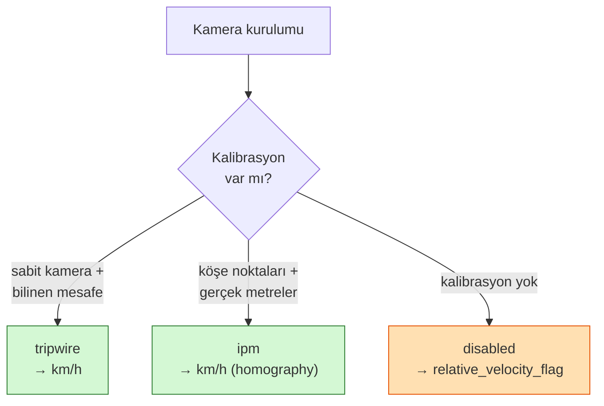
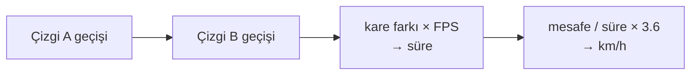
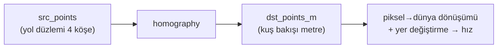

> 📄 **Hız Kalibrasyonu** · [⬅ docs](README.md) · [repo kökü](../README.md)

# 🚗 Hız Kalibrasyonu


---

## 🎯 Ne yapar

Hız ölçümü kamera kurulumuna bağımlıdır. Bu doküman `tripwire` ve `ipm` modları için
saha kalibrasyon prosedürünü tanımlar. Kalibrasyon yoksa sistem `disabled` modda kalır
ve yalnızca `relative_velocity_flag` üretir (hız iddiası yok).

> [!IMPORTANT]
> Kalibrasyon yoksa sistem `disabled` modda kalır ve yalnızca `relative_velocity_flag` üretir — **hız iddiası yapılmaz**.

---

## 🧭 Modlar

| Mod | Şart | Çıktı |
|-----|------|-------|
| `tripwire` | sabit kamera + iki nokta arası bilinen mesafe | km/h |
| `ipm` | normalize köşe noktaları + gerçek dünya metreleri | km/h (homography) |
| `disabled` | kalibrasyon yok | `relative_velocity_flag` |



---

## 📏 Tripwire kalibrasyonu

1. Görüntüde yol üzerinde iki yatay referans seçin (örn. iki şerit çizgisi başlangıcı).
2. Aralarındaki **gerçek mesafeyi** (metre) ölçün.
3. `config/default.yaml`:
```yaml
speed:
  mode: tripwire
  tripwire:
    line_a_y: 0.40          # üst çizgi (normalize ekran y)
    line_b_y: 0.70          # alt çizgi
    real_distance_m: 20.0   # iki çizgi arası gerçek mesafe
```
Araç A→B geçişindeki kare farkı × FPS → süre; `mesafe / süre × 3.6` = km/h.



---

## 🗺️ IPM kalibrasyonu (opsiyonel modül)

1. `optional_modules.homography_ipm: true` ve `speed.mode: ipm`.
2. `config/calibration/ornek_kamera.yaml` örneğini kopyalayıp düzenleyin:
```yaml
ipm:
  src_points:  [[0.30,0.45],[0.70,0.45],[0.95,0.95],[0.05,0.95]]   # normalize ekran köşeleri
  dst_points_m: [[0,0],[3.5,0],[3.5,20],[0,20]]                     # gerçek dünya (metre)
```
3. `speed.calibration_file` bu dosyayı işaret etsin.

`src_points` (yol düzlemindeki 4 köşe) → `dst_points_m` (kuş bakışı metre) homography ile
piksel→dünya dönüşümü; ardışık karelerdeki yer değiştirmeden hız.



---

## 🧪 Örnekler

```bash
# tripwire ile değerlendirme
.venv/bin/python -m aura --source saha.mp4   # config'te mode: tripwire
```

---

## 🛠️ Sorun Giderme

| Belirti | Çözüm |
|---|---|
| Hız hep `null` | `mode` doğru mu? tripwire çizgilerini araç geçiyor mu? |
| Saçma hız değerleri | `real_distance_m` ve FPS doğru mu? Çizgi konumları yola oturuyor mu? |
| IPM `None` | `calibration_file` yolu + `ipm` bölümü mevcut mu? `homography_ipm` açık mı? |
| Kamera oynak | tripwire/ipm sabit kamera gerektirir; oynak kamerada `disabled` kullanın |

> [!WARNING]
> `tripwire` ve `ipm` modları **sabit kamera** gerektirir. Oynak kamerada `disabled` modunu kullanın.
