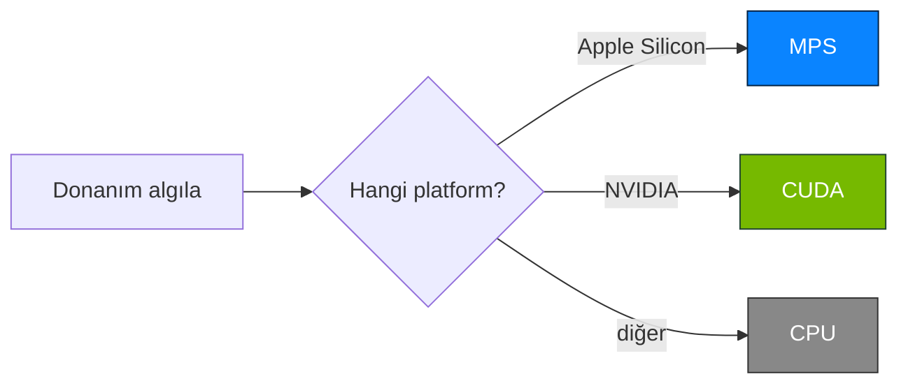
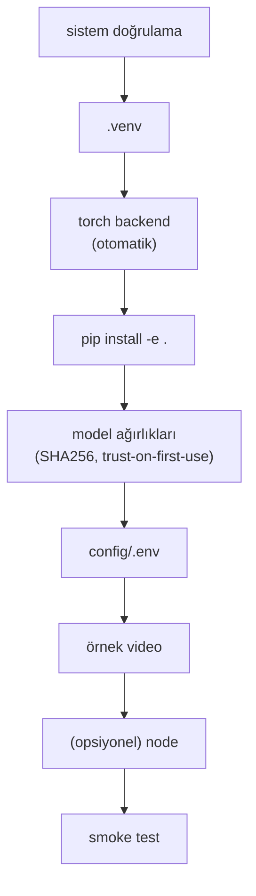

> 📄 **Kurulum** · [⬅ docs](README.md) · [repo koku](../README.md)

# 🛠️ Kurulum

<div align="center">


</div>

## 🎯 Ne yapar
RoadGuard'yı sıfırdan, tek komutla, manuel adım olmadan kurar. İdempotenttir.

---

## 📋 Gereksinimler
- Python ≥ 3.10
- git
- (opsiyonel) Node.js — mobil için
- Donanım backend'i otomatik: Apple Silicon→MPS, NVIDIA→CUDA, diğer→CPU



---

## 🚀 Kurulum

### 🍎 macOS / Linux
```bash
./setup.sh           # = python3 bootstrap.py
./setup.sh --dev     # dev bağımlılıklarıyla (pytest, ruff, black)
```

### 🪟 Windows (PowerShell 5.1+)
```powershell
git lfs install ; git lfs pull   # model ağırlıkları LFS'te (pointer yerine gerçek .pt)
.\setup.ps1                      # = python bootstrap.py (gerekirse otomatik 'py -3')
.\setup.ps1 --dev               # dev araçlarıyla (pytest, ruff, black) — make setup eşdeğeri
```

> [!NOTE]
> Konsolide Windows rehberi (ön koşullar, CUDA, profiller, sorun giderme): **[`windows.md`](windows.md)**.

> [!WARNING]
> **ExecutionPolicy:** Betik "çalıştırılamıyor" derse bir kez
> `Set-ExecutionPolicy -Scope CurrentUser RemoteSigned` (veya
> `powershell -ExecutionPolicy Bypass -File .\setup.ps1`).

> [!TIP]
> **CUDA (NVIDIA):** Güncel NVIDIA sürücüsü yeterli — `bootstrap.py`, `nvidia-smi` varsa
> CUDA'lı PyTorch'u (cu128) otomatik kurar; yoksa CPU derlemesine düşer.

### 🔧 `bootstrap.py` adımları

`bootstrap.py` adımları: sistem doğrulama → `.venv` → torch backend (otomatik) →
`pip install -e .` → model ağırlıkları (SHA256, trust-on-first-use) → config/.env →
örnek video → (opsiyonel) node → smoke test.



### ⚙️ Seçenekler
```bash
python bootstrap.py --skip-weights   # ağırlık indirmeden
python bootstrap.py --skip-node      # node atla
python bootstrap.py --skip-deps      # pip atla (yapı/config/ağırlık)
python bootstrap.py --force          # .venv'i sıfırdan
```

---

## ✅ Kurulumu doğrula
```bash
python tools/doctor.py    # bağımlılık, cihaz (MPS/CUDA/CPU), ağırlık, config, profil ✓
```
```powershell
.\dev.ps1 doctor          # Windows eşdeğeri
```

> [!IMPORTANT]
> Tüm çekirdek satırlar ✓ ise sistem gerçek modda hazır. Ağırlık eksikse `python bootstrap.py`
> (Windows: `.\setup.ps1`).

---

## ▶️ Kullanım
```bash
./run.sh             # inference :8080, qod :8081, nv :8082
open http://localhost:8080/
```
```powershell
.\run.ps1            # Windows; ardından tarayıcıda http://localhost:8080/
```

| Servis | Port |
|---|---|
| ✅ inference | `:8080` |
| ✅ qod | `:8081` |
| ✅ nv | `:8082` |

---

## 🧪 Örnekler
```bash
# CPU'ya zorla
AURA_DEVICE=cpu ./run.sh
# Farklı port
AURA_INFERENCE_PORT=9090 ./run.sh
```
```powershell
# Windows (PowerShell) — değişkeni önce ayarlayın
$env:AURA_DEVICE = "cpu"; .\run.ps1
$env:AURA_INFERENCE_PORT = "9090"; .\run.ps1
```

---

## 🩺 Sorun Giderme
| Belirti | Çözüm |
|---|---|
| `Python 3.10+ gerekli` | `python3 --version`; pyenv/Homebrew ile güncelleyin |
| Ağırlık indirilemiyor (404/ağ) | Kurulum durmaz; pipeline `mock` modda çalışır. Manuel: `.pt`'yi `weights/`'e koyun |
| `ultralytics yok` → mock mod | Normal; gerçek model için ağırlık + `ai_mode: real` |
| Port dolu | `AURA_INFERENCE_PORT`/`AURA_QOD_MOCK_PORT`/`AURA_NV_MOCK_PORT` ile değiştirin |
| `/cameras` izin istiyor (macOS) | Kamera izni verin veya `AURA_CAMERA_PROBE=0` |
| node yok | Sarı uyarı; Python servisleri tam çalışır, mobil opsiyonel |
| `.ps1 çalıştırılamıyor` (Windows) | `Set-ExecutionPolicy -Scope CurrentUser RemoteSigned` — detay: [`windows.md`](windows.md) |
| `python` Store'u açıyor (Windows) | `py -3` kullanın; betikler otomatik düşer. Kalıcı: Store stub'ını kapatın |
| Türkçe karakter bozuk / `cp1254` (Windows) | `$env:PYTHONUTF8="1"` + `chcp 65001`; betikler bunu zaten ayarlar |
