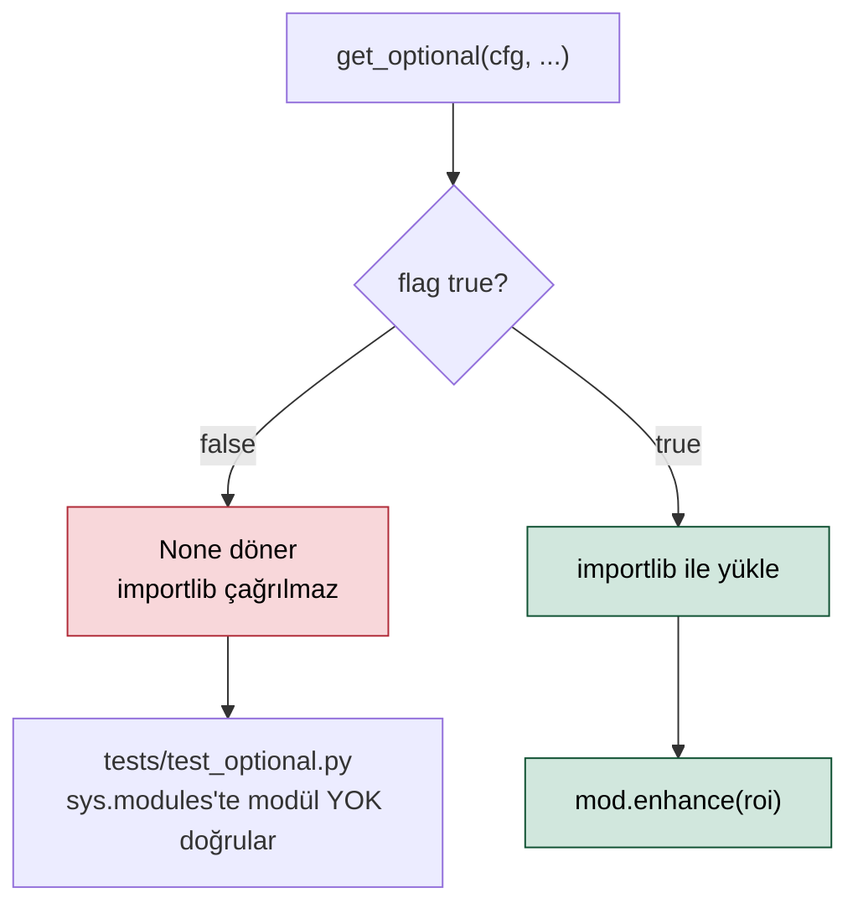
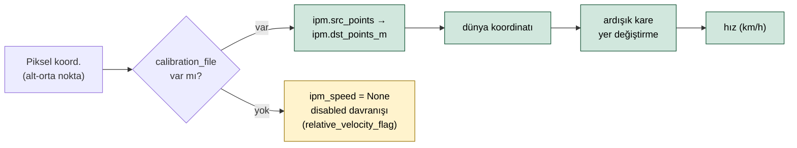

> 📄 **Ek Modüller — §8 Opsiyonel Gelişmiş Optimizasyonlar** · [⬅ docs](README.md) · [repo kökü](../README.md)

# 🧩 Ek Modüller — §8 Opsiyonel Gelişmiş Optimizasyonlar

<div align="center">


</div>

> [!NOTE]
> Bu modüller `aura/optional/` altındadır, **default kapalıdır** ve
> `config.optional_modules.*` ile toggle edilir. **Kapalıyken import bile edilmez**
> (lazy loading — `aura/optional/loader.py:get_optional`). Ana mimari (`docs/mimari.md`)
> yalnızca buraya referans verir; sistemin çekirdek davranışı bu modüllerden bağımsızdır.

---

## 🔒 Lazy loading sözleşmesi

```python
from aura.optional.loader import get_optional
mod = get_optional(cfg, "super_resolution")   # flag false → None, import YOK
if mod is not None:
    roi = mod.enhance(roi)
```

`get_optional` flag'i kontrol eder; kapalıysa `None` döner ve `importlib` hiç çağrılmaz.
Test (`tests/test_optional.py`) kapalıyken `sys.modules`'te modülün bulunmadığını doğrular.



---

## 📦 8.1 Sıfır-Atık Veri Aktarımı (`zero_waste_payload`)

**Amaç:** 5G bant genişliğini gereksiz tüketmemek. Downstream'e tam çözünürlüklü kare
gönderilmez; yalnızca küçük ROI görüntüsü + ID'ye bağlı yapısal metin iletilir.

| Alan | Değer |
|------|-------|
| **Toggle** | `optional_modules.zero_waste_payload: true` |
| **Etki** | Pipeline her track için `build_payload(track, plate_roi)` çağırır; sonuç annotation'a `zwp` alanı olarak eklenir (yapısal metin + base64 plaka JPEG). |
| **Entegrasyon** | `aura/pipeline/pipeline.py` (annotation üretiminde). |

---

## 🔍 8.2 Süper Çözünürlük (`super_resolution`)

**Amaç:** Optik sınırların aşılamadığı çok uzak mesafelerde, kırpılan bulanık plaka ROI'si
OCR'a girmeden önce yapay zeka tabanlı upscaling ile netleştirilir.

| Alan | Değer |
|------|-------|
| **Toggle** | `optional_modules.super_resolution: true` |
| **Etki** | `PlateReader` sweet-spot içindeki plaka ROI'sini OCR öncesi `enhance()` ile büyütür → küçük plakalar `min_pixel_height` eşiğini geçer, kalite tetiği azalır. |
| **Entegrasyon** | `aura/plate/reader.py`. |

> [!IMPORTANT]
> Gerçek ESRGAN ağırlığı yapılandırılmadığında yüksek kaliteli bicubic upscale'e
> düşer (yer tutucu); OCR okunabilirliğini yine de artırır.

---

## 📐 8.3 Homography / IPM (`homography_ipm`)

**Amaç:** Piksel koordinatlarını gerçek dünya metriklerine dönüştüren perspektif matrisi
(Inverse Perspective Mapping) ile hız/yörünge hesabı.

| Alan | Değer |
|------|-------|
| **Toggle** | `optional_modules.homography_ipm: true` + `speed.mode: ipm` |
| **Kalibrasyon** | `speed.calibration_file` (örn. `config/calibration/ornek_kamera.yaml`) içindeki `ipm.src_points` (normalize ekran köşeleri) → `ipm.dst_points_m` (metre). |
| **Etki** | `SpeedEstimator` ipm modunda her track'in alt-orta noktasını dünya koordinatına çevirir; ardışık karelerdeki yer değiştirmeden hız (km/h) üretir. |
| **Düşüş** | Kalibrasyon yoksa `ipm_speed` `None` döner → `disabled` davranışı (`relative_velocity_flag`). Sistem kendi sınırını tanır. |
| **Entegrasyon** | `aura/speed/estimator.py:_ipm`. |



---

## ❓ Neden opsiyonel?

Her kamera açısı/montajı IPM'e uygun değildir; süper çözünürlük ek hesap yükü getirir;
sıfır-atık payload yalnızca belirli downstream tüketicilerinde anlamlıdır. Bu nedenle
çekirdek mimari bunlardan bağımsız çalışır ve modüller yalnızca şartların karşılandığı
sahnelerde etkinleştirilir.

> [!TIP]
> **Onur zırhı K-004:** Çekirdek davranış bu modüllerden bağımsızdır; her modül
> yalnızca şartlar karşılandığında ve flag açıkken etkinleşir.
