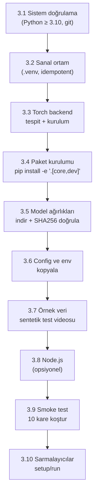
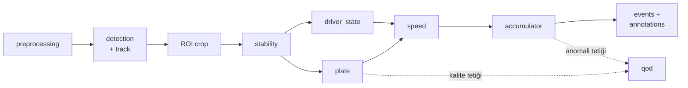
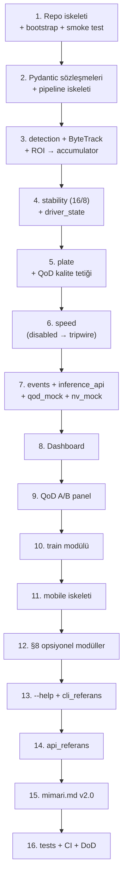

> 📄 **PROJE RoadGuard — Uygulama Planı v2.0** · [⬅ docs](README.md) · [repo kökü](../README.md)

<div align="center">

# 🛣️ PROJE RoadGuard — Uygulama Planı v2.0


</div>

> [!NOTE]
> **Hedef kitle:** Bu dosyayı işleyecek otonom kodlama agent'ı (yapay zekâ kodlama aracı).
> **Kaynak doğruluk:** TEKNOFEST 2026 "5G & Yapay Zekâ ile Akıllı Yol Güvenliği" Teknik Şartnamesi + `AURA_YZ_Mimarisi_v1.1.md`.
> **Görev:** Şartnamenin gerektirdiği tüm sistemi — mobil + 5G API + YZ çekirdeği + profesyonel dashboard — GitHub'a yüklenmeye hazır, tek komutla ayağa kalkan, Windows/macOS uyumlu bir monorepo olarak üret.

---

## 0. 🎯 Bağlayıcı Gerçekler

| Şartname zorunluluğu | Karşılayan bileşen | Puan ağırlığı |
|---|---|---|
| Araç / plaka / hız / araç-içi nesne tespiti | `aura/` YZ çekirdeği | %40 |
| QoD yalnızca kritik anda; başarım artışı kanıtlanmalı | `aura/qod` + A/B eval harness | %40 |
| Sürücü davranışı (telefon/sigara/kemer/yorgunluk) | `aura/driver_state` | %40 içinde |
| Number Verification sessiz doğrulama | `services/nv_mock` + mobil | — |
| Tespitlerin mobil ekranda gösterimi | `mobile/` + event stream | — |
| Modern mimari / rapor | repo yapısı + `docs/` + CI | %20 |

> [!IMPORTANT]
> **YZ çekirdeği gerçek; ağ/telekom/mobil katmanları mock/sandbox.** Mock'lar gerçek API sözleşmesini birebir taklit eder — final ortamında yalnızca endpoint/credential değişir.

> [!NOTE]
> **YOLO26 notu:** `yolo26s.pt` ve `yolo26l.pt` gerçek Ultralytics modelleridir (Eylül 2025). Yer tutucu değil — bootstrap sırasında otomatik indirilir. ByteTrack tracking mode ultralytics'e dahildir.

> [!WARNING]
> **MediaPipe yasağı:** Mimari kararı — landmark/pose tabanlı hiçbir yaklaşım kullanılmaz. Yorgunluk dahil tüm sürücü durumları YOLO26l detection sınıfları olarak öğrenilir.

---

## 1. 📐 Genel İlkeler

1. **Tek komutla ayağa kalkar.** `./setup.sh` veya `.\setup.ps1` → bağımlılıklar, model ağırlıkları, örnek veri, servisler — hiçbir manuel adım olmadan hazır. İdempotent: ikinci çalıştırma tekrar kurmaz.
2. **Cross-platform.** Windows (PowerShell 7+) ve macOS (zsh). Donanım backend'i otomatik seçilir: Apple Silicon→MPS, NVIDIA→CUDA, diğer→CPU. Path'ler `pathlib` ile platform-bağımsız.
3. **Config-driven.** Hiçbir eşik/flag koda gömülmez. Tek `config/default.yaml` her şeyi yönetir. §8 opsiyonel modüller buradan toggle edilir.
4. **CLI-first, `--help` her yerde.** Her `python -m aura.*` komutu `argparse` ile tam yardım metni sunar. `-h`/`--help` tutarlı, anlaşılır, örnekli.
5. **Self-documenting.** Her dizin kendi `README.md`'sini taşır. Hiçbir modül "ne yapar + nasıl kullanılır" açıklaması olmadan bırakılmaz. Kod İngilizce, tüm `.md` Türkçe.
6. **Decoupled mikroservis.** YZ pipeline'ı upstream (kamera) ve downstream'i (dashboard/mobil) bilmez; yalnızca event/annotation stream yayar.
7. **GitHub-ready.** `.gitignore` (weights/, data/raw/, .venv/, node_modules/ hariç), `LICENSE`, `.env.example`, `CHANGELOG.md`, CI iskeleti.
8. **Model ağırlıkları otomatik.** `bootstrap.py` ilk çalıştırmada `yolo26s.pt` ve `yolo26l.pt`'yi `weights/` altına indirir ve doğrular (SHA256). Sonraki çalıştırmalarda atlar.

---

## 2. 🗂️ Repo Yapısı

```
teknofest-prototip/
│
├── README.md                        # Tek-komut kurulum, mimari özet, komut rehberi
├── CHANGELOG.md
├── LICENSE
├── .gitignore
├── .gitattributes
├── .env.example
├── Makefile                         # make setup / run / train / eval / test / lint
├── bootstrap.py                     # Saf stdlib — tüm kurulum mantığı burada
├── setup.sh                         # macOS/Linux → python3 bootstrap.py
├── setup.ps1                        # Windows → python bootstrap.py
├── run.sh / run.ps1                 # Servisleri kaldırır (gerekirse bootstrap çağırır)
├── pyproject.toml                   # aura paketi + bağımlılık grupları
│
├── config/
│   ├── default.yaml                 # Tüm eşikler, flag'ler, §8 toggle'ları
│   ├── calibration/
│   │   └── ornek_kamera.yaml
│   └── README.md
│
├── weights/                         # .gitignore'lu; bootstrap tarafından doldurulur
│   ├── yolo26s.pt                   # Stage-1: araç tespiti
│   ├── yolo26l.pt                   # Stage-2: sürücü durumu (base, fine-tune bekleniyor)
│   └── README.md                    # Ağırlık yönetimi ve SHA256 doğrulama
│
├── aura/                            # YZ çekirdeği (Python paketi)
│   ├── __init__.py
│   ├── __main__.py                  # python -m aura → pipeline başlatır
│   ├── preprocessing/
│   ├── detection/
│   ├── stability/
│   ├── driver_state/
│   ├── plate/
│   ├── speed/
│   ├── accumulator/
│   ├── qod/
│   ├── events/
│   ├── pipeline/
│   ├── optional/                    # §8 modüller (default kapalı)
│   └── README.md
│
├── train/
│   ├── __main__.py                  # python -m train --help
│   ├── train_detector.py
│   ├── train_driver_state.py
│   ├── prepare_dataset.py
│   ├── roboflow_pull.py
│   ├── configs/
│   └── README.md
│
├── services/
│   ├── inference_api/               # FastAPI — YZ mikroservisi
│   │   ├── main.py
│   │   ├── routers/
│   │   │   ├── stream.py
│   │   │   ├── tracks.py
│   │   │   ├── cameras.py
│   │   │   ├── eval.py
│   │   │   └── config.py
│   │   └── README.md
│   ├── nv_mock/                     # Number Verification mock
│   │   └── README.md
│   ├── qod_mock/                    # CAMARA QoD mock
│   │   └── README.md
│   └── README.md
│
├── dashboard/                       # Profesyonel web dashboard (vanilla JS + Canvas)
│   ├── index.html
│   ├── assets/
│   │   ├── app.js
│   │   ├── video-renderer.js        # Canvas bbox overlay motoru
│   │   ├── camera-selector.js       # Kamera/kaynak seçici
│   │   ├── event-stream.js          # WS event tüketici
│   │   ├── qod-panel.js             # QoD A/B karşılaştırma paneli
│   │   └── style.css
│   └── README.md
│
├── mobile/                          # Expo (React Native)
│   └── README.md
│
├── data/
│   ├── samples/                     # Örnek video + ground-truth JSON
│   └── README.md
│
├── docs/
│   ├── mimari.md                    # Tam sistem mimarisi v2.0
│   ├── mimari_ek_moduller.md        # §8 opsiyonel modüller (ayrı)
│   ├── kurulum.md                   # Platform-bazlı kurulum + sorun giderme
│   ├── calistirma.md                # Uçtan uca demo senaryosu
│   ├── cli_referans.md              # Tüm --help çıktıları ve örnekler
│   ├── api_referans.md              # Tüm endpoint'ler: URL, method, body, response
│   ├── egitim.md                    # Eğitim akışı
│   ├── veri_seti.md                 # Dataset toplama stratejisi
│   ├── kalibrasyon.md               # Hız kalibrasyonu prosedürü
│   ├── degerlendirme.md             # Metrikler + QoD A/B protokolü
│   └── sartname_izlenebilirlik.md
│
└── tests/
    ├── test_stability.py
    ├── test_plate.py
    ├── test_accumulator.py
    ├── test_api_contracts.py
    └── README.md
```

---

## 3. ⚙️ Bootstrap ve Otomatik Kurulum

`bootstrap.py` saf Python stdlib kullanır. Adımlar:



### 3.1 Sistem doğrulama
- Python ≥ 3.10 kontrol; aksi halde `docs/kurulum.md` bağlantısıyla açıklayıcı hata.
- `git` varlığı kontrol (klonlama için).

### 3.2 Sanal ortam
`.venv/` yoksa oluştur, varsa atla (idempotent).

### 3.3 Torch backend tespiti ve kurulum
```
macOS arm64  →  pip install torch torchvision          (MPS otomatik)
nvidia-smi   →  pip install torch torchvision --index-url https://download.pytorch.org/whl/cu121
diğer        →  pip install torch torchvision --index-url https://download.pytorch.org/whl/cpu
```
Backend seçimini `weights/README.md`'ye ve log'a yazar.

### 3.4 Paket kurulumu
```
pip install -e ".[core,dev]"
```
`core`: ultralytics, opencv-python, easyocr, fastapi, uvicorn[standard], pydantic, pyyaml, websockets, sse-starlette, shapely, numpy, httpx, rich
`dev`: pytest, ruff, black, httpx (test), pre-commit

### 3.5 Model ağırlıkları otomatik indirme
```python
WEIGHTS = {
    "weights/yolo26s.pt": {
        "url": "https://github.com/ultralytics/assets/releases/download/v9.0.0/yolo26s.pt",
        "sha256": "<hash>"
    },
    "weights/yolo26l.pt": {
        "url": "https://github.com/ultralytics/assets/releases/download/v9.0.0/yolo26l.pt",
        "sha256": "<hash>"
    }
}
```
- Her ağırlık için: dosya yoksa indir, varsa SHA256 doğrula.
- Bozuksa yeniden indir.
- İndirme ilerlemesi `rich` ile gösterilir (yoksa sade print).
- `weights/README.md`'ye kurulum tarihi ve hash'i yaz.

### 3.6 Config ve env
- `config/default.yaml` yoksa `config/default.yaml.template`'ten kopyala.
- `.env` yoksa `.env.example`'dan kopyala.

### 3.7 Örnek veri
`data/samples/` boşsa: kısa sentetik test videosu üret (OpenCV ile renkli kutular + hareket) ve ground-truth JSON'unu yaz. Asıl TOGG veri seti gelince üzerine yazılır.

### 3.8 Node.js (opsiyonel)
`node` varsa `mobile/` bağımlılıklarını kur. Yoksa sarı uyarı, Python servisleri yine de tam çalışır.

### 3.9 Smoke test
Pipeline'ı `data/samples/test.mp4` ile 10 kare koştur → tüm modüller OK, event üretildi, servis ayakta. Başarıysa yeşil onay satırı yaz.

### 3.10 Sarmalayıcılar
`setup.sh`/`setup.ps1` → yalnızca `python3 bootstrap.py "$@"` çağırır.
`run.sh`/`run.ps1` → `.venv` yoksa önce `bootstrap.py` çağırır, sonra servisleri kaldırır.

---

## 4. 🖥️ CLI Tasarımı — `--help` Her Yerde

Her entry point `argparse` ile tam yardım sunar. Stil kuralları:
- `description`: tek satır, ne yaptığını açıklar.
- `epilog`: 2-3 kullanım örneği.
- `--help`/`-h`: otomatik (argparse).
- Uzun argüman adları `--kebab-case`.
- Seçenekler `choices=` ile kısıtlanır, hata mesajı açıklayıcı olur.

### 4.1 `python -m aura` (ana pipeline)
```
usage: python -m aura [-h] [--config PATH] [--source SOURCE]
                      [--device {auto,cpu,cuda,mps}] [--no-bbox]
                      [--log-level {DEBUG,INFO,WARNING}]

RoadGuard inference pipeline — araç, plaka, sürücü durumu ve hız tespiti.

options:
  -h, --help            Bu yardımı göster ve çık
  --config PATH         Config dosyası (varsayılan: config/default.yaml)
  --source SOURCE       Video dosyası, kamera index (0,1,2...) veya RTSP/HTTP URL
                        Örnekler: --source 0
                                  --source /yol/video.mp4
                                  --source rtsp://192.168.1.10:8554/stream
  --device {auto,cpu,cuda,mps}
                        İşlem birimi (varsayılan: auto)
  --no-bbox             Ham video akışı (annotation overlay olmadan)
  --log-level {DEBUG,INFO,WARNING}
                        Log seviyesi (varsayılan: INFO)

örnekler:
  python -m aura --source 0
  python -m aura --source video.mp4 --device mps
  python -m aura --source rtsp://10.0.0.5:8554/cam --log-level DEBUG
```

### 4.2 `python -m train` (eğitim)
```
usage: python -m train [-h] {detector,driver-state,dataset} ...

RoadGuard model eğitimi

subcommands:
  detector        Stage-1 araç tespit modelini eğit (YOLO26s fine-tune)
  driver-state    Stage-2 sürücü durumu modelini eğit (YOLO26l fine-tune)
  dataset         Ham veriyi YOLO formatına dönüştür ve augmentasyon uygula

örnekler:
  python -m train detector --data data/detector.yaml --epochs 100
  python -m train driver-state --data data/driver.yaml --imgsz 320
  python -m train dataset --input data/raw/ --output data/processed/
```

### 4.3 `python -m aura.eval` (değerlendirme)
```
usage: python -m aura.eval [-h] [--source SOURCE] [--ground-truth PATH]
                           [--qod-comparison] [--output PATH]

RoadGuard model değerlendirme — doğruluk metrikleri ve QoD A/B karşılaştırması

options:
  --source SOURCE       Test video dosyası
  --ground-truth PATH   Ground-truth JSON dosyası
  --qod-comparison      QoD açık/kapalı senaryolarını karşılaştır (şartname kanıtı)
  --output PATH         Rapor çıktı dizini (varsayılan: eval_results/)

örnekler:
  python -m aura.eval --source data/samples/test.mp4 --ground-truth data/samples/gt.json
  python -m aura.eval --source test.mp4 --ground-truth gt.json --qod-comparison
```

### 4.4 `python bootstrap.py`
```
usage: python bootstrap.py [-h] [--skip-weights] [--skip-node]
                           [--force] [--dev]

RoadGuard kurulum bootstrap'i

options:
  --skip-weights    Model ağırlığı indirmeyi atla
  --skip-node       Node.js kurulumunu atla
  --force           Mevcut kurulumu sıfırdan yap
  --dev             Dev bağımlılıklarını da kur (pytest, ruff vb.)
```

`docs/cli_referans.md`: tüm komutların tam `--help` çıktısı, örnekler ve açıklamalar. Agent bu dosyayı üretirken her CLI modülünü gerçekten çalıştırıp çıktısını kopyalayarak yazar.

---

## 5. 🔌 API Endpoint Tasarımı

`services/inference_api/` — FastAPI. Port: `8080`. OpenAPI docs: `http://localhost:8080/docs`.

> [!NOTE]
> **Servis portları:** inference_api `8080`, NV Mock `8082`, QoD Mock `8081`.

### 5.1 Sistem

| Method | Path | Açıklama |
|--------|------|----------|
| `GET` | `/health` | Servis durumu, model yüklü mü, cihaz, versiyon |
| `GET` | `/info` | Pipeline config özeti, aktif kaynak, uptime |

### 5.2 Kamera / Kaynak Yönetimi

| Method | Path | Açıklama |
|--------|------|----------|
| `GET` | `/cameras` | Kullanılabilir kameraları listele (index, ad, çözünürlük) |
| `POST` | `/stream/start` | İşlemeyi başlat `{source, device, bbox_overlay}` |
| `POST` | `/stream/stop` | İşlemeyi durdur |
| `PATCH` | `/stream/config` | Çalışırken ayar değiştir `{bbox_overlay, conf_threshold}` |
| `GET` | `/stream/status` | Aktif kaynak, FPS, kare sayısı, QoD durumu |

`GET /cameras` response örneği:
```json
{
  "cameras": [
    {"index": 0, "name": "FaceTime HD Camera", "width": 1280, "height": 720},
    {"index": 1, "name": "iPhone Camera (Continuity)", "width": 1920, "height": 1080}
  ],
  "rtsp_supported": true
}
```

### 5.3 Video Akışı

| Method | Path | Açıklama |
|--------|------|----------|
| `GET` | `/stream/video` | MJPEG stream — `?bbox=true\|false` param ile bbox toggle |
| `WS` | `/stream/annotations` | Gerçek zamanlı annotation verisi (bbox koordinatları, label'lar) |
| `WS` | `/stream/events` | Gerçek zamanlı `AuraEvent` JSON stream'i |

> [!TIP]
> **İki-kanal tasarımı:** Dashboard `/stream/video` ile raw/annotated MJPEG alır VE `/stream/annotations` üzerinden bbox koordinatlarını alır. Canvas üzerinde client-side çizim yapılır. Bu şekilde bbox toggle için sunucuya git-gel olmaz — client karar verir.

### 5.4 Track Yönetimi

| Method | Path | Açıklama |
|--------|------|----------|
| `GET` | `/tracks` | Aktif tüm track'ler |
| `GET` | `/tracks/{id}` | Spesifik track detayı (plaka, hız, sürücü durumu, QoD geçmişi) |
| `GET` | `/tracks/{id}/history` | Bir track'in zaman serisi verisi |

### 5.5 Değerlendirme

| Method | Path | Açıklama |
|--------|------|----------|
| `POST` | `/eval/run` | Eval pipeline'ı başlat `{source, ground_truth, qod_comparison}` |
| `GET` | `/eval/results` | Son eval sonuçları (metrikler + QoD delta tablosu) |
| `GET` | `/eval/results/export` | Markdown tablo + JSON rapor indir |

### 5.6 Config

| Method | Path | Açıklama |
|--------|------|----------|
| `GET` | `/config` | Mevcut config (çalışma zamanı değiştirilebilirler dahil) |
| `PATCH` | `/config` | Çalışırken bazı parametreleri güncelle (eşikler, QoD profili) |

### 5.7 Mock Servisler

**Number Verification Mock** — Port `8082`:

| Method | Path | Açıklama |
|--------|------|----------|
| `POST` | `/verify` | `{phone_number, sim_token}` → `{verified: bool, latency_ms: int}` |
| `GET` | `/health` | — |

**QoD Mock** — Port `8081`:

| Method | Path | Açıklama |
|--------|------|----------|
| `POST` | `/sessions` | `{profile, device_id}` → `{session_id, status, granted_profile}` |
| `GET` | `/sessions/{id}` | Session durumu |
| `DELETE` | `/sessions/{id}` | Serbest bırak |
| `GET` | `/sessions` | Aktif tüm session'lar |
| `GET` | `/health` | — |

Tüm endpoint'ler `docs/api_referans.md`'de tam örnekli (curl + Python httpx + JSON response) olarak belgelenir.

---

## 6. 🧠 YZ Çekirdek Modülleri



### 6.0 Çekirdek veri sözleşmeleri (pydantic v2)
```python
class PlateState(BaseModel):
    value: str | None
    confidence: float
    status: Literal["pending", "confirmed", "rejected"]
    votes: dict[str, int]
    ocr_disabled: bool           # erken çıkış flag'i

class DriverState(BaseModel):
    phone: bool
    smoking: bool
    no_seatbelt: bool
    fatigue: bool
    confidence: dict[str, float]

class SpeedState(BaseModel):
    value_kmh: float | None
    mode: Literal["tripwire", "ipm", "disabled"]
    relative_velocity_flag: bool

class BBox(BaseModel):
    x1: float; y1: float; x2: float; y2: float
    conf: float; cls: str

class TrackRecord(BaseModel):
    track_id: int
    vehicle_class: str
    first_frame: int
    last_frame: int
    bbox: BBox
    plate: PlateState
    driver: DriverState
    speed: SpeedState
    qod_active: bool
    qod_profile: str | None
    risk_flags: list[str]

class AuraEvent(BaseModel):
    event_id: str
    ts: float
    track_id: int
    type: Literal[
        "DETECTION_UPDATE", "PLATE_CONFIRMED", "PLATE_REJECTED",
        "DRIVER_STATE", "SPEED", "QOD_TRIGGER", "QOD_RELEASE", "RISK_ALERT"
    ]
    payload: dict
    source: str = "aura-inference"

class AnnotationFrame(BaseModel):
    frame_id: int
    ts: float
    tracks: list[dict]           # bbox + label + track_id + risk_flags
```

### 6.1 `preprocessing/` — Dinamik Ön-İşleme
OpenCV tabanlı, her filtre config'ten aç/kapa:
- Far patlaması maskeleme (local brightness threshold + morphological mask)
- Motion blur düzeltme (Wiener deconvolution, blur kernel config'ten)
- Yansıma süpürme
- Occlusion handling (frame diff tabanlı geçici kayıp yönetimi)

### 6.2 `detection/` — Stage-1 YOLO26s + ByteTrack
- `Detector` abstract class → `YOLO26Detector` implementasyonu.
- `model_path` config'ten; `yolo26s.pt` default, custom-trained ağırlık swap'lanabilir.
- ByteTrack tracking mode (ultralytics dahili).
- Çıktı: her araç için iki ROI crop → sürücü kabini + plaka bölgesi.
- Asla tam kareyi downstream'e gönderme; yalnızca crop'lar.

### 6.3 `stability/` — 16/8 State Machine
Kayar pencere (16 kare), her `track_id` × durum alanı için bağımsız.
Yeni durum ancak son 16 karenin ≥8'inde tutarlıysa yazılır.
Unit test: flicker senaryosu (7/16 → ret, 8/16 → kabul).

### 6.4 `driver_state/` — Stage-2 YOLO26l
- Girdi: yalnızca sürücü kabini ROI.
- Sınıflar: `phone`, `smoking`, `no_seatbelt`, `fatigue`.
- **Yorgunluk:** kapalı göz, esneme, baş düşmesi detection sınıfları olarak öğrenilir. MediaPipe/landmark kesinlikle kullanılmaz.
- Çoklu sınıf aynı anda aktif olabilir (detection, classification değil).

### 6.5 `plate/` — Sweet Spot + Voting Buffer + OCR
- Sweet spot: normalize koordinat (`config.plate.sweet_spot`), araç girene kadar OCR pasif.
- Voting buffer: ardışık `N` okuma (config'ten), konsensüs eşiği.
- Konsensüs → plakayı ID'ye kalıcı yaz, OCR kapat, `PLATE_CONFIRMED` event'i.
- Ret → `QOD_TRIGGER` (quality), yeniden okuma döngüsü.
- Post-validasyon: Türk plaka regex `^\d{2}[A-Z]{1,3}\d{2,4}$`.
- `PLATE_REJECTED` event'i: sebebi (düşük güven / regex fail / buffer dolu) ile birlikte.

### 6.6 `speed/` — Kalibrasyon-Bağımlı
- `tripwire`: iki sanal çizgi + ByteTrack frame-delta × gerçek mesafe.
- `ipm`: homography dönüşümü (şartlar karşılanıyorsa; opsiyonel modülle ilişkili).
- `disabled`: `relative_velocity_flag` üret, hız iddiasında bulunma.

### 6.7 `accumulator/` — ID-Merkezli
- Tüm modül çıktılarını `TrackRecord`'a yazar.
- Risk kuralları: yüksek hız + telefon → `RISK_ALERT`; yorgunluk + uzun süre → `RISK_ALERT`.
- Risk kombinasyonları config'ten genişletilebilir.

### 6.8 `qod/` — CAMARA QoD İstemcisi
- Arayüz: `request_quality(session_id, profile)`, `release(session_id)`.
- **Optimizasyon tetikleyici:** anomali/tehlike → `LOW_LATENCY` profili.
- **Kalite tetikleyici:** voting buffer ret / yetersiz piksel → `HIGH_THROUGHPUT`.
- **Histerezis:** tetikle-bırak salınımını önle. Minimum aktif süre + cooldown config'ten.
- `backend: mock` → `services/qod_mock`, `backend: camara` → Turkcell endpoint.

### 6.9 `events/` + `pipeline/`
Event emitter: `AuraEvent`'leri ve `AnnotationFrame`'leri WS/SSE üzerinden yayar.
Pipeline orkestratörü: preprocessing → detection+track → ROI → stability ⊗ (driver_state ∥ plate) → speed → accumulator → events + annotations.

---

## 7. 🧩 §8 Opsiyonel Modüller

`aura/optional/`'da, `config.optional_modules.*` ile toggle (default kapalı). Kapalıyken hiçbir import bile yapılmaz — lazy loading pattern kullanılır.

- `zero_waste_payload.py` — downstream'e tam kare değil yalnızca ROI + yapısal metin.
- `super_resolution.py` — ESRGAN tabanlı, OCR öncesi uzak plaka upscaling.
- `homography_ipm.py` — piksel→dünya koordinat dönüşümü.

Tüm detay `docs/mimari_ek_moduller.md`'de. `docs/mimari.md` yalnızca "bkz. mimari_ek_moduller.md" satırı içerir.

---

## 8. 📺 Dashboard — Profesyonel Web Arayüzü

**Yığın:** Vanilla HTML5 + ES6 Modules + Canvas API + WebSocket + Chart.js (CDN). Node.js/npm gerektirmez. `inference_api` tarafından statik dosya olarak serve edilir (`/` endpoint).

### 8.1 Genel Düzen

<details>
<summary>ASCII düzen şeması</summary>

```
┌─────────────────────────────────────────────────────────┐
│  RoadGuard Dashboard          [●REC] [QoD: ACTIVE] [FPS: 28] │
├──────────────┬──────────────────────────┬───────────────┤
│              │                          │               │
│  KAYNAK      │   CANLI VİDEO AKIŞI     │  TRACK LİSTESİ│
│  SEÇER       │   (Canvas + bbox)        │               │
│              │                          │  [ID:1] ████  │
│  ○ Webcam 0  │   ┌─────────────────┐   │  plaka: 34ABC │
│  ● iPhone    │   │  [bbox overlay] │   │  hız: 72 km/h │
│  ○ Video     │   │                 │   │  📱 telefon   │
│  ○ RTSP URL  │   └─────────────────┘   │               │
│              │                          │  [ID:2] ████  │
│  [BBox: ON]  │   ── EVENT LOG ──       │  plaka: bekl. │
│  [Kalite]    │   PLATE_CONFIRMED 34ABC │  QoD: HIGH_TP │
│              │   RISK_ALERT ID:1       │               │
├──────────────┴──────────────────────────┴───────────────┤
│  QOD A/B KARŞILAŞTIRMA PANELİ                          │
│  Plaka doğruluğu:  QoD OFF: 61%  →  QoD ON: 89%  +28% │
│  Küçük nesne mAP:  QoD OFF: 0.52 →  QoD ON: 0.71  +37% │
└─────────────────────────────────────────────────────────┘
```

</details>

### 8.2 Kamera / Kaynak Seçici (`camera-selector.js`)

- Sayfa yüklenince `GET /cameras` çağrılır, kullanılabilir kameralar listelenir.
- Liste öğeleri: cihaz adı, çözünürlük, ikon (webcam / iphone / video / rtsp).
- **iPhone Continuity Camera:** macOS Ventura+ ile iPhone standart webcam olarak görünür; OpenCV device index ile yakalar. Listede "iPhone Camera (Continuity)" olarak gösterilir.
- **RTSP / IP kamera:** Manuel URL giriş alanı (EpocCam, Camo, DroidCam uyumlu).
- **Video dosyası:** Drag-and-drop veya path girişi.
- Kaynak değişince `POST /stream/stop` + `POST /stream/start` çağrılır; akış kesintisiz geçiş yapar.

Backend kamera enumerasyonu:
```python
# GET /cameras implementasyonu
def enumerate_cameras() -> list[CameraInfo]:
    cameras = []
    for i in range(10):
        cap = cv2.VideoCapture(i)
        if cap.isOpened():
            name = get_camera_name(i)   # platform-specific (AVFoundation/DirectShow)
            w = cap.get(cv2.CAP_PROP_FRAME_WIDTH)
            h = cap.get(cv2.CAP_PROP_FRAME_HEIGHT)
            cameras.append(CameraInfo(index=i, name=name, width=w, height=h))
            cap.release()
    return cameras
```
macOS'ta `AVCaptureDevice` isimleri, Windows'ta DirectShow `filter_info`, Linux'ta `/sys/class/video4linux/` kullanılır. Fallback: `"Camera {i}"`.

### 8.3 Video Renderer (`video-renderer.js`)

**İki-kanal mimarisi:**
1. `` → `GET /stream/video?bbox=false` MJPEG stream (raw).
2. `<canvas id="overlay">` → img üstünde absolute konumlandırılmış, aynı boyut.
3. `WS /stream/annotations` → her frame için `AnnotationFrame` JSON alınır.
4. Canvas'a çizim: bbox dikdörtgenleri, track ID badge, plaka etiketi, risk flag rengi.

**BBox toggle:**
- Dashboard'da `[BBox: ON/OFF]` butonu.
- Kapalıyken: canvas temizlenir, MJPEG akışı değişmez → sunucuya gidiş-geliş yok.
- Açıkken: annotation WS'ten koordinatlar alınır, canvas'a çizilir.

**Çizim stili:**
- Normal araç: `#00ff88` (yeşil) bbox, yarı saydam arka plan.
- Risk flag'i olan araç: `#ff4444` (kırmızı) bbox, yanıp sönen border.
- Plaka onaylı: bbox altında `#ffffff` label.
- QoD aktif olan track: sağ üstte `[QoD]` rozeti.

### 8.4 Event Log
Son 50 event canlı scroll eden liste. Her event satırı:
`[HH:MM:SS.ms] [TİP] ID:N → açıklama`
Renk: RISK_ALERT kırmızı, PLATE_CONFIRMED yeşil, QOD_TRIGGER sarı, diğer gri.

### 8.5 Track Listesi
Aktif trackler kartlar halinde (sağ panel). Her kart:
- Track ID + araç sınıfı
- Plaka (onaylı/bekliyor/reddedildi)
- Hız (değer veya "relative flag")
- Sürücü durumu ikonları (📱 🚬 ⚠️ 😴)
- QoD durumu rozeti
- Risk severity rengi (kart border'ı)

Tıklanınca `GET /tracks/{id}` ile detay modalı açılır.

### 8.6 QoD A/B Karşılaştırma Paneli (`qod-panel.js`)
`GET /eval/results` ile çekilen veriden Chart.js bar chart:
- X ekseni: metrik (plaka doğruluğu, küçük nesne mAP, FPS stabilite).
- Y ekseni: QoD OFF vs QoD ON değerleri.
- Her bar üstünde delta yüzdesi (+28%, +37% gibi).
- "Son eval: {timestamp}" etiketi + `[Eval Çalıştır]` butonu.

Dashboard CSS'i CSS custom properties (dark theme default, light theme toggle) ile temalanmış. Hiçbir CSS framework'ü — saf custom properties + grid/flex.

---

## 9. 🏋️ Eğitim Modülü (`train/`)

> [!IMPORTANT]
> **Durum (18 Haz 2026):** Bu modül uygulandı; zorunlu sınıflar için **gerçek açık veri toplandı
> ve YOLO26s fine-tune SÜRÜYOR** (`license_plate` 8823, `seatbelt` 3104, `smoking` 557, `phone` 659
> — hepsi CC BY 4.0). Ara `license_plate` mAP50 ≈ 0.977 (epoch 12/35; **final kesin DEĞİL**). Güncel
> sayılar ve eğitim durumu: `docs/veri_seti.md` + `docs/egitim.md`. (Not: domain sürücü-modelinde
> `imgsz` 320 → 640'a yükseltildi; 320 küçük telefonu kaybediyordu.)

- `train_detector.py`: YOLO26s fine-tune. Araç sınıfları (car, truck, bus, minibus). ultralytics `model.train()`.
- `train_driver_state.py`: YOLO26l fine-tune. Sınıflar: `phone`, `smoking`, `no_seatbelt`, `fatigue`. 320px imgsz (cabin ROI küçük; domain modelinde 640'a yükseltildi).
- `prepare_dataset.py`: YOLO format dönüşümü, train/val/test split, augmentasyon (mozaik, flip, renk jitter, karartma — gece koşulları için).
- `roboflow_pull.py`: `ROBOFLOW_API_KEY` env ile Roboflow'dan veri çek. Yoksa local veriyle çalış.
- Çıktı `weights/custom_detector.pt`, `weights/custom_driver.pt` → config'te `model_path` swap.
- `docs/egitim.md` + `docs/veri_seti.md`: dataset toplama zorluğu, sentetik augmentasyon stratejisi, etiketleme rehberi, Roboflow entegrasyonu.

---

## 10. 📊 Değerlendirme (`aura/eval.py`)

> [!IMPORTANT]
> Puanın %80'i doğrudan burada ölçülüyor.

**Metrikler:**
- Detection mAP@0.5, mAP@0.5:0.95
- Plaka exact-match accuracy, CER (Character Error Rate)
- Hız MAE ve RMSE (kalibrasyon varsa)
- Sürücü-durum precision / recall / F1 (sınıf bazında)
- FPS (ortalama ve P95 latency)

**QoD A/B harness (kritik):**
1. Aynı video iki kez koşulur: QoD mock `LOW` profil (düşük çözünürlük simülasyonu), ardından `HIGH` profil.
2. Her senaryo için tam metrik seti.
3. Çıktı: delta tablosu (mutlak + yüzde fark).
4. Tablo hem `eval_results/report.md`'ye hem `GET /eval/results`'a yazılır.
5. Dashboard'da Chart.js ile görselleştirilir.

---

## 11. 📱 Mobil (`mobile/`)

Expo (React Native) çalışan iskelet:
- NV mock ile sessiz giriş (`POST /verify` → verified=true → ana ekran).
- `WS /stream/events` bağlantısı → tespitler canlı listelenir.
- Kritik event gelince QoD rozeti.
- Kamera seçimi (opsiyonel, inference_api kaynağını değiştiren API çağrısı).
- `mobile/README.md`: `npx expo start`, mock↔gerçek geçiş, `EXPO_PUBLIC_API_URL` env değişkeni.

---

## 12. 📚 Dokümantasyon Planı

Her `.md` aşağıdaki yapıyı takip eder:
1. **Ne yapar** — bir paragraf
2. **Gereksinimler** — varsa
3. **Kurulum / Yapılandırma**
4. **Kullanım** — tam komutlarla
5. **Örnekler**
6. **Sorun Giderme**

Üretilecek `.md` dosyaları:

| Dosya | İçerik |
|---|---|
| `README.md` | Tek-komut kurulum, mimari özet, tüm komutlar, `docs/` haritası |
| `docs/mimari.md` | v1.1 → v2.0: YZ katmanı (korunmuş) + sistem katmanı |
| `docs/mimari_ek_moduller.md` | §8 opsiyonel modüllerin detaylı mimarisi |
| `docs/kurulum.md` | macOS/Windows adım adım + sorun giderme |
| `docs/calistirma.md` | Demo senaryosu: kamera seç → stream başlat → event gör |
| `docs/cli_referans.md` | Tüm `--help` çıktıları gerçek çalıştırılmış |
| `docs/api_referans.md` | Her endpoint: URL, method, body, response, curl örneği |
| `docs/egitim.md` | Eğitim adımları, veri formatı, hyperparameter rehberi |
| `docs/veri_seti.md` | Dataset toplama zorluğu, sentetik strateji, etiketleme |
| `docs/kalibrasyon.md` | Tripwire/IPM prosedürü, saha ölçüm rehberi |
| `docs/degerlendirme.md` | Metrikler, QoD A/B protokolü, rapor yorumlama |
| `docs/sartname_izlenebilirlik.md` | Şartname maddesi ↔ modül tam eşleme tablosu |
| Her dizin `README.md` | O dizinin amacı + içindeki dosyalar |
| `weights/README.md` | Ağırlık yönetimi, SHA256, custom ağırlık swap prosedürü |
| `config/README.md` | Her config parametresinin açıklaması + geçerli değerler |

---

## 13. 🏛️ `mimari.md` v2.0 Tamamlama

`AURA_YZ_Mimarisi_v1.1.md`'nin içeriği korunur, üstüne eklenir:

- §1–7 (YZ katmanı): değişmez, yalnızca küçük netleştirmeler.
- **Yeni §8:** Sistem mimarisi — NV akışı, QoD gateway, event+annotation stream sözleşmesi, dashboard ve mobil tüketimi, mock↔gerçek sınırı diyagramı.
- **Yeni §9:** Yorgunluk/MediaPipe çelişkisi çözümü (gerekçeli).
- **Yeni §10:** Kamera enumerasyonu + iPhone Continuity Camera desteği.
- §8 opsiyonel modüller: yalnızca `docs/mimari_ek_moduller.md`'ye referans.
- Sonunda şartname izlenebilirlik özeti.

---

## 14. 🛠️ Config Şeması (tam)

```yaml
runtime:
  device: auto                  # auto | cpu | cuda | mps
  source: data/samples/ornek.mp4
  log_level: INFO

models:
  detector:
    path: weights/yolo26s.pt
    conf: 0.35
    iou: 0.45
    imgsz: 640
    vehicle_classes: [car, truck, bus, minibus]
  driver_state:
    path: weights/yolo26l.pt
    conf: 0.40
    imgsz: 320
    classes: [phone, smoking, no_seatbelt, fatigue]

tracking:
  tracker: bytetrack             # bytetrack | botsort
  reid_model: null               # weights/yolo26s-reid.pt (opsiyonel)

preprocessing:
  headlight_suppression: true
  motion_blur_correction: true
  reflection_suppression: true
  occlusion_handling: true

stability:
  window: 16
  min_consistent: 8

plate:
  sweet_spot: {x1: 0.30, y1: 0.45, x2: 0.70, y2: 0.85}
  voting_buffer_size: 7
  consensus_ratio: 0.6
  ocr_lang: [tr]
  regex: '^\d{2}[A-Z]{1,3}\d{2,4}$'

speed:
  mode: disabled                 # tripwire | ipm | disabled
  calibration_file: null

qod:
  backend: mock                  # mock | camara
  endpoint: http://localhost:8081
  profiles:
    optimize: LOW_LATENCY
    quality: HIGH_THROUGHPUT
  histeresis:
    min_active_seconds: 3
    cooldown_seconds: 5

events:
  transport: websocket
  bind: "0.0.0.0:8080"

number_verification:
  backend: mock
  endpoint: http://localhost:8082

optional_modules:
  zero_waste_payload: false
  super_resolution: false
  homography_ipm: false

dashboard:
  serve: true
  default_bbox: true
  theme: dark                    # dark | light
```

---

## 15. 🧪 Test Stratejisi

```
tests/
├── test_stability.py        # 16/8 kuralı: 7/16→ret, 8/16→kabul, 16/16→kabul
├── test_plate.py            # voting buffer konsensüs/ret, regex validasyon
├── test_accumulator.py      # risk kuralı kombinasyonları
├── test_qod.py              # histerezis, tetikleyici koşulları
├── test_api_contracts.py    # /cameras, /stream/start, NV verify, QoD session
├── test_events.py           # AuraEvent şema doğrulama
└── README.md
```

`pytest -v` CI'da çalışır. Model yüklemeyi gerektiren testler `@pytest.mark.integration` ile işaretlenir, CI'da skip edilir. `.github/workflows/ci.yml`: lint (ruff) + format check (black) + unit testler.

---

## 16. ✅ Definition of Done

- [ ] Temiz macOS ve Windows makinesinde `./setup.sh` / `.\setup.ps1` + `./run.sh` / `.\run.ps1` sıfır manuel adımla çalışıyor.
- [ ] `weights/yolo26s.pt` ve `weights/yolo26l.pt` bootstrap sırasında otomatik indiriliyor, SHA256 doğrulanıyor.
- [ ] Örnek videoda araç + plaka + sürücü-durum + hız/relative-flag üretiliyor.
- [ ] 16/8 state machine flicker testlerini geçiyor.
- [ ] Dashboard kamera seçici `/cameras` endpoint'inden doldurularak çalışıyor.
- [ ] Dashboard'da bbox ON/OFF toggle suncuya gidiş-geliş olmadan çalışıyor.
- [ ] MJPEG stream + Canvas annotation overlay eş zamanlı akıyor.
- [ ] QoD mock çalışıyor; A/B harness ölçülebilir delta üretiyor; dashboard'da Chart.js ile görünüyor.
- [ ] NV mock ile mobil sessiz giriş çalışıyor.
- [ ] `python -m aura --help`, `python -m train --help`, `python -m aura.eval --help`, `python bootstrap.py --help` eksiksiz yardım metni gösteriyor.
- [ ] `GET /docs` OpenAPI arayüzü tüm endpoint'leri gösteriyor.
- [ ] Train pipeline çalışıyor; çıktı ağırlık config ile inference'a swap'lanıyor.
- [ ] §8 toggle'ları config'ten açılıp kapanıyor; kapalıyken import bile yapılmıyor.
- [ ] `docs/` altındaki her `.md` tam ve örnek içeriyor; her dizin README'li.
- [ ] `docs/cli_referans.md` gerçek çalıştırılmış `--help` çıktılarından oluşuyor.
- [ ] `docs/api_referans.md` her endpoint için curl + response örneği içeriyor.
- [ ] `docs/mimari.md` v2.0 tam: v1.1 korunmuş + sistem katmanı + yorgunluk gerekçesi.
- [ ] `pytest` ve CI yeşil.
- [ ] `docs/sartname_izlenebilirlik.md` her şartname maddesini bir modüle bağlıyor.

---

## 17. 🔗 Şartname İzlenebilirlik

| Şartname | Bileşen |
|---|---|
| Number Verification sessiz doğrulama | `services/nv_mock` + `POST /verify` + `mobile/` |
| QoD yalnızca kritik anda + başarım kanıtı | `aura/qod` + `qod_mock` + `GET /eval/results` + dashboard QoD paneli |
| Araç / plaka / hız tespiti | `detection` + `plate` + `speed` + `accumulator` |
| Araç içi nesne / sürücü davranışı (4 sınıf) | `driver_state` (YOLO26l, 4 class, no-landmark) |
| Tespitlerin mobil ekranda gösterimi | `mobile/` + `WS /stream/events` |
| Doğruluk/hassasiyet (%40) | `train/` + `aura/eval` metrikleri |
| QoD entegrasyonu (%40) | `aura/qod` + A/B harness + delta tablosu |
| Modern mimari/rapor (%20) | Repo yapısı + CI + kapsamlı `docs/` |

---

## 18. 🚦 Geliştirme Sırası



1. Repo iskeleti + `bootstrap.py` + `config/default.yaml` + `weights/` auto-download + smoke test.
2. Pydantic sözleşmeleri (`TrackRecord`, `AuraEvent`, `AnnotationFrame`) + pipeline iskeleti (boş modüller, akış doğru).
3. `detection/` + ByteTrack + ROI crop → `accumulator/` → en kısa uçtan-uca.
4. `stability/` (16/8) + `driver_state/`.
5. `plate/` (sweet spot + voting + OCR) + QoD kalite tetiği.
6. `speed/` (disabled + relative flag, sonra tripwire).
7. `events/` + `services/inference_api/` (tüm endpoint'ler + MJPEG + WS) + `qod_mock/` + `nv_mock/`.
8. **Dashboard:** kamera seçici + MJPEG+Canvas + bbox toggle + event log + track panel.
9. **QoD A/B panel:** eval harness + `GET /eval/results` + Chart.js görselleştirme.
10. `train/` modülü + `docs/egitim.md` + `docs/veri_seti.md`.
11. `mobile/` Expo iskeleti.
12. §8 opsiyonel modüller (toggle + lazy import + `docs/mimari_ek_moduller.md`).
13. Tüm `--help` argparse entegrasyonu + `docs/cli_referans.md` (gerçek çıktıdan).
14. `docs/api_referans.md` (tüm endpoint'ler curl örnekli).
15. `docs/mimari.md` v2.0 tamamlama.
16. `tests/` + CI + DoD checklist doğrulaması.

> [!TIP]
> Her milestone: çalışan kod → smoke test yeşil → ilgili README güncel → commit + CHANGELOG satırı. Bir sonrakine geçmeden mevcut adım sağlam olsun.
