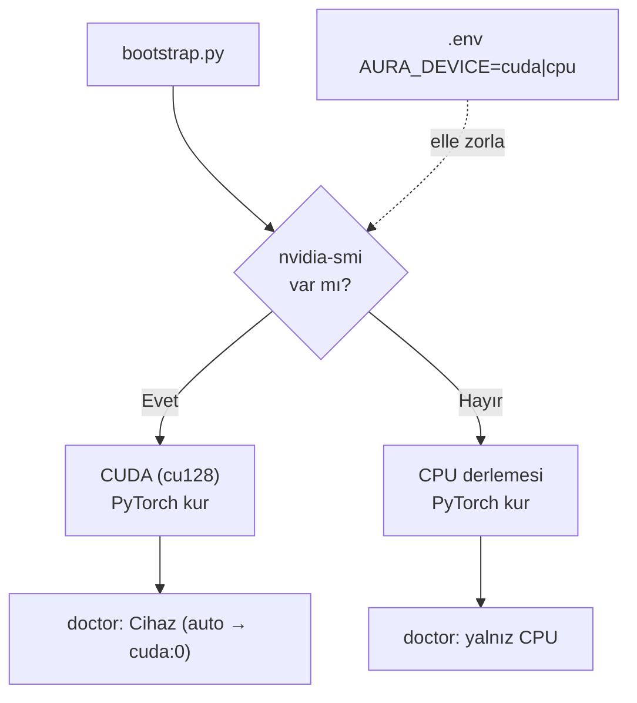
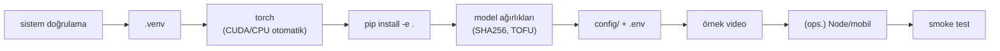

> 📄 **Windows Kılavuzu** · [⬅ docs](README.md) · [repo koku](../README.md)

<div align="center">

# 🪟 Windows Kılavuzu (konsolide)


-76B900?style=flat-square)


</div>

> [!NOTE]
> Bu belge, **Windows üzerinde sıfır RoadGuard bilgisiyle** kurulum, çalıştırma, eğitim ve
> değerlendirmeyi tek yerden anlatır. Tüm mantık `bootstrap.py` içindedir; `.ps1` betikleri
> yalnızca onun ince sarmalayıcılarıdır ve macOS/Linux'taki `run.sh` / `Makefile` ile
> **birebir aynı** işi yapar (port, profil ve `.env` sözleşmesi ortaktır).

### 🔁 Komut paritesi (macOS/Linux ↔ Windows)

| macOS / Linux | Windows (PowerShell) | İş |
|---|---|---|
| `./setup.sh` / `make setup` | `.\setup.ps1` (dev için `.\setup.ps1 --dev`) | Kurulum (bootstrap) |
| `./run.sh` / `make run` | `.\run.ps1` | Tüm servisleri kaldır |
| `make doctor` | `.\dev.ps1 doctor` | Ortam/sağlık kontrolü |
| `make test` | `.\dev.ps1 test` | Unit testler |
| `make lint` / `make format` | `.\dev.ps1 lint` / `.\dev.ps1 format` | ruff / black |
| `make train` | `.\dev.ps1 train` | Eğitim CLI yardımı |
| `make eval` | `.\dev.ps1 eval` | Örnek video + QoD A/B |
| `make metrics` | `.\dev.ps1 metrics` | FTR §4 metrik raporu |
| `make video-test VIDEO=...` | `.\dev.ps1 video-test <video.mp4>` | Gerçek video testi |

---

## 1. 📋 Ön koşullar

| Bileşen | Sürüm / Not |
|---|---|
| **Python** | **3.10+** — kurulumda **"Add python.exe to PATH"** kutusunu işaretleyin. [python.org/downloads](https://www.python.org/downloads/) |
| **Git** | [git-scm.com](https://git-scm.com/download/win) (model ağırlıkları için Git LFS ile birlikte) |
| **PowerShell** | Windows 10/11 ile gelen **5.1** yeterlidir; PowerShell 7+ de çalışır |
| **NVIDIA CUDA** (opsiyonel) | Yalnızca GPU hızlandırma için. Güncel **NVIDIA sürücüsü** yeterli — CUDA Toolkit'i ayrıca kurmanıza gerek yok; `bootstrap.py` doğru CUDA'lı PyTorch tekerleğini (cu128) kendi indirir |

> [!TIP]
> **Python doğrulama:** Yeni bir PowerShell penceresinde `python --version` veya `py -3 --version`
> en az `3.10` göstermeli. `python` komutu Microsoft Store'u açıyorsa (boş "stub"), `py -3`
> kullanın — betikler bu durumu tespit edip otomatik `py -3`'e düşer.

### 🟢 NVIDIA GPU notları
- GPU'yu doğrulamak için: `nvidia-smi` (sürücü kuruluysa GPU adı + sürücü/CUDA sürümü listeler).
- `bootstrap.py`, `nvidia-smi` varsa otomatik **CUDA (cu128)** PyTorch kurar; yoksa **CPU**
  derlemesine düşer. Backend'i `.env` içindeki `AURA_DEVICE=cuda|cpu` ile elle de zorlayabilirsiniz.
- Kurulum sonrası `.\dev.ps1 doctor` çıktısında **"Cihaz (auto → cuda:0)  CUDA: <GPU adı>"**
  satırını görmelisiniz. Sadece CPU görünüyorsa GPU yok ya da sürücü eksik demektir.
- **Geliştirme donanımı (RoadGuard):** NVIDIA GeForce RTX 5070 Laptop GPU — **4.608 CUDA çekirdeği**
  (36 SM × 128), 8 GB VRAM, Compute Capability 12.0 (Blackwell), torch 2.8.0+cu128.
  Server profili CUDA FPS: **12,31** (yolo26l, imgsz 960), laptop profili: **14,72** (yolo26s, imgsz 640).
  Benchmark: `.\dev.ps1 video-test <video.mp4>` veya `python tools/bench.py --device cuda --profile server`.



---

## 2. ⚙️ Kurulum

### a) Depoyu klonla
```powershell
git clone https://github.com/cleoanka/teknofest-prototip.v2.git
cd teknofest-prototip.v2
git lfs install          # bir kez; model ağırlıkları LFS'te tutulur
git lfs pull             # .pt ağırlıklarını indir (pointer dosyaları yerine gerçek dosyalar)
```

### b) Kur (tek komut)
```powershell
.\setup.ps1              # = python bootstrap.py (otomatik 'py -3'e düşer)
.\setup.ps1 --dev        # + dev araçları (pytest, ruff, black) — 'make setup' eşdeğeri
```

`setup.ps1` adımları (hepsi idempotent — ikinci çalıştırma tamamlanmışları atlar):



> [!IMPORTANT]
> **PowerShell çalıştırma politikası (ExecutionPolicy):** `.ps1` betiği "çalıştırılamıyor"
> hatası verirse, geçerli kullanıcı için bir kez:
> ```powershell
> Set-ExecutionPolicy -Scope CurrentUser -ExecutionPolicy RemoteSigned
> ```
> Alternatif olarak betiği tek seferlik şu şekilde de çalıştırabilirsiniz:
> ```powershell
> powershell -ExecutionPolicy Bypass -File .\setup.ps1
> ```

#### Kurulum seçenekleri (bootstrap bayrakları)
Bayraklar `setup.ps1`'e doğrudan geçer (`bootstrap.py`'ye iletilir):
```powershell
.\setup.ps1 --skip-weights   # ağırlık indirmeden (pipeline 'mock' modda çalışır)
.\setup.ps1 --skip-node      # Node.js/mobil kurulumunu atla
.\setup.ps1 --skip-deps      # pip kurulumlarını atla (yalnız yapı/config/ağırlık)
.\setup.ps1 --force          # mevcut .venv'i sil ve sıfırdan kur
```

### c) Kurulumu doğrula (doctor)
```powershell
.\dev.ps1 doctor             # bağımlılık, cihaz (CUDA/CPU), ağırlık, config, profil ✓
```
Tüm çekirdek satırlar ✓ ise sistem **gerçek modda** hazırdır. Ağırlık eksikse `.\setup.ps1`
ile yeniden indirin (veya `git lfs pull`).

---

## 3. ▶️ Çalıştırma

```powershell
.\run.ps1
```
Şunları kaldırır:

| Servis | Adres | Açıklama |
|---|---|---|
| **Inference API** | http://localhost:8080/ | Dashboard + OpenAPI `/docs` |
| **QoD mock** | http://localhost:8081 | — |
| **NV mock** | http://localhost:8082 | — |

`.venv` yoksa `run.ps1` önce bootstrap'ı çağırır. Servis modülü henüz yoksa (erken
milestone) uyarır ve atlar. **Ctrl-C** ile tüm servisleri durdurur.

> [!WARNING]
> **Windows Defender Güvenlik Duvarı:** İlk çalıştırmada `0.0.0.0` bind'i için (servis
> başına bir kez) izin penceresi çıkabilir — **beklenen davranıştır, izin verin.**

### 🎚️ Profiller
Profil, çalışma zamanı davranışını seçer (`config/profiles/*.yaml`, `default.yaml` üzerine
derin-merge). Inference servisi `AURA_PROFILE` env'ini otomatik okur (`run.sh` paritesi):
```powershell
$env:AURA_PROFILE = "server"; .\run.ps1     # yolo26l, CUDA, imgsz 960 — sunucu/maks. doğruluk
$env:AURA_PROFILE = "laptop"; .\run.ps1     # yolo26s, imgsz 640 — hafif/geliştirme
```

| Profil | Dedektör | Cihaz | imgsz | Hedef |
|---|---|---|---|---|
| `server` | yolo26l | auto (CUDA) | 960 | sunucu, maksimum doğruluk |
| `laptop` | yolo26s | auto (MPS/CPU) | 640 | geliştirme, hafif |
| `v4-finetune` | yolguvenligi_types_v4 | auto | 768 | 11-sınıf fine-tune (plaka-kritik) |

### 🔧 PowerShell ortam değişkeni sözdizimi
Bash'teki `VAR=deger komut` Windows'ta çalışmaz. PowerShell'de değişkeni **önce** ayarlayın:
```powershell
# Bash:   AURA_INFERENCE_PORT=9090 ./run.sh
# PowerShell:
$env:AURA_INFERENCE_PORT = "9090"; .\run.ps1

# CPU'ya zorla (GPU'yu yok say)
$env:AURA_DEVICE = "cpu"; .\run.ps1

# Geçerli oturumda bir değişkeni temizle
Remove-Item Env:\AURA_PROFILE
```
Yaygın değişkenler: `AURA_PROFILE`, `AURA_DEVICE`, `AURA_INFERENCE_PORT`,
`AURA_QOD_MOCK_PORT`, `AURA_NV_MOCK_PORT`. Kalıcı değerler için `.env` dosyasını düzenleyin
(`run.ps1` `.env`'i okur; oturumda elle set edilen değerler ezilmez — önce gelen kazanır).

> [!NOTE]
> **Port temizliği:** `run.ps1` önceki çalıştırmadan kalıp portu tutan dinleyiciyi otomatik
> serbest bırakır (aksi halde uvicorn `[10048]` hatası verir).

---

## 4. 🎓 Eğitim

```powershell
.\dev.ps1 train                          # eğitim CLI yardımı (alt komutları listeler)
```
Alt komutlar (detay için `docs/egitim.md`). `dev.ps1 train` yardım gösterir; gerçek eğitim
için `.venv` Python'ını doğrudan çağırın:
```powershell
.\.venv\Scripts\python.exe -m train dataset --input data\raw --output data\processed --train 0.8 --val 0.1
.\.venv\Scripts\python.exe -m train detector --data data\processed\data.yaml --epochs 100 --imgsz 768 --device auto
```
> [!TIP]
> GPU'da eğitim için `--device cuda` (veya `auto`); `--batch -1` CUDA'da otomatik batch seçer.

---

## 5. 📊 Değerlendirme ve gerçek video testi

```powershell
.\dev.ps1 eval                           # örnek video + QoD A/B değerlendirmesi
.\dev.ps1 metrics                         # FTR §4 metrik raporu (eval_results\ab özetlerinden)
.\dev.ps1 video-test C:\yol\video.mp4     # gerçek video → annotated mp4 + JSON kanıt
```
`video-test`, kaynağı pipeline'dan geçirip `eval_results\<ad>_annotated.mp4` +
`eval_results\<ad>_summary.json` üretir (plaka kararı, sürücü bayrak süreleri, swerving, FPS).
Cihaz otomatik seçilir (`--device auto`).

> [!IMPORTANT]
> Ground-truth plaka (repo'daki test videoları için): **`34TC8532`** — OCR doğruluğunu
> bununla doğrulayın.

---

## 6. 🛠️ Sorun Giderme

| Belirti | Çözüm |
|---|---|
| `.ps1 çalıştırılamıyor` / "betikler devre dışı" | `Set-ExecutionPolicy -Scope CurrentUser RemoteSigned` veya `powershell -ExecutionPolicy Bypass -File .\setup.ps1` |
| `python` Microsoft Store'u açıyor (9009) | Boş Store stub'ı. `py -3 --version` deneyin; betikler otomatik `py -3`'e düşer. Kalıcı çözüm: Store stub'ını kapatın (Ayarlar → Uygulama takma adları) ve python.org Python'ını PATH'e ekleyin |
| `Python 3.10+ bulunamadı` | python.org'dan 3.10+ kurun, **"Add to PATH"** işaretli; yeni pencere açın |
| Türkçe karakter bozuk / `UnicodeDecodeError` / `cp1254` | Betikler `PYTHONUTF8=1` + UTF-8 konsol ayarlar. Elle çağırıyorsanız: `$env:PYTHONUTF8 = "1"` ve `chcp 65001` |
| `.ps1` betik parse hatası (`Unexpected token 'veya'` vb.) | PS1 dosyaları UTF-8 BOM'suz kaydedilmişse PS 5.1 CP1252 olarak okur ve Türkçe karakterleri bozar. `.ps1` dosyalarını UTF-8 BOM'lu kaydet: `[System.IO.File]::WriteAllText($p, [System.IO.File]::ReadAllText($p,[Text.Encoding]::UTF8), (New-Object Text.UTF8Encoding($true)))` |
| Port dolu (`[10048]`) | `run.ps1` portu otomatik boşaltır; yine de çakışırsa `$env:AURA_INFERENCE_PORT="9090"; .\run.ps1` |
| Güvenlik duvarı izin penceresi | `0.0.0.0` bind'i için normaldir (servis başına bir kez) — izin verin |
| `.venv bulunamadı` (dev.ps1) | Önce `.\setup.ps1 --dev` çalıştırın |
| Ağırlık eksik → `mock` mod | `git lfs pull` veya `.\setup.ps1`; doctor "ağırlık ✓" göstermeli |
| Sadece CPU görünüyor, GPU yok | `nvidia-smi` çalışıyor mu? Sürücü güncel mi? Gerekirse `.\setup.ps1 --force` ile torch'u CUDA'lı yeniden kurun |
| `ultralytics yok` → mock mod | Normal; gerçek model için ağırlık + `ai_mode: real` |

---

## 📚 İlgili belgeler
- [`kurulum.md`](kurulum.md) — platform-bazlı kurulum
- [`calistirma.md`](calistirma.md) — uçtan uca demo senaryosu
- [`dagitim.md`](dagitim.md) — sunucu dağıtımı (profil + servis)
- [`egitim.md`](egitim.md) — eğitim akışı + hiperparametre rehberi
- [`degerlendirme.md`](degerlendirme.md) — metrikler + QoD A/B protokolü
- [`cli_referans.md`](cli_referans.md) — tüm `--help` çıktıları
