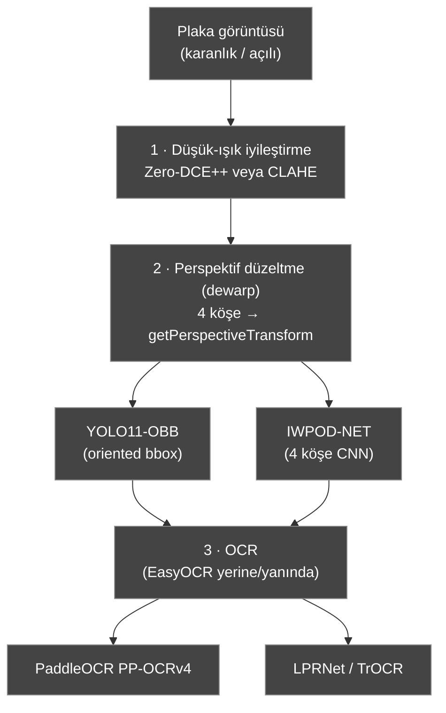
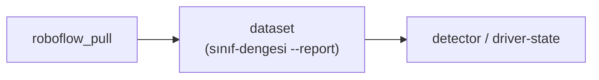
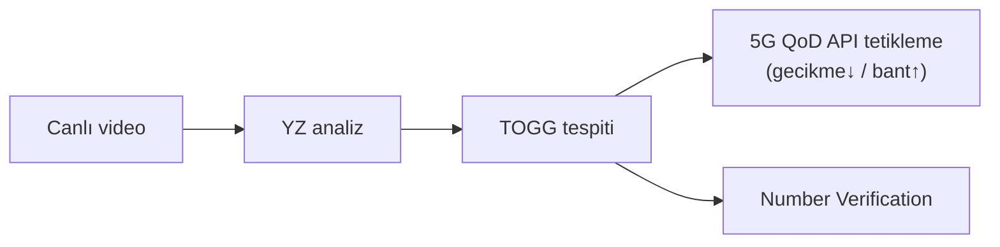

> 📄 **Yol Haritası** · [⬅ docs](README.md) · [repo kökü](../README.md)

# 🗺️ Yol Haritası — Sıradaki İşler

**(Gemini araştırması destekli)**

---

> [!NOTE]
> Bu belge, AURA'nın bilinen zayıf noktaları + FTR boşlukları için **somut, kaynaklı** sonraki adımları toplar. Araştırma `gemini-3.1-pro-preview` (salt-okunur) ile yapıldı.

> [!WARNING]
> ⚠️ **Her iddia çalışan ortama / resmi kaynağa karşı doğrulanmalı** (Gemini bilgisi güncel olmayabilir — bkz. `gemini.md`).

---

## 1. 🔢 Plaka il-kodu misread'i (büyük ölçüde KAPATILDI — 18–19 Haz 2026)

> [!IMPORTANT]
> **DURUM:** İki adımla giderildi.
> - **(a)** **OCR motoru `fast-plate-ocr`** varsayılan oldu (plakaya-özel hafif ONNX); 3 gerçek videoda EasyOCR'ın video_3 il-kodu misread'ini (3→2, T→I) kurtardı → **3/3 exact-match, CER 0.0** (bkz. `docs/degerlendirme.md`).
> - **(b)** **`custom_license_plate`** (YOLO26s, held-out mAP50 0.983) sıkı LP-kırpık varsayılan dedektör oldu (A/B 3/3 korundu). Aşağıdaki Gemini-önerili hat (dewarp/PaddleOCR) artık opsiyonel iyileştirmedir; OCR motoru `aura/plate/ocr.py:build_ocr` arkasında soyut kalır.

**Özgün sorun (arşiv):** Karanlık/açılı otopark footage'ında EasyOCR il-kodunu tutarlı yanlış okuyordu (3→0/2); oy-mantığı bunu kurtaramıyordu (dürüstlük zırhları yanlış onayı `pending`e çevirir ama doğruyu üretemez).

**Önerilen hat (Gemini, opsiyonel):**

1. **Düşük-ışık iyileştirme:** Zero-DCE++ (`Li-Chongyi/Zero-DCE_extension`, ~gerçek-zamanlı) veya mevcut CLAHE (zaten `pose.roi_enhance` + plaka ön-işlemede var).
2. **Perspektif düzeltme (dewarp):** plakanın 4 köşesini çıkar → `cv2.getPerspectiveTransform`:
   - **YOLO11-OBB** (oriented bbox; `ultralytics`) — eğik plakanın 4 köşesi, hızlı.
   - veya **IWPOD-NET** (`claudiojung/iwpod-net`) — kısıtsız plaka için 4 köşe CNN.
3. **OCR (EasyOCR yerine/yanında):** **PaddleOCR PP-OCRv4** (`PaddlePaddle/PaddleOCR`) — bloklu Latin metinde EasyOCR'dan belirgin sağlam; alternatif **LPRNet** (plakaya özel, küçük TR setiyle fine-tune) veya **TrOCR** (transformer, bulanıkta az halüsinasyon).

> [!TIP]
> **Entegrasyon notu:** AURA'nın plaka hattı (`aura/plate/reader.py`) zaten LP-dedektör + ön-işleme + oy havuzu modüler; OCR motoru `aura/plate/ocr.py:build_ocr` arkasında soyut → PaddleOCR adaptörü eklenebilir (mevcut EasyOCR yolu korunarak). Bu, A/B'deki tek zayıf metriği kapatır.

---

## 2. 📊 Eksik sınıflar için açık veri setleri (FTR §2 — veri seti)

> [!IMPORTANT]
> **GÜNCEL (19 Haz 2026):** `license_plate` (8823), `seatbelt` (3104), `smoking` (557) ve `phone` (659) için **gerçek açık veri toplandı** (hepsi CC BY 4.0, PIL-doğrulanmış) ve YOLO26s fine-tune'lar **TAMAMLANDI**: held-out mAP50/mAP50-95 = `license_plate` **0.983/0.707**, `smoking` **0.856/0.457**, `seatbelt` **0.895/0.546** (`weights/custom_*.metrics.json`).
> `custom_license_plate` → varsayılan LP dedektör; `custom_smoking` → `pose.py` ikinci-model; `seatbelt` opsiyonel. Detay: `docs/veri_seti.md`.

> [!WARNING]
> **Kalan boşluk:** `minibus` (no-auth açık set yok) ve `fatigue` (teyitli açık set yok) → komite verisi / Roboflow-Kaggle erişimi bekliyor.

Aşağıdaki tablo, daha **büyük** setler ve `minibus` için araştırılan açık kaynakları listeler (Gemini; kullanım önce lisans + içerik teyidi):

| Sınıf | Set | Kaynak | ~Görüntü | Lisans |
|---|---|---|---|---|
| cigarette/smoking | driver-smoking-detecor | Roboflow Universe (gordon-v6v6v) | 1.066 | CC BY 4.0 |
| cigarette/smoking | Smoker YOLO.v4 | Roboflow Universe (dingguangyu) | 4.221 | CC BY 4.0 |
| seatbelt | seat_belt_detection | Roboflow Universe (helmet-seatbelt-detection) | 3.820 | CC BY 4.0 |
| seatbelt | Driver Seat Belt Detection | Kaggle (lavdeep1234) | ~30.000 | CC0 |
| minibus/dolmuş | traffic (minibus/kamyon/otobüs) | Roboflow Universe (johnny) | ~5.150 | CC BY 4.0 |
| minibus/dolmuş | _images_oturum3 (İstanbul dolmuş) | Roboflow Universe (geod) | ~3.950 | CC BY 4.0 |

**İş akışı:**

İş akışı: `python -m train.roboflow_pull ...` → `python -m train dataset --input ... --output ... --report` (sınıf-dengesi) → `python -m train detector/driver-state ...`. Detay: `docs/egitim.md`.

> [!NOTE]
> Bu setler **kaynakçaya** (FTR §5) eklenmelidir (açık-kaynak veri kullanımı şartname'de serbest).

---

## 3. 🚀 Final yarışma hazırlığı (şartname 3. aşama)

Gemini'nin özeti (şartnameyle uyumlu): finalde **mobil/web uygulamada canlı demo** — canlı video → YZ analiz → **TOGG tespiti** → **5G QoD API** tetikleme (gecikme↓/bant↑) + **Number Verification**.

AURA tarafında karşılıkları: `qod` (yaklaşma tetiği), `nv_mock`, `mobile/`, `WS /stream/events` (bkz. `ftr.md` §6).

> [!TIP]
> Final'de yalnız endpoint/credential değişir.

---

## 4. ✅ FTR teslim tarihi — 28.06.2026 (ertelendi, AÇIK)

- ⏳ FTR son teslim **28.06.2026'ya ERTELENDİ** (kullanıcı 17 Haz'da teyit etti; eski şartname PDF'indeki 14.06 ve Gemini'nin 22.06 tahmini geçersiz — bağlayıcı tarih 28.06).
- 🟡 Yani **FTR hâlâ açık** → `ftr.md` doldurulabilir taslağı + `aura.eval --metrics-report` + `train dataset --report` çıktıları rapora doğrudan girer (en yüksek puanlı §2 ve §4 hazır).
- 📅 Diğer tarihler: finalistler 31.07.2026, final Ağu–Eyl 2026 (KYS/mail'den teyit edin).

---

> [!NOTE]
> *Kaynaklar: Gemini 3.1 Pro araştırması (docs.ultralytics.com, Roboflow Universe, Kaggle, teknofest.org). Tüm bağlantılar kullanım öncesi doğrulanmalı.*
