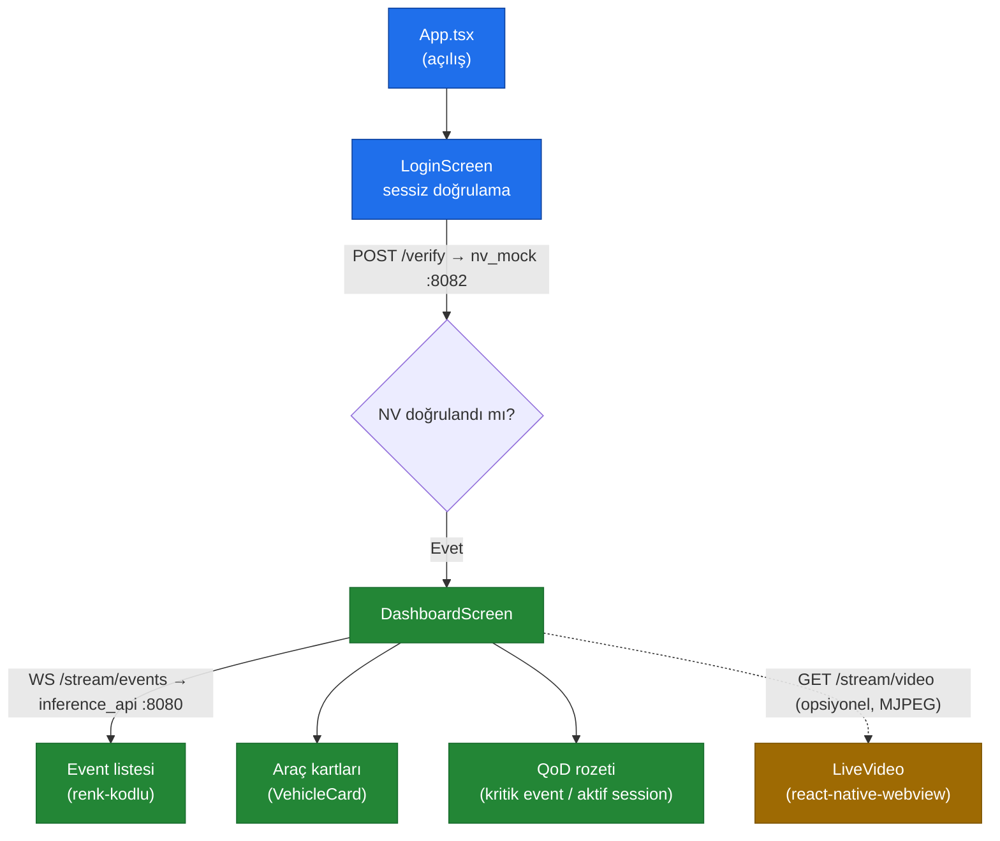

# `mobile/` — RoadGuard Mobil (Expo / React Native)

> 📂 **mobile/** · Mobil İstemci (Expo / React Native) · [⬅ repo köküne dön](../README.md)

<div align="center">


</div>

TEKNOFEST şartnamesindeki **Number Verification sessiz giriş** + **tespitlerin mobil
ekranda gösterimi** maddelerini karşılayan çalışan iskelet.

> [!IMPORTANT]
> **Onur zırhı K-004:** Bu doküman yalnızca görsel olarak zenginleştirilmiştir. Hiçbir sayı, komut, dosya-yolu, bağlantı veya iddia uydurulmamış ya da değiştirilmemiştir.

---

## ✨ Özellikler

- **Sessiz giriş:** açılışta NV mock'a (`POST /verify`) otomatik doğrulama (SMS/OTP yok).
- **Canlı tespitler:** `WS /stream/events` → event listesi (renk-kodlu) + araç kartları.
- **Canlı video (opsiyonel):** `GET /stream/video` MJPEG — `react-native-webview` kuruluysa
  oynar, değilse bilgilendirici yer-tutucu (kart akışı ana gösterimdir, bağımlılık şişmez).
- **QoD rozeti:** kritik event/aktif QoD session'da "QoD AKTİF" rozeti.
- **Kaynak değiştirme:** opsiyonel — `inference_api` kaynağını mobilden değiştirme.

---

## 🚀 Kurulum & çalıştırma

```bash
cd mobile
npm install
npx expo start          # QR kod → Expo Go (iOS/Android) veya emülatör
```

> [!TIP]
> `bootstrap.py` node mevcutsa `npm install`'ı otomatik yapar.

---

## ⚙️ Yapılandırma (mock ↔ gerçek)

API adresleri env ile verilir; **mock↔gerçek geçişi yalnızca adres değiştirmektir**
(sözleşme aynı kalır):

```bash
# Makinenizin LAN IP'sini kullanın (localhost emülatörden erişilemez)
EXPO_PUBLIC_API_URL=http://192.168.1.20:8080 \
EXPO_PUBLIC_NV_URL=http://192.168.1.20:8082 \
npx expo start
```

PowerShell (Windows):

```powershell
$env:EXPO_PUBLIC_API_URL="http://192.168.1.20:8080"; $env:EXPO_PUBLIC_NV_URL="http://192.168.1.20:8082"; npx expo start
```

| Env | Varsayılan | Açıklama |
|---|---|---|
| `EXPO_PUBLIC_API_URL` | `http://localhost:8080` | inference_api (events/status/source) |
| `EXPO_PUBLIC_NV_URL` | `http://localhost:8082` | Number Verification |

> [!NOTE]
> Android emülatör için host makine `10.0.2.2` adresinden görünür.

---

## 🔄 Akış (sessiz giriş → canlı tespitler)



---

## 🗂️ Yapı

| Dosya | Sorumluluk |
|---|---|
| `App.tsx` | Giriş — NV doğrulama → Dashboard |
| `src/api/client.ts` | NV verify + event WS + kaynak kontrolü |
| `src/api/types.ts` | Event/track DTO tipleri (inference_api sözleşmesi) |
| `src/screens/LoginScreen.tsx` | Sessiz doğrulama ekranı |
| `src/screens/DashboardScreen.tsx` | Canlı event listesi + araç kartları + QoD rozeti |
| `src/hooks/useQod.ts` | QoD durum/histerezis hook'u |
| `src/ui/` | Sunum bileşenleri: `LiveVideo`, `EventRow`, `VehicleCard`, `Badges`, `QodIndicator`, `theme` |
| `src/config.ts` | API adresleri (env override) |

---

## ✅ Önkoşul

> [!WARNING]
> `inference_api` (:8080) ve `nv_mock` (:8082) çalışıyor olmalı (`./run.sh`).
