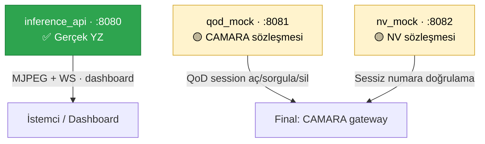

> 📂 **services/** · Mikroservisler · [⬅ repo kökü](../README.md)

<div align="center">

# 🧩 `services/` — Mikroservisler


</div>

---

## 🗂️ Servisler

| Servis | Port | Gerçek/Mock | Açıklama |
|---|---|---|---|
| `inference_api/` | 8080 | ✅ **Gerçek YZ** | Pipeline'ı koşturur; MJPEG + WS yayar; dashboard'u serve eder |
| `qod_mock/` | 8081 | 🟡 Mock (CAMARA sözleşmesi) | QoD session aç/sorgula/sil |
| `nv_mock/` | 8082 | 🟡 Mock (NV sözleşmesi) | Sessiz numara doğrulama |

---

## 🧠 Gerçek/Mock sınırı

> [!IMPORTANT]
> `inference_api` tüm CV/YZ hattını gerçek çalıştırır. `qod_mock` ve `nv_mock` gerçek telekom API sözleşmesini birebir taklit eder — final ortamında yalnızca endpoint/credential CAMARA/operatör gateway'ine çevrilir, sözleşme değişmez.



---

## 🚀 Çalıştırma

```bash
./run.sh          # üçünü birden kaldırır (macOS/Linux)
.\run.ps1         # Windows
```

<details>
<summary>veya tek tek</summary>

```bash
uvicorn services.inference_api.main:app --port 8080
uvicorn services.qod_mock.main:app --port 8081
uvicorn services.nv_mock.main:app --port 8082
```

</details>

---

> [!TIP]
> Tüm endpoint'ler: `docs/api_referans.md` · OpenAPI: http://localhost:8080/docs
