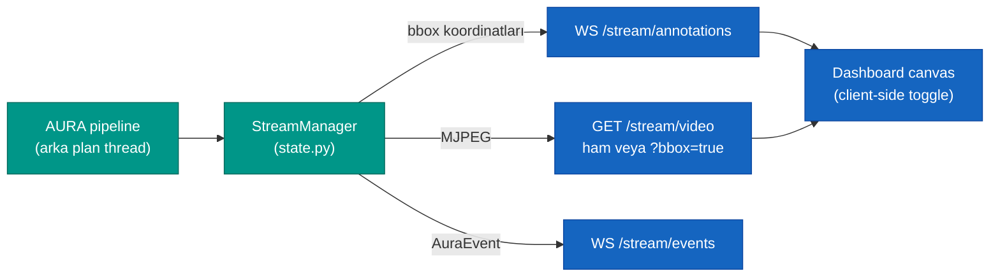

> 📂 **aura/** · Gerçek YZ Mikroservisi · [⬅ repo kökü](../../README.md)

# `inference_api/` — Gerçek YZ Mikroservisi (:8080)

<div align="center">


</div>

FastAPI. AURA pipeline'ını arka plan thread'inde koşturur ve **iki-kanal** akış yayar.

> [!IMPORTANT]
> **Onur zırhı K-004** — Bu dosya yalnızca görsel olarak zenginleştirilmiştir. Hiçbir sayı, komut, dosya-yolu, bağlantı veya iddia değiştirilmemiş; tüm bölümler aynen korunmuştur.

---

## 🧠 İki-kanal mimari

- `GET /stream/video` → MJPEG (ham veya `?bbox=true` ile server-side çizimli)
- `WS /stream/annotations` → kare başına bbox koordinatları (dashboard canvas çizer)
- `WS /stream/events` → `AuraEvent` stream'i (durum değişimleri)

Dashboard bbox toggle'ı **client-side** yapar (canvas temizle/çiz) → sunucuya gidiş-geliş yok.



---

## 🔌 Endpoint grupları

| Grup | Endpoint'ler |
|---|---|
| Sistem | `GET /health`, `GET /info` |
| Kamera | `GET /cameras` (OpenCV enum + platform isimleri) |
| Akış | `POST /stream/start\|stop`, `PATCH /stream/config`, `GET /stream/status`, `GET /stream/video`, `WS /stream/annotations\|events` |
| Track | `GET /tracks`, `GET /tracks/{id}`, `GET /tracks/{id}/history` |
| Eval | `POST /eval/run`, `GET /eval/results`, `GET /eval/results/export` |
| Config | `GET /config`, `PATCH /config` |

---

## 🗂️ Yapı

| Dosya | Sorumluluk |
|---|---|
| `main.py` | App assembly (lifespan, router'lar, statik dashboard serve) |
| `state.py` | `StreamManager` — pipeline worker + MJPEG buffer + WS push |
| `models.py` | İstek/yanıt DTO'ları |
| `routers/` | system, cameras, stream, tracks, eval, config |

---

## ⚙️ Env

| Değişken | Etki |
|---|---|
| `AURA_AUTOSTART=0` | Başlangıçta otomatik stream başlatma (varsayılan 1) |
| `AURA_CAMERA_PROBE=0` | `/cameras` donanım taramasını atla (CI/başsız) |

---

## 🚀 Çalıştırma

```bash
uvicorn services.inference_api.main:app --port 8080 --reload
```
