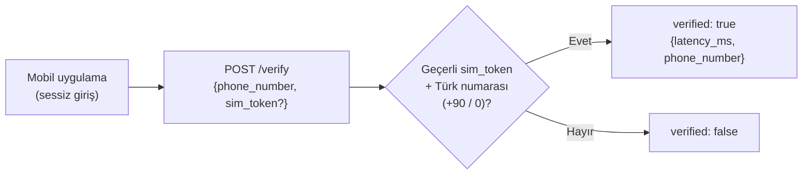

> 📂 **services/nv_mock/** · Number Verification Mock · [⬅ repo kökü](../../README.md)

<div align="center">

# 📱 `nv_mock/` — Number Verification Mock


</div>

Operatör **Number Verification** (sessiz doğrulama) sözleşmesini taklit eder.
SMS/OTP yoktur; SIM/şebeke bağı kontrol edilir. Mobil uygulama sessiz girişte bunu çağırır.

---

## 🔁 Akış



> [!IMPORTANT]
> **Onur zırhı K-004:** Bu dosya yalnızca görsel olarak zenginleştirilmiştir. Hiçbir sayı, metrik, komut, dosya-yolu, bağlantı veya iddia uydurulmamış ya da değiştirilmemiştir; tüm olgusal içerik aynen korunmuştur.

---

## 🔌 Endpoint'ler

| Method | Path | Açıklama |
|---|---|---|
| `POST` | `/verify` | `{phone_number, sim_token?}` → `{verified, latency_ms, phone_number}` |
| `GET` | `/health` | Servis durumu |

> [!NOTE]
> **Mock kuralı:** geçerli `sim_token` + Türk numarası (`+90`/`0`) → `verified: true`.
> Final ortamında endpoint operatör NV API'sine çevrilir.

---

## 🚀 Örnek

```bash
curl -X POST localhost:8082/verify -H 'content-type: application/json' \
  -d '{"phone_number":"+905551112233","sim_token":"abc"}'
# → {"verified": true, "latency_ms": 40, "phone_number": "+905551112233"}
```

> [!TIP]
> Çalıştır: `uvicorn services.nv_mock.main:app --port 8082`
