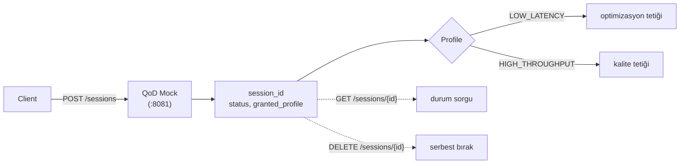

> 📂 **services/qod_mock/** · CAMARA QoD Mock Gateway · [⬅ repo köküne](../../README.md)

<div align="center">

# 📡 `qod_mock/` — CAMARA QoD Mock Gateway


</div>

5G **Quality-on-Demand** (CAMARA) sözleşmesini taklit eder. Gerçek ağ kaynağı
ayırmaz; session yaşam döngüsünü in-memory yönetir. Final ortamında endpoint
Turkcell QoD gateway'e çevrilir — sözleşme aynı kalır.

> [!NOTE]
> Bu servis **mock**'tur: gerçek ağ kaynağı **ayırmaz**, session yaşam döngüsünü **in-memory** yönetir. Final ortamında endpoint Turkcell QoD gateway'e çevrilir — **sözleşme aynı kalır**.

---

## 🧠 Session Yaşam Döngüsü



---

## 🔌 Endpoint'ler

| Method | Path | Açıklama |
|---|---|---|
| `POST` | `/sessions` | `{profile, device_id, duration_seconds?}` → `{session_id, status, granted_profile}` |
| `GET` | `/sessions` | Aktif tüm session'lar |
| `GET` | `/sessions/{id}` | Session durumu |
| `DELETE` | `/sessions/{id}` | Session'ı serbest bırak |
| `GET` | `/health` | Servis durumu + aktif session sayısı |

> [!TIP]
> Profiller: `LOW_LATENCY` (optimizasyon tetiği), `HIGH_THROUGHPUT` (kalite tetiği).

---

## 🚀 Örnek

```bash
curl -X POST localhost:8081/sessions -H 'content-type: application/json' \
  -d '{"profile":"LOW_LATENCY","device_id":"togg-01"}'
```

**Çalıştır:**

```bash
uvicorn services.qod_mock.main:app --port 8081
```
