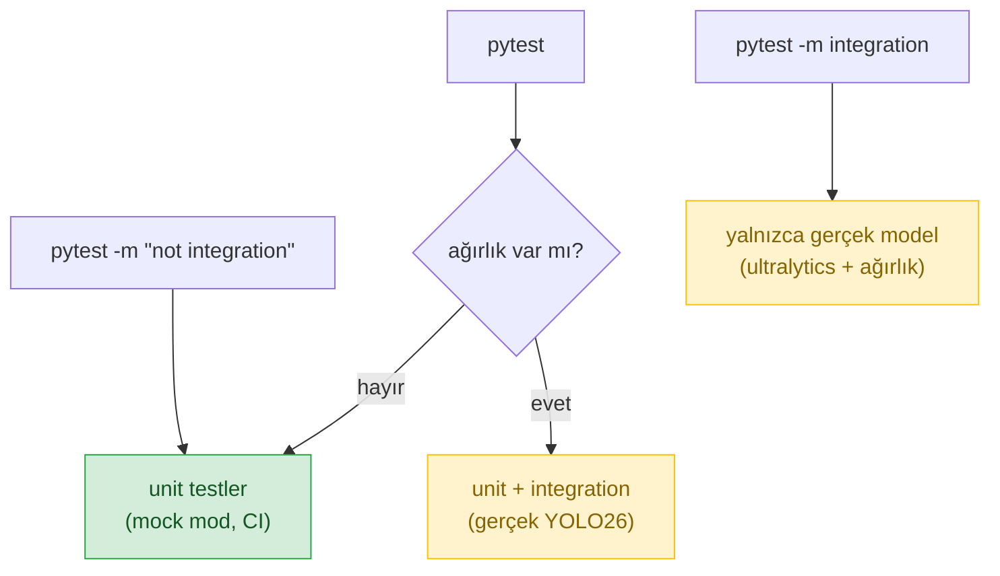

> 📂 **roadguard/tests/** · Test Paketi · [⬅ repo kökü](../README.md)

<div align="center">

# 🧪 `tests/` — Test Paketi


</div>

---

Model gerektirmeyen **unit testler** (mock modda çalışır, CI-uyumlu) + ağırlık gerektiren
**integration testler** (`@pytest.mark.integration`, CI'da skip).

> [!NOTE]
> Unit testler ağırlık olmadan mock modda koşar ve CI'da çalışır; integration testleri ağırlık yoksa **otomatik skip** edilir.

## 🚀 Çalıştırma

```bash
pytest                      # tümü (integration'lar ağırlık yoksa otomatik skip)
pytest -m "not integration" # yalnızca unit (CI'nın yaptığı)
pytest -m integration       # gerçek model (ultralytics + ağırlık gerekir)
```



---

## 🗂️ Kapsam (alana göre)

| Alan | Dosyalar | Test eder |
|---|---|---|
| Sözleşme/şema | `test_contracts.py`, `test_events.py` | §6.0 pydantic sözleşmeleri, RoadGuardEvent/AnnotationFrame emitter + WS push |
| Tespit/takip | `test_detection.py`, `test_yolo_detector.py`, `test_class_vote.py` | Mock + gerçek YOLO26 dedektör, IoU takipçi, ROI geometri, alan-ağırlıklı sınıf oyu |
| Stabilite | `test_stability.py` | 16/8 state machine (7/16→ret, 8/16→kabul, flicker) |
| Sürücü durumu | `test_driver_state.py`, `test_driver_engine.py`, `test_driver_pose.py`, `test_driver_lock.py`, `test_driver_yolo_backend.py` | Katman A pose/yolo backend, Katman B `DriverStateEngine` ID-oylaması, sürücü kimlik kilidi |
| Plaka | `test_plate.py`, `test_plate_normalize.py`, `test_plate_ocr.py`, `test_plate_ocr_engines.py`, `test_plate_reader_branches.py` | Sweet-spot, TR regex/normalizasyon, OCR motorları (fastplate/easyocr/paddle), ret→QoD |
| Hız/yalpalama | `test_speed.py`, `test_speed_metric.py`, `test_speed_gt.py`, `test_speed_gaps.py`, `test_speed_plate_calib.py`, `test_swerving.py` | disabled relative flag, tripwire, metric oto-kalibrasyon, plaka-tabanlı kalib, swerving |
| Sahne | `test_sign.py`, `test_sign_gaps.py` | Tabela takibi → aktif hız limiti |
| Accumulator/risk | `test_accumulator.py` | ID-merkezli TrackRecord + risk kuralları |
| QoD | `test_qod.py` | QoD histerezisi (tetik/bırak, cooldown) |
| API | `test_api_contracts.py`, `test_api_core_coverage.py` | inference_api + qod_mock + nv_mock (TestClient) |
| Eval | `test_eval.py`, `test_eval_metrics.py`, `test_eval_map.py` | QoD A/B harness, metrikler (CER, plaka doğruluğu), mAP |
| Eğitim | `test_train.py` | Dataset split + data.yaml |
| Altyapı | `test_config.py`, `test_device.py`, `test_ai_mode.py`, `test_taxonomy.py`, `test_preprocess.py`, `test_report.py` | Config yükleyici, cihaz çözümleyici, ai_mode (real/mock/auto), taksonomi eşlemesi, ön-işleme, rapor |
| Pipeline | `test_pipeline_unit.py`, `test_pipeline_output_gate.py` | Uçtan uca orkestrasyon + `min_track_frames` çıktı kapısı |
| Opsiyonel | `test_optional.py` | §8 lazy import (kapalıyken import yok) + işlevsellik |
| Integration | `test_integration.py` | Gerçek YOLO26 (`@pytest.mark.integration`, ağırlık yoksa skip) |

---

> [!TIP]
> `conftest.py`: `cfg` fixture (`config/default.yaml`) + repo kökünü `sys.path`'e ekler.
