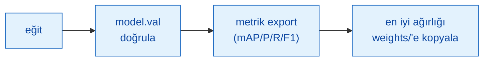
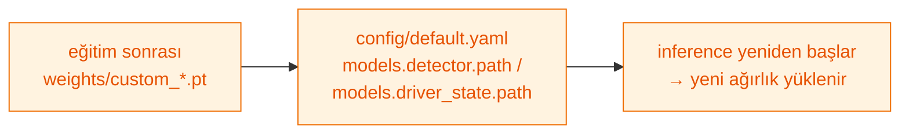

> 📂 **aura/train/** · Model Eğitimi · [⬅ repo kökü](../README.md)

<div align="center">

# 🏋️ `train/` — Model Eğitimi (YOLO26 fine-tune)


-1565C0?style=flat-square)


</div>

YOLO26 fine-tune pipeline'ları. `--help` torch gerektirmez (ultralytics lazy import).
Otomatik cihaz (CUDA→MPS→CPU). Detaylı rehber: `docs/egitim.md`.

### 🔄 Akış



---

## 🚀 Komutlar

```bash
python -m train --help
python -m train dataset --input data/raw/ --output data/processed/ --classes car,truck,bus,minibus
python -m train dataset --report --output data/processed/          # veri-dengeleme raporu (FTR §2)
python -m train detector --data data/processed/data.yaml --weights weights/yolo26l.pt --epochs 100 --imgsz 768
python -m train driver-state --data data/driver/data.yaml --imgsz 320
python -m train fetch                                                 # eksik-sınıf indirme PLANI (kuru, ağ yok)
python -m train fetch --class minibus                                # tek sınıfın planı
python -m train fetch --run                                          # gerçek indirme (ROBOFLOW_API_KEY)
python -m train.roboflow_pull --workspace W --project P --version 1   # ROBOFLOW_API_KEY
```

Subcommand'lar: `detector` · `driver-state` · `dataset` · `fetch`.

> [!TIP]
> Konfigüre edilebilir: `--lr0 --patience --resume --no-augment --no-val --out --device {auto,cpu,cuda,mps}`.

---

## 🗂️ Dosyalar

| Dosya | Sorumluluk |
|---|---|
| `__main__.py` | `python -m train` (detector / driver-state / dataset subcommand) |
| `train_detector.py` | YOLO26 dedektör fine-tune → `weights/custom_detector.pt` (+metrics.json) |
| `train_driver_state.py` | YOLO26 sürücü-durum fine-tune (320px) → `weights/custom_driver.pt` |
| `prepare_dataset.py` | train/val/test split + `data.yaml` + veri-dengeleme raporu (torch gerektirmez) |
| `fetch.py` | `datasets.yaml` manifestini oku → eksik-sınıf indirme PLANI bas (varsayılan kuru/ağsız; `--run` ile çeker) |
| `merge_driver_datasets.py` | Çok-kaynaklı Roboflow YOLO datasetlerini tek birleşik driver_state uzayına (phone/smoking/no_seatbelt/fatigue) remap+merge eder (standalone betik) |
| `roboflow_pull.py` | Roboflow veri çekme (opsiyonel) |
| `utils.py` | `run_finetune` (eğit+doğrula+export) + otomatik cihaz + veri istatistiği |
| `datasets.yaml` | Bildirimsel eksik-sınıf veri seti manifesti (kaynak/lisans/class_map) — `fetch.py` okur |
| `configs/` | `detector.yaml`, `driver_state.yaml` data.yaml örnekleri + `driver_merge.json` |

---

## 🔁 Custom ağırlık swap

Eğitim sonrası `weights/custom_*.pt` üretilir. `config/default.yaml` →
`models.detector.path` / `models.driver_state.path` değerini güncelleyin; inference
yeniden başladığında yeni ağırlık yüklenir.



---

> [!NOTE]
> Detaylar: `docs/egitim.md` · veri toplama: `docs/veri_seti.md`.
