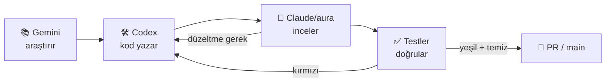
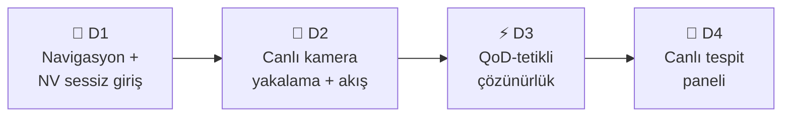
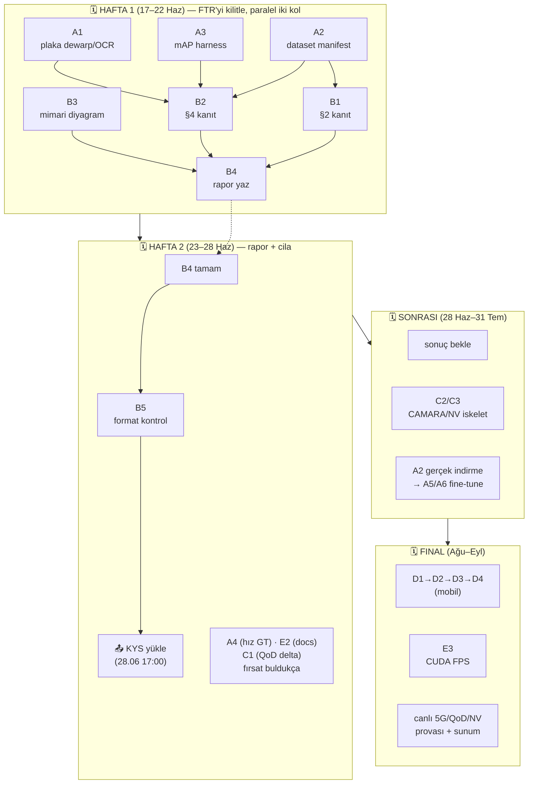

<div align="center">

# 🛣️ ULTRAPLAN — AURA

### FTR'yi Geç + Her Şeyi Geliştir (Codex CLI ile yürütülür)


</div>

> [!NOTE]
> **Ne bu?** AURA'nın (TEKNOFEST 2026 "5G & YZ ile Akıllı Yol Güvenliği") FTR aşamasını
> geçmek ve finale kadar **her cephede** (öncelik YZ; sonra QoD, mobil, rapor, altyapı)
> en üst seviyeye çıkarmak için **uçtan uca, gerçeğe oturmuş** bir yol haritası.
> **Özelliği:** her iş kalemi bir **Codex CLI iş emri** olarak yazılmıştır — kopyala,
> çalıştır, Codex yazar; Claude/aura inceler; testler doğrular.

> [!IMPORTANT]
> **Bağlam tarihleri (bağlayıcı):** Plan tarihi **17.06.2026**. **FTR son teslim 28.06.2026**
> (ertelendi; BİRİNCİL KAPI). Finalistler **31.07.2026**. Final **Ağu–Eyl 2026**.
> Kaynak okuma: `şartname PDF` (v1 repo), `ftr.md`, `docs/mimari.md`, `config/default.yaml`,
> `CHANGELOG.md`, `docs/sartname_izlenebilirlik.md`, `docs/yol_haritasi.md`.

> [!TIP]
> ✅ **YÜRÜTME DURUMU (18.06.2026):** Bu planın **W1 (1. hafta) kısmı büyük ölçüde
> UYGULANDI** (`feat/ultraplan-w1` dalı, origin'e push'lu): A1 plaka hattı (dewarp/enhance
> ölçülüp KAPATILDI; **fast-plate-ocr getirildi → plaka 3/3 exact, CER 0**), A3 mAP harness,
> B1/B2/B3 FTR kanıt+diyagram, B4 `ftr_rapor_taslak.md`, stabilite zırhları, **mobil temel
> uygulama** (D1–D4 çekirdeği; commit `1bbbf8c`, tsc-temiz). **Özel-model fine-tune ŞU AN
> KOŞUYOR** (A2/A5/A6 — license_plate ara `mAP50≈0.97` ep12/35; seatbelt/smoking sırada;
> *nihai mAP'ler kesinleşmedi*). Aşağıdaki iş emirleri **tarihsel referans + kalan işler**
> (CAMARA/NV gerçek entegrasyon, fine-tune'u bitir, final demo) için geçerlidir.

> [!WARNING]
> **Not (araç durumu):** Codex **ölü** (0-çıktı); Gemini **kısmi** (pro `403`, `gemini-2.5-flash`
> çalıştı). Bu planın iş emirleri Codex içindi; fiilen çalışmalar Claude (Opus) tarafından yürütüldü.

---

## 🧭 0. Yürütme modeli — planı Codex nasıl "yapar"

Her iş emri (WP-x) aşağıdaki kalıpla çalıştırılır.

<div align="center">

-orange?style=flat-square)
-blue?style=flat-square)
-9cf?style=flat-square)

</div>



**A) Tek iş emri — doğrudan Codex (yazma yetkili):**
```bash
codex exec -s workspace-write -C ~/teknofest-prototip.v2 "<İŞ EMRİ PROMPTU>"
```
- `-s workspace-write` → repo içinde dosya yazar, **commit etmez**.
- `-s read-only` → yalnız okur/önerir (riskli işlerde önce bununla "ne yapardın" sorulur).
- Zor/araştırma gerektiren işlerde güçlü model: `codex exec -m gpt-5-codex-high ...` veya aşağıdaki `aura --deep`.

**B) Üst-seviye sarmalayıcı — `aura` (plan→codex→review tek komut):**
```bash
aura fix  --dry "<kısa görev>"     # Codex yamasını ÖNİZLE (yazmaz) → incele
aura fix  --apply                  # önizlenen yamayı uygula
aura ship "<kısa görev>"           # plan(claude) → uygula(codex) → review(claude), tek komut
aura ship --deep --research "..."  # en güçlü modeller + gemini araştırma adımı
```
> [!NOTE]
> İş emirlerinin uzun/kesin promptu **A kalıbı** içindir. Kısa görev cümleleri **B kalıbı**
> (`aura ship`) içindir; aura zaten Codex'i çağırır ve Claude review ekler. İkisi de **commit etmez**.

**C) Her iş eminden SONRA zorunlu doğrulama kapısı (DoD ortak çekirdeği):**
```bash
cd ~/teknofest-prototip.v2 && \
.venv/bin/python -m pytest -m "not integration" -q && \
.venv/bin/ruff check . && .venv/bin/black --check . && \
git --no-pager diff --stat
```
Sonra **bağımsız inceleme**: `codex exec review` **veya** `aura review` (Claude diff'i eleştirir).
Yeşil + inceleme temiz değilse → düzeltme iş emri, birleştirme yok.

**D) Sıralama ilkesi:** Bölüm 5'teki bağımlılık grafiğine uy. YZ kanıtı (WP-A) ile FTR
metrikleri (WP-B) **paralel** ilerler; QoD/Mobil (WP-C/D) FTR sonrası ağırlık kazanır.
Her WP **ayrı feature dalında** yürür (`git switch -c feat/<wp>`), yeşilse PR.

> [!CAUTION]
> **E) Onur zırhı (değişmez, K-004):** Hiçbir iş emri sayı uydurmaz, eşik footage'a gömmez,
> "pending"i sahte "confirmed"e çevirmez. Codex'e her promptta hatırlatılır: *"ölçülen gerçek
> sayıları yaz; belirsizlikte dürüstçe çekimser kal; videoya-özel sabit ekleme."*

---

## 🗂️ 1. Mevcut durum envanteri (kod okunarak DOĞRULANDI, 17.06.2026)

| Alan | Durum | Kanıt |
|---|---|---|
| YZ çekirdeği (`aura/`) | ✅ Olgun, ~6000 satır; pipeline mimariyi birebir uyguluyor | `aura/pipeline/pipeline.py` (421), tüm modüller gerçek |
| Birim testler | ✅ **Yeşil** (`pytest -m "not integration"`), `tests/` ~604 `def test_` (W1 sonrası); servis testleri sürüyor | ~**600 birim test** |
| Dedektör | ✅ Varsayılan stok `yolo26l` + ByteTrack + alan-ağırlıklı sınıf-oyu + dedup; `--profile v4-finetune` | `aura/detection/`, `config/profiles/` |
| Sürücü durumu | ✅ İki katman (pose-hibrit + `DriverStateEngine` zaman-oylaması); sigara/telefon gerçek videoda | `aura/driver_state/` |
| Plaka | ✅ LP-dedektör + **fast-plate-ocr** (W1) + güven-ağırlıklı kalıcı oy + pozisyon-veto + zemin koşulu → **3/3 exact, CER 0** (eski EasyOCR il-kodu misread'i çözüldü) | `aura/plate/` (reader/normalize/ocr) |
| Hız | ✅ Metrik oto-kalibrasyon + Kalman/EMA + swerving; ⚠️ **mutlak GT doğrulaması yok** | `aura/speed/` |
| Sahne/tabela | ✅ SignTracker + hız-limiti ihlali | `aura/scene/` |
| QoD | ✅ Yaklaşma+kalite+anomali tetiği + histerezis + A/B harness; ⚠️ **gerçek CAMARA bağlanmadı** (mock) | `aura/qod/`, `services/qod_mock/` |
| inference_api | ✅ Tam: 18 uç (2 WS: annotations/events, MJPEG video, eval, cameras, tracks, config) | `services/inference_api/` (722) |
| Number Verification | ✅ `nv_mock /verify`; ⚠️ gerçek NV final işi | `services/nv_mock/` |
| Dashboard | ✅ Vanilla JS çalışır (kamera, video-renderer, qod-panel, event-stream) | `dashboard/assets/` (~453 js) |
| Eğitim hattı | ✅ Tam: detector/driver-state/dataset/roboflow_pull/merge | `train/` (711) |
| Eval/metrik | ✅ FTR §4 üreteci (P/R/F1+CER+FPS, A/B) + QoD A/B; ⚠️ **3-video** (mAP değil) | `aura/eval/report.py` |
| **Mobil** | 🟡 **Temel uygulama HAZIR** (commit `1bbbf8c`, tsc-temiz) — NV sessiz giriş + canlı WS tespit panosu + QoD histerezis; final için cihaz testi + gerçek CAMARA kaldı | `mobile/` |
| Eksik sınıflar | 🟡 Veri **toplandı** (license_plate 9123 / seatbelt 3104 / smoking 557 / phone 659; minibus yok) → **fine-tune SÜRÜYOR** (license_plate ara `mAP50≈0.97`); nihai mAP kesinleşmedi | `train/datasets.yaml`, `runs/detect/...` |
| İstatistiksel metrik | 🟡 mAP/PR eğrisi yok (geniş etiketli set lazım) | `ftr.md` §4 |
| Dokümantasyon | 🟡 Çoğu güncel; `AURA_Repo_Detayli_Anlatim.md` gövdesi eski (58 test / yolo26s) | — |

> [!IMPORTANT]
> **Net özet:** YZ çekirdeği + servisler + eval + eğitim hattı **güçlü ve gerçek**. Üç büyük açık:
> **(1) plaka karanlık-il-kodu** (en zayıf metrik), **(2) eksik sınıflar için veri/fine-tune**
> (§2 ve §4'ü birlikte besler), **(3) mobil + gerçek 5G entegrasyonu** (final). FTR raporu henüz
> **yazılmadı** (rehber `ftr.md` hazır).

---

## 📊 2. Öncelik matrisi (puan-etki × efor × tarih)

| WP | Başlık | FTR/Yarışma puanı | Efor | Ne zaman | Öncelik |
|---|---|---|---|---|---|
| **WP-B** | FTR raporunu yaz + kanıt üret | §1-5 = 100p rapor; rapor %20 | 🟡 Orta | **17–28 Haz (KAPI)** | 🔥 P0 |
| **WP-A** | YZ derinleştirme (plaka/sınıf/metrik) | YZ %40 + §2/§4 = 40p | 🔴 Yüksek | 17–28 Haz (FTR'yi güçlendirir) + sonrası | 🔥 P0/P1 |
| **WP-C** | QoD: ölçülen delta + CAMARA hazırlığı | QoD %40 | 🟡 Orta | FTR sonrası ağırlık | P1 |
| **WP-D** | Mobil uygulama (NV+kamera+QoD+canlı) | Final demo (%40 QoD + %40 YZ kanıtı) | 🔴 Yüksek | Tem–Eyl (final) | P1/P2 |
| **WP-E** | Çapraz kalite (dashboard/docs/CUDA/test/paket) | rapor %20 + sağlamlık | 🟢 Düşük-Orta | Sürekli | P2 |

> [!TIP]
> **Altın kural:** 28.06'ya kadar **WP-B (rapor) + WP-A'nın FTR'de gösterilebilen kısımları**
> bitmeli. WP-A'nın geri kalanı, WP-C/D FTR sonrası finale kadar.

---

## 🤖 3. WP-A — YZ Derinleştirme (ÖNCELİK; FTR §3/§4 + yarışma %40)

> [!NOTE]
> Codex çalışma kökü hep `~/teknofest-prototip.v2`. Her iş emrinden sonra **Bölüm 0-C** kapısı.

### 🔥 A1 — Plaka: low-light + perspektif düzeltme (dewarp) + PaddleOCR adaptörü (en zayıf metrik)

> [!WARNING]
> **Sorun:** karanlık/açılı otoparkta EasyOCR il-kodunu tutarlı yanlış okuyor (3→0/2); oy-mantığı
> kurtaramıyor. **Hedef:** OCR'a temiz, düzleştirilmiş, parlatılmış plaka girsin.

```bash
codex exec -s workspace-write -C ~/teknofest-prototip.v2 "AURA plaka hattını güçlendir. Mevcut yapı: aura/plate/reader.py (LP-dedektör + ROI), aura/plate/ocr.py:build_ocr (OCR motoru SOYUTLANMIŞ — fabrika), aura/plate/normalize.py (oy havuzu). YAP: (1) Yeni modül aura/plate/dewarp.py: plaka ROI'sinin 4 köşesini tahmin edip cv2.getPerspectiveTransform ile fronto-paralel düzleştiren saf-OpenCV fonksiyon (köşe yoksa kimlik dönüşü; köşe bulma için minAreaRect + en büyük kontur fallback). (2) aura/plate/enhance.py: CLAHE+gamma+keskinleştirme low-light iyileştirme (mevcut plate ön-işlemeyle çakışmadan, config plate.enhance.* ile aç/kapa). (3) aura/plate/ocr.py'ye PaddleOCR adaptörü ekle: build_ocr config plate.ocr_engine: easyocr|paddleocr ile motor seçsin; PaddleOCR kurulu değilse LOGLU EasyOCR'a düş (import guard). Mevcut EasyOCR yolu AYNEN korunur (geriye dönük uyum). (4) reader.py akışı: dewarp→enhance→OCR; config flag'leri default.yaml'a ekle (varsayılan dewarp:true, enhance:true, ocr_engine:easyocr — Paddle opsiyonel). Eşikler oran-bazlı, videoya-özel sabit YOK. Test: tests/test_plate_dewarp.py (kimlik dönüşü, köşe düzeltme, motor fallback) ve mevcut tests/test_plate*.py yeşil kalmalı. pyproject.toml'a paddleocr'ı OPSIYONEL extra olarak ekle (zorunlu bağımlılık yapma). Dürüstlük: belirsiz okuma yine 'pending'; bu iş sadece girdi kalitesini artırır, onay zırhlarını gevşetME."
```
**Dosyalar:** `aura/plate/{dewarp,enhance,ocr,reader,normalize}.py`, `config/default.yaml`, `tests/test_plate_dewarp.py`, `pyproject.toml`.
**Kabul:** yeni testler + tüm `test_plate*` yeşil; `paddleocr` yokken EasyOCR'a düşüyor; `python tools/test_video.py --source ~/video_3.mp4 --device auto` ile video_3 plaka CER'i düşüyor **veya** dürüst `pending` korunuyor (yanlış onay YOK).
**Araştırma (opsiyonel, önce):** `gemini -p "YOLO11-OBB vs IWPOD-NET plaka köşe tespiti; PaddleOCR PP-OCRv4 Türk plakası blok metin doğruluğu — 2026 güncel"` → bulguyu prompta ekle.

### A2 — Eksik sınıflar: açık veri setleri + YOLO26 fine-tune (§2 ve §4'ü birlikte besler)
**Hedef:** cigarette/seatbelt/fatigue/minibus için gerçek eğitim verisi → ölçülebilir metrik.

```bash
codex exec -s workspace-write -C ~/teknofest-prototip.v2 "AURA eğitim hattını eksik-sınıf veri setleriyle çalışır hale getir. Mevcut: train/roboflow_pull.py, train/prepare_dataset.py, train/merge_driver_datasets.py, train/train_detector.py, train/train_driver_state.py, train/__main__.py. docs/yol_haritasi.md §2'de açık setler listeli (cigarette: driver-smoking-detecor/Smoker YOLO.v4; seatbelt: seat_belt_detection/Kaggle; minibus: traffic/_images_oturum3). YAP: (1) train/datasets.yaml: her hedef sınıf için kaynak (roboflow workspace/project/version veya kaggle/url), lisans, sınıf-eşleme tablosu — tek bildirimsel manifest. (2) train/__main__.py'ye 'fetch' alt-komutu: manifest'ten roboflow_pull + indirme + YOLO formatına dönüştürme + AURA taksonomisine sınıf-remap (aura/taxonomy.py ile tutarlı). (3) 'dataset --report' çıktısını manifest setleriyle çalışır doğrula (sınıf-denge oranı + augment önerisi). (4) docs/veri_seti.md ve docs/egitim.md'yi gerçek komutlarla güncelle. Ağ erişimi gerektiren indirmeleri ÇALIŞTIRMA (read-only ağ yok); sadece komutları/manifesti hazırla ve kuru-çalıştırma (--dry) yolunu test et. tests/test_train.py yeşil + yeni manifest parse testi. Lisansları docs'a not düş (FTR §5 kaynakça)."
```
**Dosyalar:** `train/datasets.yaml`, `train/__main__.py`, `train/prepare_dataset.py`, `docs/veri_seti.md`, `docs/egitim.md`, `tests/test_train.py`.
**Kabul:** `python -m train dataset --report` manifest setleriyle çalışıyor; `python -m train fetch --dry` indirme planını basıyor; testler yeşil. **İnsan adımı:** gerçek indirme + `python -m train detector --data <data.yaml> --weights weights/yolo26l.pt --epochs 100 --imgsz 768` → `weights/custom_detector.pt`.

### A3 — İstatistiksel metrik harness'ı (mAP/PR — FTR §4'ün "neden güveniyoruz"u)
**Hedef:** 3-video "çalışıyor" kanıtının yanına **held-out mAP/P/R + PR-eğrisi** koy.

```bash
codex exec -s workspace-write -C ~/teknofest-prototip.v2 "AURA eval'a istatistiksel metrik ekle. Mevcut: aura/eval/report.py (video-düzeyi P/R/F1), aura/eval/metrics.py, aura/eval/__main__.py, train/ (ultralytics model.val erişimi). YAP: (1) aura/eval/__main__.py'ye '--map' modu: bir YOLO ağırlığı + data.yaml alıp ultralytics model.val() koşar, box.map/map50/precision/recall + sınıf-bazı tabloyu eval_results/map_report.md/.json'a yazar (ultralytics yoksa LOGLU atla). (2) PR-eğrisi PNG'sini ultralytics'in ürettiği yerden eval_results/'a kopyala/işaret et. (3) report.py markdown'ına 'İstatistiksel mAP' bölümü iskeleti ekle (değerler --map'ten gelince dolar). Saf-sözlük testlerini koru; tests/test_report.py + yeni test_eval_map (mock model.val ile) yeşil. Dürüstlük notu metni KORU: küçük-set ≠ mAP; geniş set gelince aynı harness üretir."
```
**Kabul:** `python -m aura.eval --map --weights weights/yolo26l.pt --data <data.yaml>` → `eval_results/map_report.md`; testler yeşil.

### A4 — Hız: mutlak GT doğrulaması (komite "gerçek hız" verisiyle)
```bash
codex exec -s workspace-write -C ~/teknofest-prototip.v2 "AURA hız modülüne mutlak-GT doğrulama ekle. Mevcut: aura/speed/estimator.py + calibration.py (metrik oto-kalibrasyon), data/samples/*_gt.json. YAP: (1) GT şemasına opsiyonel 'real_speed_kmh' alanı (video-düzeyi veya zaman serisi). (2) aura/eval/report.py'ye hız MAE/MAPE metriği: tahmin km/h serisi vs GT (varsa). (3) tools/test_video.py JSON özetine hız serisi zaten varsa kullan, yoksa ekle. (4) GT yoksa metrik sessizce atlanır (yanlış sayı YOK). tests: test_speed_metric.py yeşil + hız-MAE testi (sentetik GT). Şartname 4.2/4.3 'gerçek hız' verisi geldiğinde tek komutla doğrular."
```

### A5/A6 — Komite/geniş veri gelince: detector & driver-state fine-tune (tek komut, hazır)
> [!NOTE]
> **İnsan tetikli** (veri varlığına bağlı). İş emirleri A2 manifesti + mevcut train tool'uyla hazır:
```bash
# Detector (YOLO26 fine-tune → custom_detector.pt), sonra config models.detector.path veya yeni profil:
codex exec -s workspace-write -C ~/teknofest-prototip.v2 "config/profiles/custom.yaml ekle: models.detector.path=weights/custom_detector.pt, conf 0.30, imgsz 768, vehicle_classes komite sınıfları. README + docs/dagitim.md'ye --profile custom notu. tests/test_config.py profil sayısını güncelle, yeşil."
# Driver-state domain modeli (custom_driver.pt) + kemer iki-katman zaten kodda (no_seatbelt türetme, varsayılan kapalı).
```

---

## 📝 4. WP-B — FTR Raporu (28.06 KAPISI; rapor 100p + yarışma %20)

> [!CAUTION]
> Rehber `ftr.md` hazır; bu WP **gerçek kanıtları üretir** ve **raporu yazar**. Format zorunlu:
> 3–10 sayfa, Arial 12 / başlık Arial Black 14, satır 1.15, iki yana yaslı, kenar üst 2.8/diğer 2.5,
> Kapak + İçindekiler ayrı 2 sayfa, tekrar cümle yok. **Uymayan rapor değerlendirilmez.**

### B1 — §2 Veri Seti kanıtı üret (20p)
```bash
codex exec -s workspace-write -C ~/teknofest-prototip.v2 "FTR §2 için veri-seti kanıt paketini üret. YAP: (1) 'python -m train dataset --report' çıktısını eval_results/dataset_report.md olarak kaydeden make hedefi/komut doğrula. (2) docs/veri_seti.md'yi şu başlıklarla TAMAMLA: toplama (COCO + Roboflow/CCPD + özel etiketleme; A2 manifesti), etiketleme (YOLO formatı), DENGELEME (dağılım tablosu + dengesizlik oranı), AUGMENTASYON (ultralytics mozaik/HSV/flip + ROI CLAHE), train/val/test 0.8/0.1/0.1 GEREKÇELİ. Tüm sayılar dataset --report'tan; uydurma YOK."
```

### B2 — §4 Sınama kanıtı üret (20p — en kritik)
```bash
# Önce 3 videoyu iki dedektörle koş (A/B), sonra metrik raporunu üret:
codex exec -s workspace-write -C ~/teknofest-prototip.v2 "FTR §4 kanıt üretim akışını tek script'e bağla: scripts/ftr_evidence.sh — (1) her video için tools/test_video.py hem varsayılan (yolo26l) hem --profile v4-finetune ile koşup özetleri eval_results/ab/'a yazar, (2) python -m aura.eval --metrics-report --summaries eval_results/ab üretir, (3) python -m aura.eval --qod-comparison ile QoD A/B delta üretir, (4) (varsa) A3 --map'i çağırır. README + ftr.md'ye 'tek komutla FTR kanıtı' notu. Script idempotent, --device auto. Çalıştırma ZORUNLU değil (model/ağırlık gerektirir); script doğru ve --help'li olsun. tests etkilenmez."
```
> [!NOTE]
> Çalıştır (insan, ağırlıklar kurulu makinede): `bash scripts/ftr_evidence.sh` → `eval_results/metrics_report.md` + QoD delta tablosu rapora hazır.

### B3 — §3.2 Mimari diyagramları (kuşbakışı, ham video → etiketli çıktı)
```bash
codex exec -s workspace-write -C ~/teknofest-prototip.v2 "FTR §3.2 için yayın-kalite mimari diyagramı üret. docs/mimari.md'deki ASCII akışı temel al. YAP: docs/diagrams/ altına Mermaid (.mmd) kaynak + render talimatı: (1) kuşbakışı pipeline (kamera→ön-işleme→YOLO26+ByteTrack→ROI→[sürücü iki katman | plaka LP+oylama+OCR]→hız/swerving→accumulator→event/annotation→dashboard/mobil), (2) sistem topolojisi (inference_api + qod_mock + nv_mock + gerçek/mock sınırı), (3) plaka karar akışı (oy havuzu+pozisyon-veto+zemin koşulu). README'ye diagram linkleri. Mermaid render komutu (mmdc) docs'a not."
```

### B4 — Raporu YAZ (doldurulabilir taslak → tam metin)
```bash
aura ship --deep "ftr.md rehberini ve eval_results/ kanıtlarını kullanarak ftr_rapor_taslak.md adında TAM Final Tasarım Raporu taslağı yaz: §1 Özet(5) §2 Veri Seti(20) §3 YZ Çözümü(50: 3.1 problem 15 / 3.2 mimari 15 / 3.3 detay 20) §4 Sınama(20) §5 Kaynakça(5). Her bölüm gerçek AURA kanıtlarıyla (metrics_report.md sayıları, mimari diyagram referansı, config kararları). Akademik dil, tekrar cümle yok, alıntı formatına uygun kaynakça. 3-10 sayfa hedefi. SADECE markdown üret (docx formatlama insan adımı)."
```
> [!IMPORTANT]
> **İnsan adımı (format):** `ftr_rapor_taslak.md` → docx şablonuna: `pandoc ftr_rapor_taslak.md -o ftr_rapor.docx` veya v1 repodaki `..._FTR_şablon_TR_....docx` şablonuna elle yerleştir; Arial 12 / Arial Black 14 / 1.15 / yaslı / kenar boşlukları ayarla; Kapak+İçindekiler 2 ayrı sayfa. **KYS'ye 28.06 17:00'dan önce yükle.**

### B5 — Kontrol listesi (rapor reddini önle)
- [ ] 3–10 sayfa (kapak+içindekiler+kaynakça dahil)
- [ ] Arial 12 / Arial Black 14
- [ ] 1.15 satır
- [ ] iki yana yaslı
- [ ] kenar üst 2.8 / alt-sağ-sol 2.5
- [ ] Kapak ve İçindekiler **ayrı 2 sayfa**
- [ ] tekrar cümle yok
- [ ] geçmiş-yıl alıntısı varsa formatına uygun
- [ ] tüm sayılar `eval_results/`ten (uydurma yok)
- [ ] Takım Adı/ID/Başvuru ID dolu

---

## 📡 5. WP-C — QoD (yarışma %40; FTR sonrası ağırlık)

### C1 — Ölçülen A/B delta'yı sağlamlaştır ("neden güveniyoruz")
```bash
codex exec -s workspace-write -C ~/teknofest-prototip.v2 "QoD A/B kanıtını güçlendir. Mevcut: aura/eval/harness.py (QoD ON/OFF), aura/qod/client.py, GET /eval/results, dashboard qod-panel.js. YAP: (1) harness ON/OFF deltasını çoklu metrikte (plaka exact/CER, küçük-nesne recall, tespit oranı, FPS) tek tabloya çıkar; eval_results/qod_ab.md. (2) yaklaşma tetiğinin (vehicle_approach) gerçekten ateşlendiğini gösteren zaman-damgalı iz (--save-events JSONL'den). (3) dashboard qod-panel'e ON/OFF delta görselleştirmesi (Chart.js zaten var). tests/test_qod.py + test_eval yeşil. Sayılar gerçek koşumdan; simülasyon olduğu (çözünürlük ON/OFF) açıkça etiketli."
```

### C2 — Gerçek CAMARA QoD entegrasyon iskeleti (final hazırlığı)
```bash
codex exec -s workspace-write -C ~/teknofest-prototip.v2 "CAMARA QoD gerçek-entegrasyon adaptörü ekle. config'te qod.backend: mock|camara + endpoint zaten var. YAP: aura/qod/client.py'de backend=camara dalı için CAMARA QoD API sözleşmesine (QoS session create/get/delete, profile QOS_E/L) uyan HTTP adaptörü iskeleti; credential .env'den; mock ile AYNI iç arayüz (request_optimize/state/release) → pipeline değişmez. Gerçek ağ olmadan kontrat-testiyle (mock HTTP) doğrula. docs/dagitim.md'ye 'finalde yalnız endpoint/credential değişir' adımları. tests/test_qod.py camara-adaptör kontrat testi (mock transport) yeşil."
```

### C3 — Number Verification gerçek-entegrasyon iskeleti
```bash
codex exec -s workspace-write -C ~/teknofest-prototip.v2 "NV gerçek-entegrasyon adaptörü: services/nv_mock sözleşmesini koruyarak number_verification.backend: mock|camara dalı; CAMARA Number Verification API (POST /verify, SIM/şebeke sessiz doğrulama) kontratına uyan HTTP iskeleti; credential .env. Mobil akış değişmez. Kontrat testi (mock transport) yeşil; docs/dagitim.md NV bölümü."
```

---

## 📱 6. WP-D — Mobil Uygulama (FINAL demo; şu an iskelet)

> [!NOTE]
> Şartname 3. aşama: telefonda canlı kamera → YZ → TOGG yaklaşınca QoD → tespitleri ekranda göster;
> giriş NV ile sessiz doğrulama. **En büyük açık.** Tem–Eyl. Sıra: D1→D2→D3→D4.



### D1 — Navigasyon + NV sessiz giriş akışı
```bash
codex exec -s workspace-write -C ~/teknofest-prototip.v2 "mobile/ Expo uygulamasını kur: react-navigation (stack) ekle, App.tsx Login→Dashboard akışı. mobile/src/screens/LoginScreen.tsx: NV sessiz doğrulama (POST {nv_endpoint}/verify, SMS/OTP YOK) → başarılıysa Dashboard'a geç. mobile/src/api/client.ts: nv + inference_api base URL config.ts'ten. package.json'a @react-navigation/native+stack, expo gerekli paketler. tsconfig temiz; expo start --no-dev derlenebilir olmalı (tip hatası yok). README mobile/ güncelle."
```

### D2 — Canlı kamera yakalama + akış
```bash
codex exec -s workspace-write -C ~/teknofest-prototip.v2 "mobile DashboardScreen'e expo-camera ile canlı kamera önizleme + kareleri inference_api'ye gönderme (WS /stream/* veya POST kare) ekle; inference_api zaten MJPEG /stream/video + WS /stream/annotations + WS /stream/events sunuyor — bunları TÜKET. Annotation'ları kamera üzerine overlay çiz (bbox+plaka+sürücü bayrağı). config.ts'te sunucu adresi. Derlenebilir; ağ yoksa zarif boş-durum."
```

### D3 — QoD-tetikli çözünürlük + D4 canlı tespit paneli
```bash
codex exec -s workspace-write -C ~/teknofest-prototip.v2 "mobile: (D3) QOD_TRIGGER/RELEASE event'lerine tepki — TOGG yaklaşınca yüksek çözünürlük/kalite moduna geç (UI rozet + akış parametresi), bırakınca düş; şartnamenin 'yaklaşınca QoD' senaryosu görünür olsun. (D4) WS /stream/events listesini canlı tespit paneli olarak göster (plaka onayı, sürücü ihlali, hız-limiti ihlali, risk). Boş/again durumları zarif. Derlenebilir, tip temiz."
```

---

## 🧹 7. WP-E — Çapraz kalite (sürekli; rapor %20 "modern mimari" + sağlamlık)

```bash
# E1 dashboard polish
codex exec -s workspace-write -C ~/teknofest-prototip.v2 "dashboard/assets: sürücü/yolcu rolü (yeşil/turuncu) ve LİMİT banner zaten var — plaka 'pending/partial' rozetini, QoD ON/OFF delta panelini ve swerving uyarısını görsel olarak netleştir. Saf vanilla JS, build yok. Kırık yok."
# E2 docs refresh (eski sayıları düzelt)
codex exec -s workspace-write -C ~/teknofest-prototip.v2 "AURA_Repo_Detayli_Anlatim.md gövdesindeki ESKİ bilgileri güncelle: '58 unit test'→güncel sayı, dedektör 'yolo26s conf 0.35'→'varsayılan yolo26l conf 0.10 + profiller', hız 'disabled'→'metric oto-kalibrasyon', M1-M16'ya v2.1-2.3'ü ekle. README test rozetini doğrula. CHANGELOG ile tutarlı yap. Sadece doküman, kod değişmez."
# E3 CUDA FPS ölçümü (rapor için gerçek sunucu sayıları)
codex exec -s workspace-write -C ~/teknofest-prototip.v2 "tools/bench.py ekle: bir video + profil alıp ortalama FPS + p50/p95 kare süresi ölçer, eval_results/bench_<device>.md yazar; --device auto. docs/dagitim.md'ye 'CUDA sunucuda gerçek FPS ölç' notu (MPS sayıları alt-sınır). tests gerektirmez ama --help'li ve import-temiz."
# E4 test coverage + E5 paketleme (ihtiyaç oldukça)
codex exec -s workspace-write -C ~/teknofest-prototip.v2 "pytest-cov ekle (opsiyonel), make test-cov hedefi; en düşük kapsamlı modülleri raporla. Yeni zorunlu bağımlılık yok."
```

---

## 🔗 8. Yürütme sırası (bağımlılık grafiği + sprint)



<details>
<summary>📄 Orijinal ASCII sprint planı (korundu)</summary>

```
HAFTA 1 (17–22 Haz) — FTR'yi kilitle, paralel iki kol:
  Kol YZ:   A1 (plaka dewarp/OCR) ─┐
            A3 (mAP harness)       ├─► B2 (§4 kanıt) ─► B4 (rapor yaz)
  Kol Veri: A2 (dataset manifest) ─┴─► B1 (§2 kanıt) ─┘     │
            B3 (mimari diyagram) ───────────────────────────┤
HAFTA 2 (23–28 Haz) — rapor + cila:
            B4 tamam ─► B5 (format kontrol) ─► KYS yükle (28.06 17:00)
            A4 (hız GT), E2 (docs), C1 (QoD delta) fırsat buldukça
SONRASI (28 Haz–31 Tem): sonuç bekle + C2/C3 (CAMARA/NV iskelet) + A2 gerçek indirme→A5/A6 fine-tune
FINAL (Ağu–Eyl): D1→D2→D3→D4 (mobil) + E3 (CUDA FPS) + canlı 5G/QoD/NV provası + sunum
```

</details>

**Paralellik:** YZ ve Veri kolları ayrı dallarda eşzamanlı; her dal yeşil+inceleme sonrası `main`.
**Gate:** B-kolu A-kolundan kanıt bekler ama A1/A3/A2 bitmeden B2/B1 iskeleti yazılabilir (kanıt sonradan dolar).

---

## ⚠️ 9. Risk kaydı + açık kararlar

| Risk / Karar | Etki | Aksiyon |
|---|---|---|
| **Komite etiketli veri gelmedi mi?** | A5/A6 fine-tune + §2 gerçek sayılar | A2 ile açık-veri köprüsü; veri gelince tek komut retrain. Rapor "açık-kaynak köprü + komite verisiyle yeniden eğitilir" der (dürüst). |
| **PTR geçildi mi / FTR'ye davetli mi?** | Tüm FTR eforu | Kullanıcı teyit etsin; FTR açık varsayımıyla ilerliyoruz (28.06). |
| Plaka karanlık-il-kodu A1'le de çözülmezse | YZ %40 plaka metriği | Dürüst `pending` + `--profile v4-finetune` (2/3) + komite footage'ı; ASLA yanlış onay. |
| Mobil final'e yetişmezse | Final demo | D1-D2 minimum demo (NV giriş + canlı tespit) öncelik; D3/D4 artımlı. |
| Gerçek CAMARA sandbox erişimi | QoD %40 final | C2/C3 iskelet + bilgilendirme seansı bilgisi; "yalnız endpoint değişir" mimarisi hazır. |
| Codex soğuk-başlangıç hatası | Yanlış/eksik değişiklik | Her iş emrinde dosya+desen+kabul testi gömülü; sonrasında `aura review` + pytest kapısı. |
| `paddleocr`/ağır bağımlılık | Kurulum kırılması | Opsiyonel extra; yokken EasyOCR fallback (A1). |

---

## 🚀 10. HEMEN BAŞLA — ilk 5 Codex iş emri (kopyala-çalıştır)

```bash
# 0) Güvenlik: ayrı dal
cd ~/teknofest-prototip.v2 && git switch -c feat/ultraplan-w1 2>/dev/null || git switch feat/ultraplan-w1

# 1) (opsiyonel araştırma) plaka için güncel teknik
gemini -p "2026: plaka köşe tespiti YOLO11-OBB vs IWPOD-NET; PaddleOCR PP-OCRv4 Türk plakası; Zero-DCE low-light — kısa karşılaştırma"

# 2) WP-A1 — plaka dewarp + enhance + PaddleOCR adaptörü  (Bölüm 3-A1 promptu)
codex exec -s workspace-write -C ~/teknofest-prototip.v2 "<A1 PROMPTU>"
cd ~/teknofest-prototip.v2 && .venv/bin/python -m pytest -m "not integration" -q && .venv/bin/ruff check . && .venv/bin/black --check . && aura review

# 3) WP-A2 — eksik-sınıf dataset manifesti  (Bölüm 3-A2 promptu)
codex exec -s workspace-write -C ~/teknofest-prototip.v2 "<A2 PROMPTU>"
# + doğrulama kapısı (aynı)

# 4) WP-B2 — FTR §4 kanıt script'i  (Bölüm 4-B2 promptu)
codex exec -s workspace-write -C ~/teknofest-prototip.v2 "<B2 PROMPTU>"

# 5) WP-B4 — raporu yaz (aura ship: plan→codex→review)
aura ship --deep "ftr.md + eval_results kanıtlarıyla ftr_rapor_taslak.md tam FTR taslağı yaz (Bölüm 4-B4)"
```

> [!TIP]
> **Çalıştırma notu:** Yazma iş emirleri `-s workspace-write` ile dosya değiştirir ama **commit etmez**.
> Önce görmek istersen `aura fix --dry "<görev>"` ile yamayı önizle, sonra `aura fix --apply`.
> Her iş eminden sonra **Bölüm 0-C doğrulama kapısı** + `aura review`. Yeşil değilse birleştirme yok.

---

<div align="center">

*Bu plan, repo kodu + şartname + FTR şablonu + config + CHANGELOG okunarak (17.06.2026) hazırlandı.*
*Sayılar ve dosya yolları gerçektir. Yürütme: Codex CLI (eller) + aura/Claude (inceleme) + Gemini (araştırma).*

</div>
