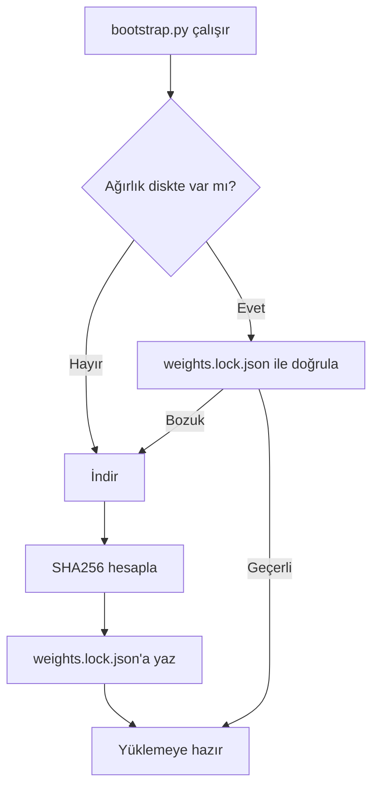
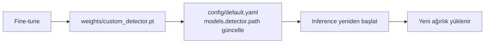

> 📂 **weights/** · Model Ağırlıkları · [⬅ repo koku](../README.md)

# 🏋️ Model Ağırlıkları

Bu dizin `bootstrap.py` tarafından doldurulur ve `.gitignore`'ludur.

- **Tespit edilen torch backend:** `mps`
- **Son kurulum platformu:** Darwin arm64

---

## 📦 Ağırlıklar

| Dosya | Durum | SHA256 (ilk 16) | Kaynak |
|---|---|---|---|
| `yolo26s.pt` | ✅ present | `646f8bc3fe0a6568` | https://github.com/ultralytics/assets/releases/download/v8.4.0/yolo26s.pt |
| `yolo26l.pt` | ✅ present | `9fe3c544f2b19beb` | https://github.com/ultralytics/assets/releases/download/v8.4.0/yolo26l.pt |
| `yolo26s-pose.pt` | ✅ present | `a083adb42303728a` | https://github.com/ultralytics/assets/releases/download/v8.4.0/yolo26s-pose.pt |
| `yolo26l-pose.pt` | ✅ present | `ad33da8a29ea5772` | https://github.com/ultralytics/assets/releases/download/v8.4.0/yolo26l-pose.pt |
| `lp_yolo11n.pt` | ✅ present | `0aec75976c56eb6f` | https://huggingface.co/morsetechlab/yolov11-license-plate-detection/resolve/main/license-plate-finetune-v1n.pt |

---

## 🎯 Özel (fine-tune) ağırlıkları — TAMAMLANDI (19 Haz 2026)

> [!NOTE]
> YOLO26s ile eğitilen domain modelleri. Gerçek held-out mAP `weights/custom_*.metrics.json` dosyalarından okunur (Ultralytics `model.val`, ayrılmış test bölmesi).

> [!IMPORTANT]
> Bunlar otomatik indirilmez (`bootstrap.py`/`weights.lock.json` kapsamı dışı; ağırlık diskte yoksa pipeline loglu olarak stok yola/no-op'a düşer, davranış değişmez).

| Dosya | mAP50 | mAP50-95 | Veri (CC BY 4.0) | Pipeline rolü |
|---|---|---|---|---|
| `custom_license_plate.pt` | **0.983** | **0.707** | 9123 görsel (keremberke/HF) | **Varsayılan LP dedektör** (`plate.lp_detector.path`); A/B 3/3 plaka korundu |
| `custom_smoking.pt` | **0.856** | **0.457** | 557 görsel (CigDet/Mendeley) | `pose.py` **ikinci-model** (`smoking_model`); phone-kanıtını korur |
| `custom_seatbelt.pt` | **0.895** | **0.546** | 3104 görsel (Roboflow/HF) | **Opsiyonel** (dış-kamera görüş açısı; varsayılan kapalı) |

---

## 🔐 Trust-on-first-use

> [!TIP]
> Şartname için resmi SHA256 yayımlandığında `bootstrap.py` içindeki `WEIGHTS` sözlüğüne yazın; bozuk indirmeler otomatik yeniden indirilir. İlk indirmede hesaplanan hash `weights.lock.json`'a yazılır ve sonraki çalıştırmalarda doğrulanır.

---

## 🔄 Custom ağırlık swap

> [!NOTE]
> Araç dedektörü için fine-tune sonrası `weights/custom_detector.pt` üretip `config/default.yaml` → `models.detector.path` değerini güncelleyin (varsayılan araç dedektörü hâlâ stok `yolo26l`).
>
> Plaka için `custom_license_plate.pt` zaten varsayılan LP dedektörüdür (`plate.lp_detector.path`).
>
> Inference yeniden başladığında yeni ağırlık yüklenir. Detay: `docs/egitim.md`.

